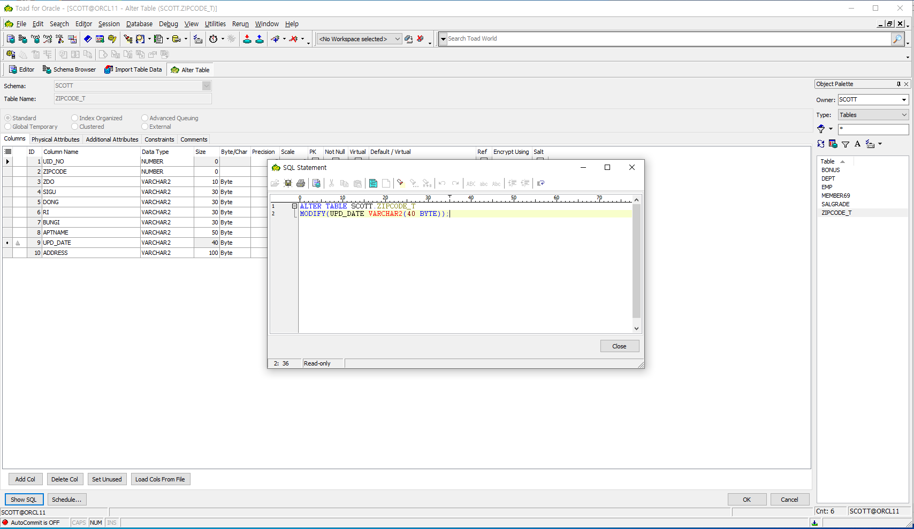

# toad for oracle : table생성, data올리기

### table생성하기

* oracle안에 집을 짓는 단계
* varchar\(10\) : 10자리 
* constraints : 조건을 걸수 있다.
* 오른쪽에서 table이 생성되었음을 볼 수 있다.

### table에 data목록 올리기

* object이름을 만들어둔 테이블로 지정한다.
* Show Data - next

* 목록이 text파일이므로 text파일 선택, 경로를 지정한다. - next

* 구분 기호 선택 - next

* First row : 2 : 1은 header이고 data는 2줄부터이다. - next

* 선택창이 뜨면 그대로 ok한다.\(자동으로 선택한다\) - next

* key field를 지정해준다. - next
* 이후에는 업로드를 진행해주는데 이때 처음에 만든 table을 벗어나거나 하면 안내팝업이 뜬다. 
* all to yes 후 Alter Table에서 해당 부분을 수정한다.

* UPD\_DATE의 데이터중에 오류가 나는 부분이 있어 크기를 수정해 주었다.

