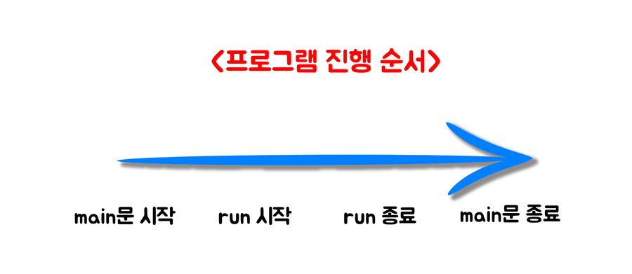
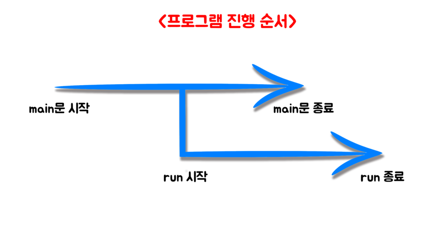

# 19 Days - 추상클래스, 인터페이스, Thread, Socket

## 복습

* 참고 : StarCraft.java

### 설계 - UML

* 프로그램 설계시 UML을 그려보면 좋다.
* 클래스의 변수와 메서드를 적어보는 것이다.

### 다중구현

* 상속은 **단일상속**만 가능하다. 
* 인터페이스는 상속 **다중구현**이 가능하다. 
* 단일 상속의 단점을 보완하기 위한 것이 인터페이스이다.

### extends & implements

* extends 클래스 - 추상클래스를 상속받으면 나도 추상클래스가된다.
* implements I - 인터페이스를 implements하면 나는 구현체 클래스가 된다.
* 인터페이스 : 행위는 특정개체에 종속적이면 안되는 것과 같이 추상적이여야한다. - Movable을 인터페이스로 한 이유는 Tank는 Marine과 다르게 움직이기 때문이다. - 유닛 추가, 수정이 가능하다.

## 필기

### 콜백메서드 & 추상메서드

* ActionListener 인터페이스 - actionPerformed 추상메서드 = JVM이 호출하는 콜백메서드 - 이벤트는 개발자가 정한다. 변화한다. -&gt; 추상메서드를 이용하는 이유
* 콜백메서드는 추상메서드일 가능성이 높다.

### StringBuilder & StringBuffer

* StringBuilder 클래스는 싱글스레드에서 안전하다.
* StringBuffer  클래스는 멀티스레드에서 안전하다.

### UI & Server

* initDisplay와 Server중 먼저 실행되어야 하는것은 무엇인가?
* Server는 요청이 있을때까지 대기한다. -&gt; 화면먼저
* 화면이 있어야 요청이 있을 수 있다.

### 사용 프로그램

* 사용언어 : JAVA\(JDK\)1.8.0\_261 : Oracle.com
* 사용Tool  - Eclipse : Eclipse.org - Toad DBA Suite for Oracle 11.5

## 스레드\(Thread\) 클래스

* 시간을 건드리는 API를 갖고있다. -&gt; 변수와 메서드 들을 갖는다. -&gt; 인스턴스화 -&gt; 생성자 -&gt; 파라미터 설정 -&gt; 사용자의 입력
* **동시작업**, **지속작업**에 사용된다.
* 순서를 정해준다.
* 인터넷의 탭과 같이 병렬구조를 갖고 여러 작업을 진행해도 되게 해주는 클래스이다. - 작업마다 스레드 하나를 제공해야한다. - 서버 : 듣고, 말하기 - 동시에 말할 수 있다. = 경합이 일어난다. = Thread가 필요하다.
* 스레드 하나로 작업을 여러개 하고싶다 -&gt; Runnable 인터페이스

### 스레드 상속

* extends Thread
* run\( \) { } 메서드를 갖고있다. Override해서 사용한다.

### Runnable 인터페이스 이용

* implements Runnable
* run메서드를 갖고 있다. Override해서 사용한다.

### run\( \) { }

* 콜백메서드이다.
* run메서드의 역할 - **순서**를 정해준다. \(순서대로 듣고, 차례대로 말한다.\) - **지속**되는 경우 \(ex\)네비게이션의 길 안내\)
* 순서를 정해주고 지속을 유지해주는 것은 run메서드 안에서 일어나는 일이다. - 사용시 Override해야한다.

## Socket

### ServerSoket

* 서버 안의 socket은 port번호만 있으면 된다. 
* port지정 = 열어둔다.
* 서버소켓안에는 a의 소켓, b의 소켓, 등이 있다.
* ServerSoket server = new ServerSoket\( \);

### Client

* 클라이언트도 가져올 값을 받을 socket을 선언한다.
* 이 소켓은 ip, port번호 둘다 있어야 들어갈 수 있다.
* 서버의 ip와 port번호가 필요하다 -&gt; 서버에게 물어보자 -&gt; 인스턴스화
* Socket s = server.accept\( \);
* 소켓에 쓰여져있는 것을 읽어오려면 - InputSting : read의 역할 - OutputString : write의 역할 - 두가지가 필요하다.

## Thread 활용

### TimeServer.java

* TimeClient 클래스 - 클라이언트, 핸드폰 - 스레드를 Runnable인터페이스를 implement해서 사용한다. - run메서드 Override - 화면에 시간을 표시한다. -&gt; 1초마다 이루어지는 지속적인 작업
* TimeServer 클래스 - 서버, 기지국 - 스레드를 extends Thread, 상속해서 사용한다. - run메서드 Override - 시간을 제공한다. String PushTime\( \);
* Calenda 클래스 - API : util -&gt; Calenda -&gt; 생성자\(Timezone, Local\) 존재 -&gt; static 메서드 이므로 -&gt; static field에서 사용할 변수를 찾는다. -&gt; getInstance메서드가 있으므로 생성자를 통해 인스턴스화 한다.

### TimeServer2.java

TimeServer보다 더 개선된, 더 안전한 Server 만들기

* Server : TimeServer2 클래스 - JFrame, Runnable 상속 - run 메서드 Override
* Server : TimeServerThread - ObjectOutputStream : oos - ObjectInputStream : ois
* TimeServer2에서 Socket선언
* TimeServerThread에서 TimeServer2 인스턴스화, 생성자를 이용한다. - TimeServer2의 멤버변수 사용가능 - Socket을 사용하기 위해 ts2의 주소번지를 생성자의 파라미터로 넘긴다.

## 

후기 : 세미 프로젝트와 병행하려니 하루가 30시간이였으면 좋겠다는 생각을 한다..

