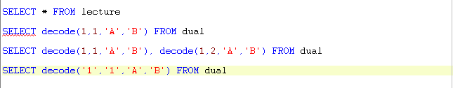
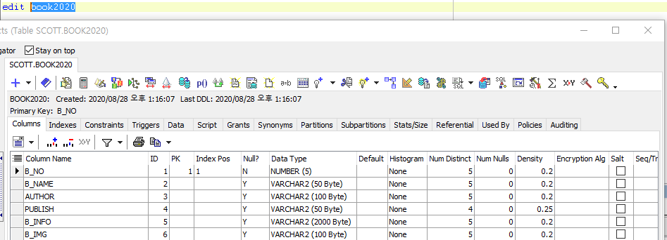
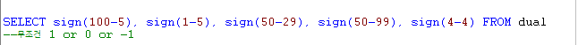
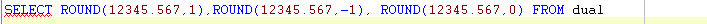
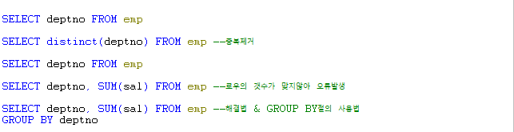
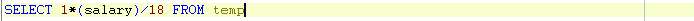

# 25 Days - SQL정의 & PL/SQL\(DECODE\) & GROUP BY

## 복습

### for & if

* if : 양방향 서비스, 소통할 때 필요하다.
* for : 접속이 일어나면 필요하다.

### oracle & SELECT

* 단어\(data\)-&gt;수집-&gt;분석-&gt;chat\(도식화\)-&gt;의사결정권자 : data를 유지해야한다.
* data유지\(영속성\):oracle의 역할 -&gt; oracle과 자바의 연결\(SELECT\)
* SELECT의 한계 - 정보들\(chat\)를 보여줄수만 있다. - data의 변조하는 기능은 없다.\(수정, 입력, 삭제\)

### 지역변수

* 유지되지 않아 외부에서 사용할 수 없고, 재사용할 수 없다는 한계를 갖는다.
* 임시 저장 역할로 중요한 정보는 저장하지 않는다.
* 유지되려면 oracle과같은 다른 프로그램과의 결합이 필요하다.

### 인스턴스화

* 인스턴스화 시 new뒤에는 구현체 클래스가 와야한다.
* ex\) List l = new ArrayLsit\(\);

### PROCEDURE

* oracle에서 업무를 자바의 도움없이 처리하며 속도가 빠르다.

### 사용 프로그램

* 사용언어 : JAVA\(JDK\)1.8.0\_261 : Oracle.com
* 사용Tool  - Eclipse : Eclipse.org - Toad DBA Suite for Oracle 11.5

## 필기 - oracle & toad

### DQL : 질의어

| 문 | 기 |
| :---: | :---: |
| SELECT | 데이터 검색 및 조회 |

### DML : 조작어

| 문 | 기 |
| :---: | :---: |
| INSERT | 데이터 입력 |
| UPDATE | 데이터 수정 |
| DELETE | 데이터 삭제 |

### DDL : 정의어

| 문 | 기능 |
| :---: | :---: |
| CREATE | DB객체 생성 |
| ALTER | DB객체 변경 |
| DROP | DB객체 삭제 |
| RENAME | DB객체 이름 변경 |
| TRUNCATE | 데이터 및 저장공간 삭제 |

### List & Table의 형태

* List는 1차 배열로 로우를 담은 방이 오른쪽으로 늘어난다.
* Table은 n차 배열로 로우가 밑으로 늘어난다.  - 합집합으로 SELECT한다.

### 컬럼- 로우의 타입

* 같은 컬럼의 로우들은 타입이 같아야 한다.

### Oracle IF & PL/SQL

* Oracle은 IF를 제공한다.
* **PL/SQL문**에서 사용 가능하다.
* SQL\(DML\)문에서는 사용할 수 없다. -&gt; Decode ****
* **IF**로 시작해서 **END IF;** 로 종료한다.
* **ELSIF** = else if
* 출력문 작성 후 왼쪽 상단의 Execute ad script를 누르면 실행된다.
* 출력문에는 OUT되는 변수를 받을 변수를 타입을 맞춰 선언한다.
* A컬럼과 B컬럼이 같다면 'T'를 리턴한다. IF A = B THEN RETURN 'T'; END IF;

### Oracle DECODE & SQL

* Oracle에서 제공하는 IF를 일반 SQL문은 사용할 수 없다. -&gt; DECODE함수를 이용
* **decode\(비교값,조건,true값, false값\)**  - 비교값과 조건에는 값 이나 컬럼이 들어갈 수 있다.
* 프로그래밍 언어 IF의 일반적인 기능을 포함한다.
* **서로 연관되어있는 같은 로우**끼리만 비교가능하다.
* SELECT문에서 FROM절을 제외한 어디에서나 사용 가능하다. - FROM에서 불가능하다. = SELECT할 때 테이블을 Decode를 이용해 유동적으로 변경할 수 없다.
* A컬럼과 B컬럼이 같으면 'T'를, 다르면 NULL을 리턴한다. Decode\(A,B,'T'\) - 테이블에 NULL을 두는 것은 추천하지 않는다. **Default 제약조건**을 이용해 0을 넣자.
* Decode함수는 같은지만 비교하고, 작거나 같으면, 크면 등의 연산은 불가능하다.  - A-B 가 음수면 A   A-B 가 양수면 B - 위 수식을 이용한다.

* 1과 1이 같으면 A, 다르면 B를 출력 - A
* 1과 1이 같으면 A, 다르면 B를 출력, 1과 2가 같으면 A출력, 다르면 B출력 - A B
* 문자 1과 문자 1을 비교하는 sql - A

### Sign 함수

*  1 : 수식 결과가 양수이다.
*  0 : 수식 결과가 0이다.
* -1 : 수식 결과가 음수이다. - 반환 결과 : 1, -1 , 1, -1, 0
* Decode함수와 같이 사용하면 주식 현황판과 같이 전날과 같으면, 전날보다 올랐으면 등의 표시를 할 수 있다.

### Round 함수

*  1 : 소수점 둘째 자리를 반올림, 소수점 한자리까지 표시한다. - 결과 : 12345.6
* -1 : 정수 첫째 자리를 반올림한다. - 결과 : 12350
*  0 : 소수점 첫째 자리를 반올림, 정수까지 표시한다. - 결과 : 12346

### distinct & SUM & GROUP BY

* deptno의 로우는 n개 이지만 SUM\(sal\)은 결과 값이 로우 하나 이므로 오류가 발생한다.
* 이럴때 GROUP BY 절 을 이용한다.

### 변수에 컬럼 이용하기

* 변수로 컬럼을 사용할 수 도 있다.



## 필기 - java

### SELECT 통로 & PROCEDURE 통로

* SLECT문을 DB로 보내주는 통로 = PreparedStement PROCEDURE문을 DB로 보내주는 통로 = CallableStatement

### PROCEDURE 통로

* CallableStatemen : 자바 제공, PROCEDURE를 오라클 서버에 요청시 사용하는 인터페이스OracleCallableStatement : 오라클 제공 API, ojdbc6.jar가 라이브러리에 존재해야 한다.
* 둘다 프로시저를 호출한다.
* 단, cstmt는 0 or 1 int를 담고, ocstmt는 다른 타입을 담을 수 있다. - cursor의 String값 등
* cstmt는 자바 제공 API 인터페이스이기 때문에 oracle이 제공해주는 cursor타입을 담을 수 없다. - 캐스팅 연산자를 이용한 강제 형전환 - ocstmt = \(OracleCallableStatement\)cstmt; ****- oracle 제공의 ocstmt인터페이스로 타입을 맞춰야한다.



### execute\(\); - 실행함수

* execute\(\); : Procedure
* ExecuteQuery : SELECT문
* ExecuteUpdate : INSERT, DELETE, UPDATE문

### ResultSet & Cursor

* Cursor는 커서가 가르키는 곳에 값이 있거나 DML문이 성공하면 int 1을 반환한다.
* 가르키는 곳에 값이 없거나 DML문이 실패하면 0을 반환한다.
* ResultSet은 next\( \);함수를 이용해 커서를 이동시켜준다
* **rs.next\( \);** : 기본, 위에서 아래로 이동 **rs.previous\( \);** : 아래에서 위로 이동 **rs.absolute\(숫자, 몇번째 로우\);** : 해당 로우로 바로 이동

### refCursor

* oracle의 반환값을 변수에 담을 때
* 위-변조를 방지하는 보안을 위해 변수는 private로 선언한다.
* 이때 동시접속이 일어날 수 있는 상황이라면
* setter, getter 메서드를 이용해서 받아와야한다. - 하나 가져오고 기다리던 다음 접속을 담는다.
* row가 n개라면 sys-refCursor가 필요하다.



후기 : 영타가 늘고 있다.ㅋㅋㅋㅋ 오늘은 파라미터의 중요성을 또 한번 깨달았다. 파라미터에 일반 변수 뿐아니라, 배열, 클래스를 사용할수 있다니 얼마나 편리한지! 그리고 배열 공부를 더 해야겠다.  

