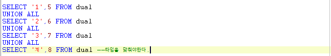

# 25 Days - PL/SQL\(DECODE\), GROUP BY,

### 사용 프로그램

* 사용언어 : JAVA\(JDK\)1.8.0\_261 : Oracle.com
* 사용Tool  - Eclipse : Eclipse.org - Toad DBA Suite for Oracle 11.5

## 복습

### for & if

* if : 양방향 서비스, 소통할 때 필요하다.
* for : 접속이 일어나면 필요하다.

### oracle & SELECT

* 단어\(data\)-&gt;수집-&gt;분석-&gt;chat\(도식화\)-&gt;의사결정권자 : data를 유지해야한다.
* data유지\(영속성\):oracle의 역할 -&gt; oracle과 자바의 연결\(SELECT\)
* SELECT의 한계 - 정보들\(chat\)를 보여줄수만 있다. - data의 변조하는 기능은 없다.\(수정, 입력, 삭제\)

### 지역변수

* 유지되지 않아 외부에서 사용할 수 없고, 재사용할 수 없다는 한계를 갖는다.
* 임시 저장 역할로 중요한 정보는 저장하지 않는다.
* 유지되려면 oracle과같은 다른 프로그램과의 결합이 필요하다.

### 인스턴스화

* 인스턴스화 시 new뒤에는 구현체 클래스가 와야한다.
* ex\) List l = new ArrayLsit\(\);

## 필기

### DQL : 질의

| 문 | 기 |
| :---: | :---: |
| SELECT | 데이터 검색 및 조 |

### DML : 조작

| 문 | 기 |
| :---: | :---: |
| INSERT | 데이터 입 |
| UPDATE | 데이터 수정 |
| DELETE | 데이터 삭제 |

### DDL : 정의어

| 문 | 기능 |
| :---: | :---: |
| CREATE | DB객체 생성 |
| ALTER | DB객체 변 |
| DROP | DB객체 삭 |
| RENAME | DB객체 이름 변 |
| TRUNCATE | 데이터 및 저장공간 삭 |

### List & Table의 형태

* List는 1차 배열로 로우를 담은 방이 오른쪽으로 늘어난다.
* Table은 n차 배열로 로우가 밑으로 늘어난다.  - 합집합으로 SELECT한다.

