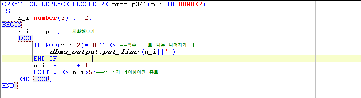

# 26 Days - DISTINCT, DUAL, NULL, ALIAS, NVL, TO\_CHAR, ORDER BY, LOOP

## 복습

### JVM과 Oracle의 값 유지

* 화면에서의 사용자 요청 값을 JVM이 인식하여 DB에 요청하면 Oracle이 처리, 반환한다. - 요청 값이 Oracle Table로 넘어간다.
* 값.getText\( \); - 값을 파라미터로 넘길때, String 타입이다.
* 값.setText\( \); - 처리결과, 리턴값을 보여줄때, void타입이여도 된다.
* 사용자가 요청하는 값은 사용자마다 변화하는 변수로, VO를 사용하는것이 일반적이다. - 변수 = table 컬럼 - ex\) 로그인 : 아이디, 패스워드 

### 전달자

* DML\(SQL\) : PreparedStatement
* PROCEDURE : CallableStatement

### 업무처리

* 함수\(메서드\)의 로직을 이용해 업무를 처리한다. - 리턴과 파라미터를 통해 요청 값이 이동된다. - Oracle함수는 반드시 리턴값과 파라미터를 갖는다. - 함수는 파라미터 값으로 판단, 처리한다. -ex\) Decode

### IF & Decode

* IF 1=1 THEN 실행문 END; - PL/SQL
* Decode\(1,1실행문\) - SQL, DML

### SELECT 실행문

* 위치 :SELECT 실행문 FROM 테이블명
* 실행문 : 산술연산자 + 컬럼 + 함수

### 사용 프로그램

* 사용언어 : JAVA\(JDK\)1.8.0\_261 : Oracle.com
* 사용Tool  - Eclipse : Eclipse.org - Toad DBA Suite for Oracle 11.5

## Toad

### DISTINCT

* Oracle **중복제거** 예약어
* 중복된 데이터를 한번씩만 출력한다.
* SELECT distinct 컬럼명 FROM 테이블명

### Dual 테이블

* CREATE 하지 않아도 자동으로 생성되는 테이블이다.
* 결과를 한 행으로 출력해준다.

### NULL & IS NOT NULL

* 1번 : 결과 테이블이 모두 비어있다.
* 2번 : 등산 만 출력된다.  -  hobby = NULL : 항상 false이다.
* 3번 : 등산과 NULL 둘다 출력된다.
* 4번 : 둘다 출력되지 않는다.  -  NOT IN 연산자에 NULL이 포함되면 어떤 경우에도 조회하지 못한다.
* 5번 : 등산이 아닌 것이 출력되고, NULL이 아닌 것이 출력되므로 결과에는 등산 값도 포함되어 출력된다.\(합집합\)

### ALIAS

* 컬럼명에 부여해주는 별칭이다. 
* 변수에 수식이 사용될때 ALIAS명을 붙여주면 출력시 수식이 아닌 ALIAS명이 출력된다.
* 띄어쓰기가 포함되는 경우에는 반드시 " " 를 붙여주어야 한다.

### NVL

* NULL을 0이나 지정된 값으로 변환해주는 함수

### TO\_데이터타입

* 형변환 함수
* TO\_CHAR, TO\_NUMBER, TO\_DATE, ....

* 출력

### ORDER BY

### LOOP



## JAVA

