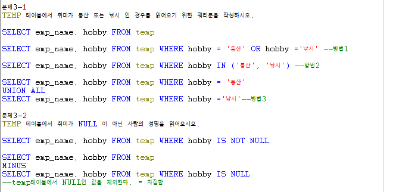
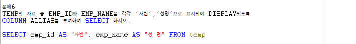

# Toad - 문제풀이

### ROUND & TO\_CHAR

* 월 급여는 연봉을 18로 나눠 홀수달에는 연봉/18, 짝수달에는 연봉\*2/18이 지급될때,  홀수달과 짝수달에 받는 금액을 나타내시오
* 홀수달 급여 : 1\*salary컬럼/18
* 짝수달 급여 : 2\*salary컬럼/18
* Round함수를 이용해 나눈 값의 소수점을 반올림해서 표시한다.
* To\_char함수를 이용해 값의 형식을 정해준다.
* Alias명을 이용해 컬럼명을 정해준다.

### ALIAS & TO\_CAHR 

* 위 월 급여에 교통비가 홀수달은 10만원, 짝수달은 20만원씩 지급됨을 나타내시오

### NULL & UNION ALL & MINUS

* TEMP테이블에서 취미가 등산 또는 낚시인 경우를 나타내시오
* 방법 1 : WHERE 컬럼 = 값1 OR 값2 ...
* 방법 2 : WHERE 컬럼 IN\(값1, 값2, ...\)
* 방법 3 : WHERE 컬럼 = 값1 UNION ALL WHERE 컬럼 = 값2
* TEMP테이블에서 취미가 NULL이 아닌 사람의 이름을 나타내시오
* 방법 1 : WHERE 컬럼 IS NOT NULL
* 방법 2 : 전체 TEMP MINUS WHERE 컬럼 IS NULL

### NULL & NVL

### ALIAS

### ORDER BY

### LOOP 입력 값 이하의 수 중에서 짝수 값 총합

