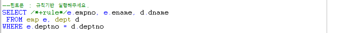

# 27 Days - join, toad계정권한생성, DCL, 카디날리티, 옵티마이저모드, 힌트문, 무결성제약조건, rowid, group by, 실행계획

### 사용 프로그램

* 사용언어 : JAVA\(JDK\)1.8.0\_261 : Oracle.com
* 사용Tool  - Eclipse : Eclipse.org - Toad DBA Suite for Oracle 11.5

## 복습

| JAVA | ORACLE |
| :---: | :---: |
| 변수 | 컬럼 |
| VO | refCursor or SELECT |
| List | sysRefCursor |

## Toad 

### Join

* 필요한 값이 들어있는 테이블이 분산되어 있을 때 Join이 필요하다.
* Join을 하려면 DB설계와 ERD 를 그려보면 도움이 된다.

### DB설계

1. 요구사항 분석 - 업무 정의서 작성 : Event, Logic, Dao, View, ...
2. 논리적 모델링 - 추상적 모델링, 집합과 속성의 후보를 정한다. - ERD를 그린다.
3. 물리적 모델링 - 구체적 모델링 : Table과 컬럼을 정한다. Table이 정해질때 인덱스도 생성된다.
4. 구현

### EDR & Cadinality

* ERD에서 부모식별자를 자식 table이 식별자로 이용하면 실선표시, FK로 갖고만 있으면 점선표시된다.
* Cadinality\(카디날리티\) = 관계형태
* 집합 간의 관계에서 연결될 수 있는 관계의 수를 말한다, - 관계 대응 엔티티 수
* 1 : 1
* 1 : n
* n : m - 업무 정의가 덜 된 상태로, 필요없는 값 까지 나오므로 join을 걸어서는 안되고, 행위엔티티\(관계타입\)을 넣어주어 1 : n, m : 1관계로 만들어주어야한다.

### 옵티마이저

1. 파싱\(Parsing\) : 문법오류 검사
2. DBMS : 실행계획 검사
3. 실행계획을 따른 진행 실시 - 한번에 하나만 진행가능 - Explain Plan에서 확인할 수 있다. - 속도를 올리려면 = 옵티마이저를 똑똑하게 이용하려면 여러 CPU가 필요하다. 데이터를 쪼개서 CPU마다 할당하고, 그 값을 Merge해주는 CPU까지 필요하다.

* 테이블을 관리하는 물리적인 공간과 인덱스를 관리하는 물리적인 공간은 다르다.
* 1차 가공 : 테이블을 그대로 보여주는 것
* 2차 가공 : 비교 조회 하는것 - Cost가 커지고 속도는 느려진다. - ex\) 150m에 대형 백화점이 있고, 50m에 과일가게가 있을때, A가 부모님의 심부름으로 과일가게에 가서 과일을 사온다음, 언니의 심부름으로 대형 백화점에 가서 과자를 사온다면, A일의 양은 200m이지만. B는 심부름 두가지를 한번에 들어서 대형 백화점만 다녀왔다면, B 일의 양은 150m뿐이다.

### Explain Plan\(실행계획\)

* SQL블럭처리 -&gt; ctrl + e 
* 데이터를 조회할때, 옵티마이저의 진행 순서를 관찰 할 수 있다.
* 사용한 SQL에 대한 계산점을 발견하여 개발자가 일을 개선해 나가는데 도움이 된다. - 옵티마이저와 개발자가 공유하는 언어가 필요하다. = 힌트문
* 위의 경우는 각 테이블의 PK를 이용한 SELECT문이다. PK를 사용한 조회의 경우에는 전체 테이블을 조회하지 않고, 갖고 있는 인덱스로 검색을 한다.
* 같은 실행문이더라도 오라클에 따라 실행계획이 다를 수 있다.

### 규칙기반 옵티마이저\(Rule-Based Optimizer\)

* 통계 자료와는 상관없이 규칙 우선순위에 따라 실행계획을 선택한다. 현재에는 잘 사용하지 않는다.
* 수동카메라
* 부서가 100개, 사원이 30만명일 때, 부서는 부서테이블에서 똑똑한 조건이지만 사원 테이블에서는 중복되기때문에 멍청한 조건이라 할 수 있다.
* 규칙기반 옵티마이저는 멍청한 조건을 먼저 읽고 상대쪽을 비교하면서 결과를 내보내는것이 더 빠르다고 판단한다. - 30만 사원을 조회하면 그 안에 부서가 들어 있으므로 일량은 30만이지만, 부서를 먼저 읽으면 사원도 읽어야 하므로 더 느리다고 판단하는 것이다.
* rule : 규칙기반

### 비용기반 옵티마이저

* 통계 자료에 따라 비용을 계산해서 Cost가 가장 적은 실행계획을 선택한다,
* 자동카메라
* 요청 누적 횟수에 따라 오라클 내부에서 관리하는 통계자료가 달라지므로 자료가 옛날 것이면 신뢰도가 떨어진다. -&gt; 오라클 서버 관리자에게 통계자료를 최신 업데이트 요청을 해야 신뢰도가 높게 유지된다.
* all row : 비용기반

### merge join & hash join

* merge join : 1번 테이블 값 하나를 2번 테이블에 비교, 반복
* hash join : 1번 테이블 전체 조회 -&gt; 2번 테이블 전체조회 -&gt; 비교

### 힌트문

* 옵티마이저에게 개발자의 생각을 전달 할 수 있는 구문이다.
* 오름차순 힌트문 : /_+INDEX\_DESC\(테이블명 인덱스명\)_/ 

### 무결성 제약조건

* PK 기본조건 : UNIQUE + NOT NULL
* 모든 row에 대해 유일한 값이여야하고, NULL값이 없어야한다.
* Constraint : 제약조건예약어 - Constraint 컬럼명 primary key\(pk명\)  - = 인덱스 이름 선언

### Equi Join & Explain Plan

* Equi Join이라고도, Natural Join이라고도 한다.
* 불러올 테이블이 두개 이상인 경우에는 JOIN을 사용한다.

* JOIN시, 먼저 읽어들이는 테이블이 있고, 나중에 읽어들이는 테이블이 있다.
* 실행계획을 통해 확인할 수 있다.

### rowid

* n개의 데이터를 조회하면 오라클이 n건에 대한 상수값을 갖게된다.
* 이는 오라클이 내부적으로 관리하는 값이다.
* rowid : 물리적으로 데이터가 저장되어있는 값
* 18자리 - 6자리 : 데이터 오브젝트 번호 - 3자리 : 상대적인 파일번호 - 6자리 : 블록번호 - 3자리 : 블록내의 행번호

### GROUP BY심화

* 생산관리 시스템이나 영업관리 시스템같이 집계를 하거나 통계를 내는 곳에서 자주 사용한다. - 소계, 총계, 분기별 총계, 반기별 합계 등

## JAVA

### 값을 읽어오는 경로

* 수정, 상세보기는 JTable의 DTM\(Data Set되는 Table\)의 값을 읽어와서\(getValueAt함수\) 이루어진다. -&gt; DTMtable의 좌표를 알아야한다. -&gt; getValueAt\( \) : 파라미터로 좌표가 두개 필요하다. 리턴값의 타입은 무엇을 써야할까? -&gt; Object타입 : 문자가 올지, 숫자가 올지 타입을 알수 없다.     - getValueAt\( , \):Object -&gt; 반환된 Object의 타입을 맞추지 않으면 CastingExeption이 발생할 수 있다.
* Table에서 수정, 상세보기할 값을 선택\(action\)하고, 그 값을 WHERE절에 꽂아 SELECT문으로 값을 가져와야한다. -&gt; 값이 한 건이라면 VO를 사용한다. -&gt; 기본의 List메서드에 파라미터로 VO를 넣어준다면 사용할 수 있을 것이다. -&gt; 선택이 없으면 선택하라고 안내\(응답\)해야한다. : API에 get, select, row가 있을 것이다. -&gt; 반환값이 1이면 action을 진행하고, 0 이라면 메세지를 띄운다.



후기 : 코로나 때문에 수업을 쉬어서 그런지 긴장이 풀려 전보다 집중이 떨어지는 것 같다. 추석도 얼마 남지 않았고 힘내서 집중해야지!

