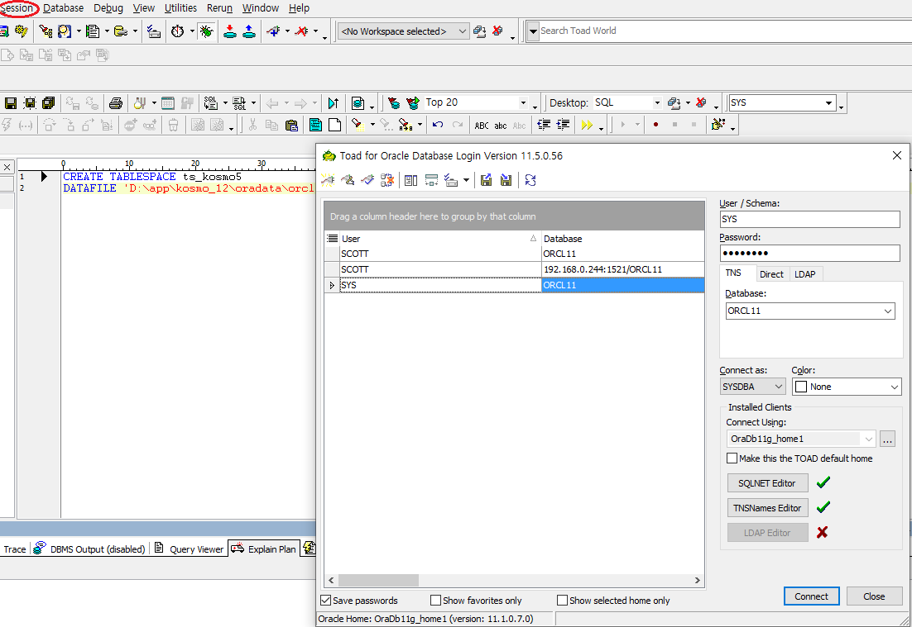
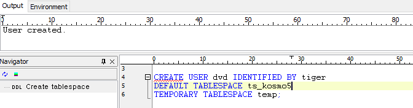
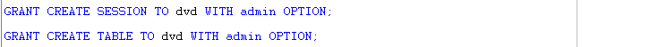

# Toad - DB관리 권한계정 생성

### 관리자 계정 생성

* Toad Session메뉴의 New를 눌러 Connetion창을 띄운다.
* Connect as : SYSDBA 권한으로 계정을 생성한다.

## DB 테이블 분리, 권한계정 생성

* 위에서 설정한 관리자 아이디로 접속한다.

### Table Space생성

* Oracle이 설치된 경로안에 Table Space를 생성한다.

### 계정생성

* 유저명과 암호를 정하고, 위에서 만든 TableSpace를 기본 경로로 지정해준다.

* DCL문을 이용해 접근을 위한 세션을 생성한다.
* DCL문을 이용해 테이블에 대한 접근권한을 생성한다.
* 위 과정이 끝나면 Session메뉴로 가서 해당 아이디를 만들어 접속하면된다.

