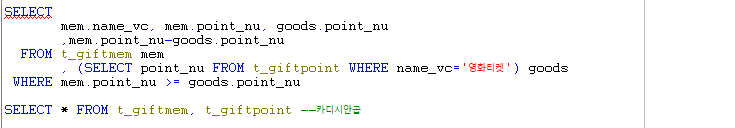
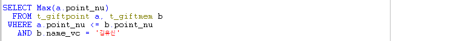

# Toad - t\_giftpoint, t\_giftmem 숙제풀이

### 문제1

#### 영화 티켓을 받을 수 있는 사람의 명단과 현재 가지고 있는 포인트, 영화 티켓의 포인트 그리고 그 티켓을 사용한 후 남은 예상 포인트를 출력하시오. - equi join과 인라인뷰를 이용하시오.

* 집합이름 : t\_giftpoint, t\_giftmem
* 상품포인트\[point\_nu\]를 주지 않는다. - 간접조건 -&gt; 서브쿼리를 사용해야한다.
* 영화 티켓을 받을 수 있는 집합 : 상품집합 = t\_giftpoint
* 사람의 명단과\(+, add\) 보유 포인트 : t\_giftmem
* 잔여포인트 : 회원포인트 - 상품포인트

* 조건1 : 영화티켓 - 영화티켓의 포인트 : 포인트는 제공해주지 앟는 대신 영화티켓을 제공해 주었다. - SELECT point\_nu FROM t\_giftpoint WHERE name\_vc = '영화티켓' -&gt; 15000 - 이 조건이 있어야 비교를 할 수 있게된다.
* AND OR 어떤것을 써야할까? - 영화티켓이 기준이 된다. 상품집합에 있는 모든 상품이 비교대상은 아니다. - 그 중에서 영화티켓 = 15000포인트 보다 크거나 같으면 되는 것이다. - AND 사용
* 조건2 : 상품포인트보다 회원포인트가 커야한다. - mem.point\_nu &gt;= goods.point\_nu

### 문제 1-2

#### 김유신씨가 보유하고 있는 마일리지 포인트로 얻을 수 있는 상품 중 가장 포인트가 높은 것은 무엇입니까? - 서브쿼리를 이용하시오.

