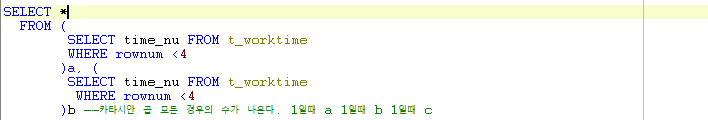

# Toad - t\_worktime 풀이

## 문제

#### time\_nu가 작업코드\(workcd\_vc\)에 대한 작업시간일때, 작업시간이 작은 순서대로 순위를 나타내시오

## 이론

### Join 사용

* 기본적으로 한테이블에서는 다른 로우를 비교할 수 없다. -&gt; 같은 두개의 테이블이 있다면 로우를 서로 비교 하면 된다.
* a테이블과 b테이블을 카테시안 곱으로 두고,  - a테이블 값과 같거나 큰것 보여줘 : Count\(b테이블\)

## 풀이

