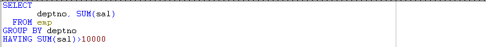

# 29 Days - WHERE-having,in,exists/ceil, rownum, server, socket, Thread, protocol

### 사용 프로그램

* 사용언어 : JAVA\(JDK\)1.8.0\_261 : Oracle.com
* 사용Tool  - Eclipse : Eclipse.org - Toad DBA Suite for Oracle 11.5 - Tomcat v9.0

## 복습

### 인라인뷰

* FROM절에 오는 집합\(SELECT문\)을 인라인뷰 라고 한다.
* 인라인뷰에서 SELECT된 컬럼, ALIAS명은 외부 SELECT문에서 사용할 수 있다.

### WHERE

* 개별 행의 조건을 비교할때 사용한다.
* WHERE절 안에 오는 집합\(SELECT문\)을 서브쿼리 라고 한다.
* 서브쿼리에 온 컬럼이나 ALIAS명은 외부 SELECT문에서 사용할 수 없다.
* if의 역할로 선택지를 좁혀주므로 일 처리 속도를 빠르게 해준다.

### DB 로우 비교

* 데이터베이스에서 같은 테이블의 서로 다른 로우는 비교할 수 없다.
* 비교할 때에는 항상 상대 테이블이 있어야한다.

### GROUP BY 역할

1. SELECT 문에 deptno, count\( \) 를 같이 사용할 수 없다. - 일반 컬럼과 그룹함수를 같이 사용하는 것은 불가능하다. - 결과 로우의 갯수가 다르므로 표시될 수 없다.
2. 해결방법 1 - 일반 컬럼에 그룹함수를 씌운다.  - ex\) AVG, SUM, COUNT, .... - 대부분 의미없는 SQL이 되어버린다.
3. 해결방법 2 - 일반 컬럼에 GROUP BY한다. - GROUP BY할 때에는 의미가 없는 경우가 있으니 주의해야한다. - 옵티마이저의 동작원리 파악후, 일량을 줄이려면 경우의 수를 넣는다. - 단, 이름 컬럼같이 그룹으로 묶어도 효과가 없는 경우도 있다. - 중복되는 값이 있을때 사용한다.

### 테이블

* 데이터 베이스에서 같은 테이블의 서로 다른 로우는 비교할 수 없다.
* 비교할 때에는 항상 상대 테이블이 있어야한다.
* 업무에서 테이블을 있는 그대로 보여주는 경우는 흔치 않고, 재가공을 통해 원하는 자료만 나타낸다.

### rowid

* row가 있는 물리적인 위치에 대한 정보를 가지고 있다.
* DBMS가 갖고있는 모든 데이터에 대한 각각의 고유한 식별자.
* 인덱스테이블은 index key + rowid이다.
* 실제로 저장되는 물리적인 정보는 아니고, index 테이블 안의 rowid는 해당 데이터를 찾기위한 논리적인 정보라고 할 수 있다.

### run\( \)

* Thread클래스를 상속받거나 Runnable인터페이스를 구현하는 클래스에서 사용 가능한 메서드이다.
* 추상메서드로, 경합이 일어나 순서를 정해줘야 할때에나 지속적인 통신이 이루어져야할 때 사용된다.

### ServerSocket

* Server는 24시간 열려있어 통신이 가능해야한다. - ServerSocket의 역할
* ServerSocket은 실제로 일하는 역할은 아니다. 실제로 일하는 것이 Socket이다. - Server에 필요한 기본 소켓은 2개이다. - 하나는 24시간, 하나는 그때 그때 사용되는 것
* ServerSocket은 JVM이 제공해주는 api 클래스 이므로 사용하려면 인스턴스화를 해야하고, 이때 필요한 것이 port번호이다. - Server쪽은 port번호만, Client쪽은 Server의 ip, port번호 둘다 있어야한다.
* ServerSocket생성문 - ServerSocket 변수이름 = new ServerSocket\(port번호\); - port번호는 중복되어서는 안되고 사용할 서버의 port번호 이여야 한다.

### Socket

* 마이크 : Input, 말하기  와  스피커 : Output, 듣기  둘다 탑재되어야 한다.
* 개인에게 말할때 : Send
* n명에게 말할때 : BroadCasting



## Toad

### NOSQL

* 경량 오픈 소스 비관계혈 분산 DB
* 인터넷, SNS가 활성화되면서 기존의 관계형-정형 데이터를 처리하는 DB가 아닌 비정형 데이터를 쉽게 담아 저장-처리하는 더 융통성있는 데이터 모델이 생겨나고, 이는 데이터 저장 및 검색에 특화되어있다.
* 단순 검색 및 추가 작업에 최적화된 키 값 저장 기법을 사용하며, 응답속도와 처리 효율에 있어 성능이 뛰어나다.
* 분석함수와, 테이블간의 join을 지원하지 않는다.

### rownum

* 단어 그대로 row의 number를 말한다.
* 위의 SQL문을 보면 작은것 또는 작거나 같은 것만 출력이 되고 큰것은 보여주지 않음을 알 수 있다.

### ceil

* 올림값을 반환하는 함수
* ceil\(10.4354\) -&gt; 11
* ceil\(-10.1234\) -&gt; -10

### HAVING

* 그룹화된 결과에 조건을 걸 때 사용하는 if문 역할
* GROUP BY절, AVG, SUM, MAX, COUNT 등...
* 그룹화된 결과에 조건을 걸때 WHERE절은 사용할 수 없다.

### WHERE - IN, EXISTS

* IN  - 괄호 안의 특정값이나 서브쿼리의 결과값이 포함되는지 체크해주는 역할 - 특정 컬럼의 값을 조건으로 이용할 때 사용한다.
* EXISTS - 괄호 안의 서브쿼리로부터 해당 컬럼 값의 존재 유무를 체크해주는 역할 - 서브쿼리를 조건으로 이용할 때 사용한다.

## JAVA

### 자바 입출력

* 데이터를 입력, 출력하는 기능 - 데이터 : oracle이나 화면에서 입력된 데이터, 내 컴퓨터에서 가져온 데이터 등..
* 외부 저장 장치나 네트워크 연동에 따라, 장치에 따라 다르게 구현해야한다. - 네트워크 연동 : 네트워크-하드웨어 간의 연계

### 프로토콜\(protocol\)

* 데이터를 주고받는 통신 시스템이 데이터 교환시 사용되는 통신 규칙, 규약을 말한다.

### Server

* 서버 제공 = 대문 제공
* port번호 1-1023번은 window가 사용하는 번호이다. - naver, chrome 등의 브라우저들은 80번 번호를 사용한다. - 점유 되어있는 port번호는 사용불가하다. - 브라우저가 연결되어있는 컴퓨터는 port번호 80번이 열려 있는 것이다.
* 네트워크서버와 DB서버는 다른 역할을 수행하므로 주의해서 사용하자. - 로그인서비스는 DB서버와 연결해야한다.

### 직렬화 & 역직렬화

* 클래스의 인스턴스가 생성되면 RAM에 저장되고, 인스턴스 변수는 계속 변화한다.
* 보조스트림 OIS와 OOS를 사용한다. - OIS : ObjectInputStream - OOS : ObjectOutputStream
* 스트림의 특징 - 단방향이다. - FIFO 특징을 갖는다. \(First In First Out\)
* 직렬화 - 인스턴스의 순간 상태를 그대로 저장하거나 네트워크를 통해 전송하는 것 - 인스턴스 내용을 연속하는 스트림으로 만들어주어 속도를 빠르게 해준다.
* 역직렬화 - 저장된 내용이나 전송받은 내용을 다시 복원하는 것

## Server 구현 설계

### 학습목표

* Oracle이 제공해주는 서버를 사용해 보기도 했고, Tomcat을 설치해  서버를 살펴도 보았다. 카톡과 같은 채팅 프로그램을 모토로하는 지속가능한 서버를 제작해보자.

### TalkServerThread 클래스

* Thread를 상속받는다.
* run\( \)메서드

### TalkServer 클래스

* JFrame을 상속받고 Runnable 인터페이스를 구현한다.
* main메서드, run\( \)메서드
* Client의 접속전에 먼저 실행되어야 한다.
* Socket이 두개 필요하다.

### TalkClient 클래스

* JFrame을 상속받는다.
* main메서드
* 말하기가 일어나는 클래스이다. - event, actionPerformed 등 write의 역할을 하는 클래스

### TalkClientThread 클래스

* Thread를 상속받는다.
* run\( \) 메서드
* 듣기가 일어나는 클래스이다. - 여러명이 말하면 경합이 일어날 수 있고, 대화의 순서가 맞아야하며 대화가 지속될 수 있어야한다. -&gt; Thread가 필요한 이유, 다자간에 일어나는 통신이다.
* 접속할 서버의 ip와 port번호가 필요하다.

후기 : 아침 저녁으로 날씨가 쌀쌀해지고 있다. 독감예방주사를 맞았고 따뜻하게 입고다니면서 건강에 유의하자!!

