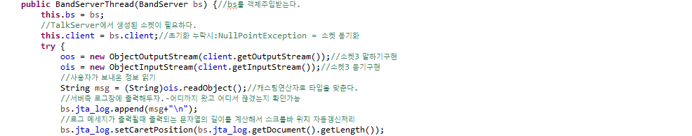
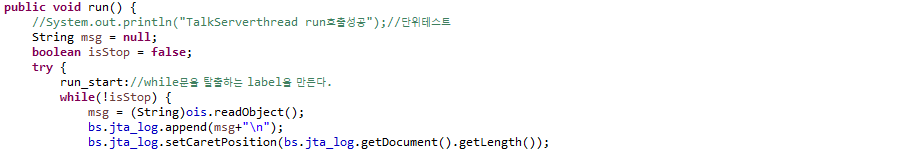
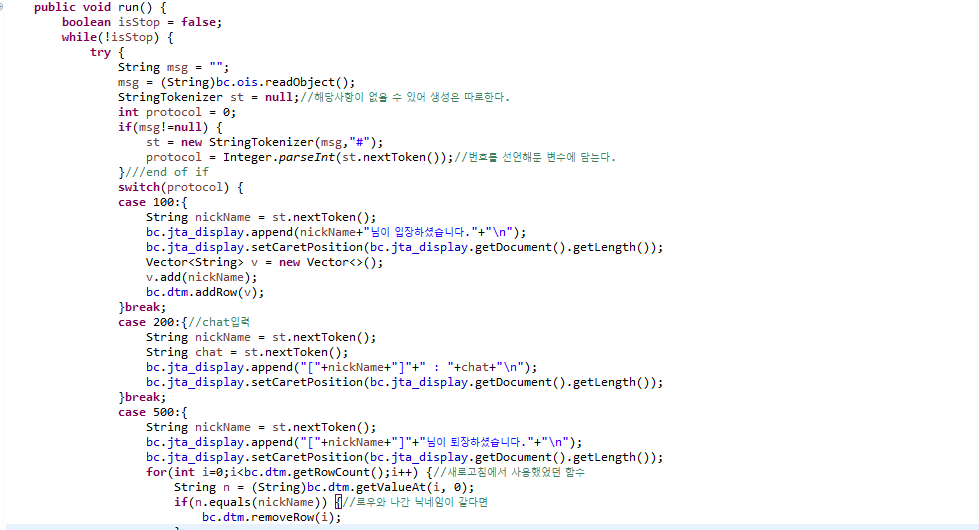

# setCarePosition

## 이해하기

현재 server의 log를 보여주는 화면과 client의 대화 화면에서 입력되는 문자열을 따라 커서가 이동하지 않기때문에 화면을 넘어가 스크롤바가 생기면 직접 스크롤바를 움직여 하단을 확인해야한다는 불편함이 있다.  
이를 보완하기 위해 setCarePosition함수를 사용한다. 

### 기본형

* 적용할 TextField, TextArea등 에 append\(문자열\) 다음에 위치한다.
* textField명.setCarePosition\(\)

## Band에 적용

### BandServerThread-1

* log화면의 100번이 붙는 입장 메세지 입력에 대한 처리

### BandServerThread-2

* log화면의 100번이 아닌 다른 메세지 입력에 대한 처리

### BandClientThread-1

* client 대화창의 입력화면 대한 처리

