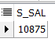
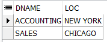

# 39 Days - toad복습, try-catch,

### 사용 프로그램

* 사용언어 : JAVA\(JDK\)1.8.0\_261 : Oracle.com
* 사용Tool  - Eclipse : Eclipse.org - Toad DBA Suite for Oracle 11.5

## Toad 복습

```sql
SELECT ename FROM emp
GROUP BY ename --14가지

SELECT deptno FROM emp
GROUP BY deptno --3가지
```


```sql
--ename은 GROUP BY 표현식이 아닙니다.=JAVA SQLException
--ora-000979 에러는 무조건 오라클 쿼리문 에러인 것이다.
SELECT deptno, ename FROM emp
GROUP BY deptno

SELECT ename, deptno FROM emp
GROUP BY ename --사용불가 둘다 같이 묶일 수 없으므로
```


```sql
--해결방법1 : deptno에 그룹함수(sum,count,...)를 사용한다, 문법적 문제는 해결되지만 의미있는 정보가 아님
SELECT ename, MAX(deptno), MIN(deptno) FROM emp
GROUP BY ename--ename의 부서번호가 아닌 그저 최대, 최소값 부서번호가 나온것이다.

```


```sql
--해결방법2 : deptno도 GROUP BY절에 포함시킨다. ename이 다 다른값이므로 효과가 없다는것이 문제
SELECT ename, deptno FROM emp
GROUP BY ename, deptno
```

```sql
--단, 예외인 경우가 존재한다. 어떤경우일까?
-- 힌트 : 중복을 제거하는 데이터를 조회해보자
SELECT distinct(deptno) FROM emp

SELECT distinct(ename) FROM emp

SELECT distinct(empno) FROM emp

```


```sql
--그룹화 한 뒤에 그 결과에 대한 조건검색을 할때 WHERE절은 불가능하다. HAVING절 사용
SELECT deptno, sum(sal) FROM emp
GROUP BY deptno
HAVING sum(sal)>10000
--부서별 연봉중 1000이상이것이 나오므로 의미있는 값이다.
```



```sql
--decode는 from절을 제외한 어디든 사용될 수 있다.
--SELECT문 컬럼자리에, 
--WHERE절에, WHRER절의 and, or다음에도 올 수 있다.

--HAVING절에는  알리아스명은 사용할수 있을까?
--인라인뷰에서 사용되면 사용할 수 있다.
--인라인뷰 없이 FROM절 뒤에는 알리아스명을 사용할 수 없다.
SELECT s_sal
  FROM (SELECT deptno, sum(sal) s_sal FROM emp
        GROUP BY deptno)
WHERE s_sal>10000
```

## Explain plan & index

### 1단계


```sql
--explain plan
--옵티마이저에게는 두가지 동작 모드가 있다.
--1.룰베이스 옵티마이저 모드 : 15가지 기준에따라 순서를 정해 진행(ex index가 있으면 index 검색이 최우선), 기준을 조정할 수 있다. 수동카메라
--2.비용기반 옵티마이저 모드 : 비용을계산한다. 통계정보가 많을수록 정확도가 높다. 자동카메라

--pk제약조건 : not null, unique 
--pk는 unique index를 지원받는다.
SELECT empno FROM emp--1
```

### 2단계


```sql
SELECT empno, ename FROM emp--2
```

### 3단계


```sql
SELECT empno, ename FROM emp--3
WHERE empno=7566
--1.테이블을 먼저 드라이브 하는 것이 아니라 index를 드라이브한다.
--2.index가 존재하더라도 저건절에서 묻지않으면 사용하지 않는다.
--index를 사용하려면 해당 pk컬럼을 조건절에서 사용해야한다.
```

### 4단계


```sql
--index를 무력화시킬 수 있다.옵티마이저를 조작할 수 있다.
--좌변 pk를 가공하면 index로서 사용될수 없다.
SELECT empno, ename FROM emp--4
WHERE empno!=7566

SELECT empno, ename FROM emp
WHERE empno<>7566
```

### IN



```sql
--in구문
--테이블을 한번만 읽어서 처리
SELECT dname, loc FROM dept WHERE deptno IN(10,30)--집합 한개

--테이블을 두번 읽어서 처리
SELECT dname, loc FROM dept WHERE deptno = 10--집한 한개
UNION ALL 
SELECT dname, loc FROM dept WHERE deptno = 30--집합 두개
```



후기 : 

