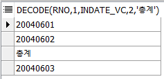
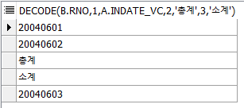
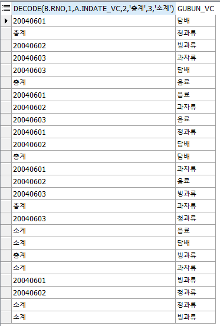
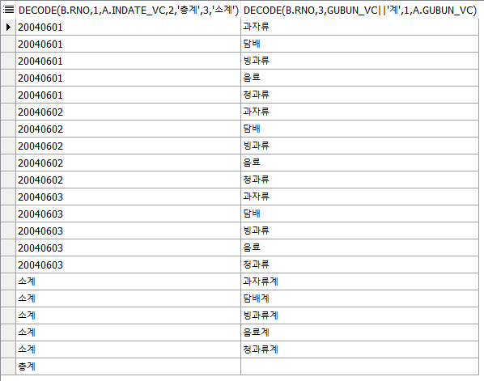

# t\_orderbasket

#### decode, sum, group by, alias, where, from, select, order by, 인라인뷰, 

## t\_orderbasket Table


## 문제 1

#### t\_orderbasket 테이블에서 분석함수를 사용하지 않고 각 날짜별로 총 몇개의 물건이 얼만큼 팔렸고 총 매출액을 얼마인지 나타내시오. 윗줄 3줄은 날짜를, 마지막 줄에는 총계를 나타내는 SQL문을 작성하시오. 


### 1단계

```sql
위 3줄은 날짜를 출력한다(중복되는 날짜는 하나만 표시)
네 번째 줄에는 날짜 대신 총계 라고 출력해야한다.어떤 경우에는 날짜를, 어떤 경우에는 총계를
경우의 수가 2가지 = if문 -> DML에서는 decode

SELECT *  FROM t_orderbasket;

SELECT indate_vc, price_nu FROM t_orderbasket;

SELECT --인라인뷰의 알리아스명을 SELECT절의  컬럼으로 사용할 수 있다. 서브쿼리는 불가능
      a,b
  FROM (SELECT indate_vc a, price_nu b FROM t_orderbasket)a --인라인뷰
  
--없는 컬럼 추가하기
SELECT rownum rno, indate_vc a, price_nu b FROM t_orderbasket; --row 54개

--카타시안의 곱, 기본꼴을 알아야한다. - 인라인뷰      
SELECT
       a.indate_vc, b.rno
  FROM (SELECT indate_vc, price_nu FROM t_orderbasket)a
        , (SELECT rownum rno FROM dept WHERE rownum<3)b --테이블이 2개, row 108개
        
--decode(if)사용
decode(b.rno,1,a.indate_vc,2,'총계')

--조립
SELECT
       decode(b.rno,1,a.indate_vc,2,'총계')
       ,a.indate_vc, b.rno
  FROM (SELECT indate_vc, price_nu FROM t_orderbasket)a
        , (SELECT rownum rno FROM dept WHERE rownum<3)b --총계가 54번 나온다.
        
SELECT
       decode(b.rno,1,a.indate_vc,2,'총계')9
  FROM (SELECT indate_vc, price_nu FROM t_orderbasket)a
        , (SELECT rownum rno FROM dept WHERE rownum<3)b
GROUP BY decode(b.rno,1,a.indate_vc,2,'총계')

--1단계 : 카타시안의 곱을 활용해 데이터 복제.
SELECT *
  FROM t_orderbasket, (SELECT rownum rno FROM dept WHERE rownum<3)--2배수, 54X2=108개 출력
```

### 2단계

```sql
--2단계 : 그룹핑
SELECT DECODE(rno,1,indate_vc,2,'총계')
  FROM t_orderbasket, (SELECT rownum rno FROM dept WHERE rownum<3)
GROUP BY DECODE(rno,1,indate_vc,2,'총계')
```

### 3단계



```sql
--3단계 : 금액계산을 위한 합 구하기
-- 공식 : 판매개수 * 개당판매가격
a.qty_nu*a.price_nu--a=t_orderbasket
```

### 4단계


```sql
--4단계 : GROUP BY절에는 GROUP BY표현식이 아닌것은 사용불가
-- 1번 : GROUP BY절에 추가한다.=효과없음
-- 2번 : 그룹함수를 사용한다.
SELECT DECODE(rno,1,indate_vc,2,'총계'), sum(a.qty_nu*a.price_nu)
  FROM t_orderbasket a, (SELECT rownum rno FROM dept WHERE rownum<3)
GROUP BY DECODE(rno,1,indate_vc,2,'총계')
```

### 4-2단계

```sql
--4단계-2 : 만일 사용자가 판매된 갯수를 알고싶어한다면?
--count를 쓰면 row의 갯수만 세므로 사과가 몇개 나갔는지는 세지지 않고, 계산 횟수만 세버린다.
--모든 판매량을 세려면 SUM을 사용해야한다.
SELECT DECODE(rno,1,indate_vc,2,'총계'), sum(a.qty_nu*a.price_nu), sum(a.qty_nu)
  FROM t_orderbasket a, (SELECT rownum rno FROM dept WHERE rownum<3)
GROUP BY DECODE(rno,1,indate_vc,2,'총계')
ORDER BY DECODE(rno,1,indate_vc,2,'총계')
```

## 문제 2

#### 아래와 같은 테이블을 출력하는 SQL문을 작성하시오.


### 1단계



```sql
--날짜 3졸류, 상품 5종류 = 15종류, 날짜 마다 5종류가 나와야한다.

SELECT * FROM t_orderbasket a, t_orderbasket b


--1단계 .
SELECT DECODE(b.rno,1,a.indate_vc,2,'총계',3,'소계')
  FROM (SELECT indate_vc, price_nu FROM t_orderbasket)a
     , (SELECT rownum rno FROM dept WHERE rownum<4)b
GROUP BY DECODE(b.rno,1,a.indate_vc,2,'총계',3,'소계')
```

### 2단계



```sql
--2단계
SELECT DECODE(b.rno,1,a.indate_vc,2,'총계',3,'소계'), gubun_vc
  FROM (SELECT indate_vc, price_nu, gubun_vc FROM t_orderbasket)a
     , (SELECT rownum rno FROM dept WHERE rownum<4)b
GROUP BY DECODE(b.rno,1,a.indate_vc,2,'총계',3,'소계'),gubun_vc
```

### 3단계

```sql
--3단계
decode(a.rno,3,gubun_vc||'계',1,a.gubun_vc)
```

### 4단계


```sql
--4단계
SELECT DECODE(b.rno,1,a.indate_vc,2,'총계',3,'소계')
      ,DECODE(b.rno,3,gubun_vc||'계',1,a.gubun_vc)
  FROM (SELECT indate_vc, price_nu, gubun_vc FROM t_orderbasket)a
     , (SELECT rownum rno FROM dept WHERE rownum<4)b
GROUP BY DECODE(b.rno,1,a.indate_vc,2,'총계',3,'소계')
        ,DECODE(b.rno,3,gubun_vc||'계',1,a.gubun_vc) 
```

### 4-2단계



```sql
--4-2단계 : 총계는 1개 row, 소계는 상품종류=5개 row 만큼만 있어야한다.
--1번 날짜 3개, 2번 총계 1개, 3번 소계 5개가 나오도록 합쳐야한다.
SELECT DECODE(b.rno,1,a.indate_vc,2,'총계',3,'소계')
     , DECODE(b.rno,3,gubun_vc||'계',1,a.gubun_vc)
  FROM (SELECT indate_vc, price_nu, gubun_vc FROM t_orderbasket)a
     , (SELECT rownum rno FROM dept WHERE rownum<4)b
GROUP BY DECODE(b.rno,1,a.indate_vc,2,'총계',3,'소계')
     ,DECODE(b.rno,3,gubun_vc||'계',1,a.gubun_vc)
ORDER BY DECODE(b.rno,1,a.indate_vc,2,'총계',3,'소계')
```

### 5단계

```sql
--5단계
SELECT DECODE(b.rno,1,a.indate_vc,2,'총계',3,'소계') as "판매날짜"
     , DECODE(b.rno,3,gubun_vc||'계',1,a.gubun_vc) as "물품구분"
     , SUM(a.qty_nu)||'개' as "판매개수"
     , SUM(a.qty_nu*a.price_nu)||'원' as "판매가격"
  FROM (SELECT indate_vc, gubun_vc, qty_nu, price_nu FROM t_orderbasket)a
     , (SELECT rownum rno FROM dept WHERE rownum<4)b
GROUP BY DECODE(b.rno,1,a.indate_vc,2,'총계',3,'소계')
     ,DECODE(b.rno,3,gubun_vc||'계',1,a.gubun_vc)
ORDER BY DECODE(b.rno,1,a.indate_vc,2,'총계',3,'소계')
```

