# 세미 프로젝트 - 영화예매

## 영화예매프로그램 만들기

* 조원 : 김호철, 이주성, 한영진
* 분야 나누기 - UI : 김호철 - EVENT : 이주성 - LOGIC & DB : 한영진







후기 : 코로나로 인해 학원도 2주를 쉬고, 수업과 복습과 병행하려니 시간이 너무 모자라 완성이나 할 수 있을까 걱정했는데 우려와 달리 깔끔하게 완성해서 만족스러운 결과이지 않은가 싶다. 엑셀 파일로 설계를 먼저 하고 진행하면서 달라지는 부분들도 많고, 테이블도 많이 수정했다. 세미 프로젝트를 진행하기전에는 DB부분을 못따라가는것 같아 걱정이였는데 프로젝트를 진행하고 나니 한결 따라가기 쉬워 많은 도움이 되었다.

## ScreenShot

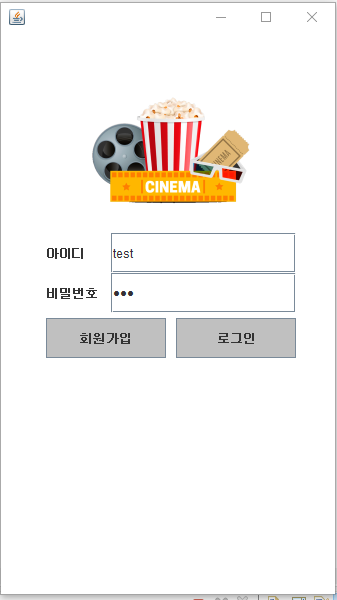

* DB 연동, NVL 중복검

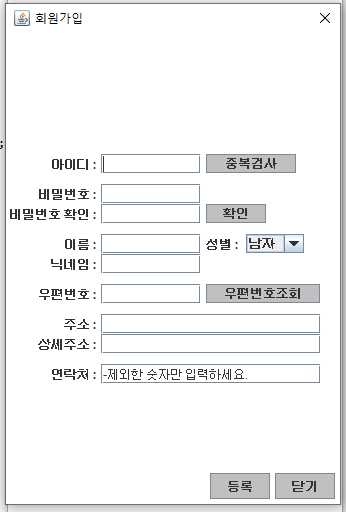

* DB연동, NVL 중복검사

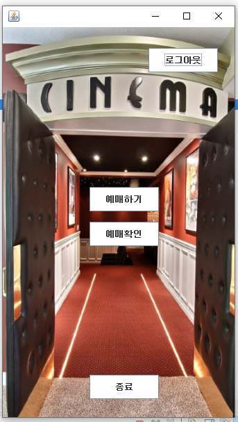

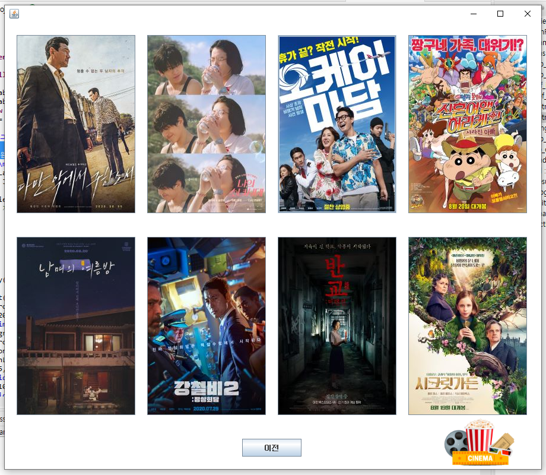

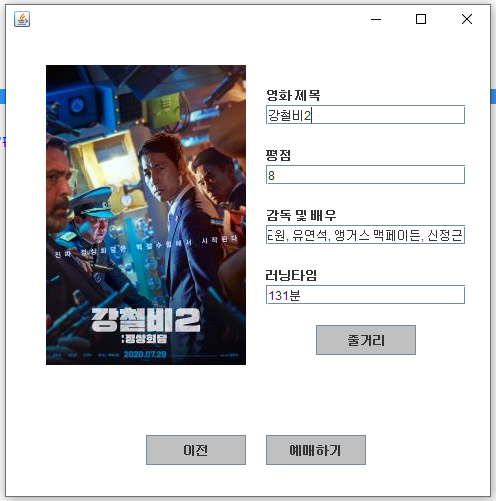

* DB연동

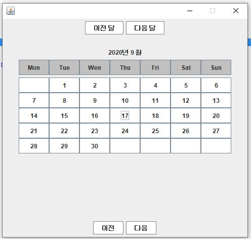

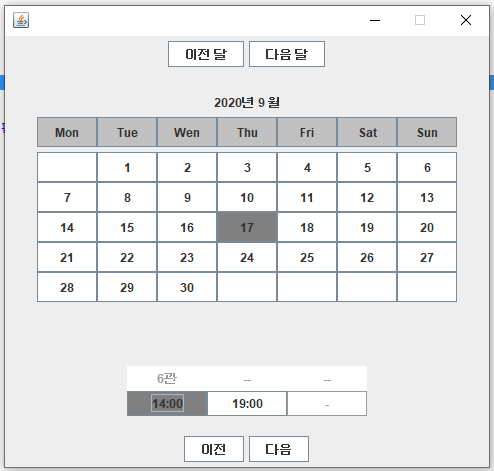

* DB연동

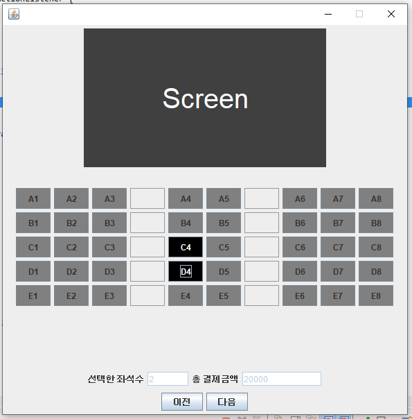

* DB연

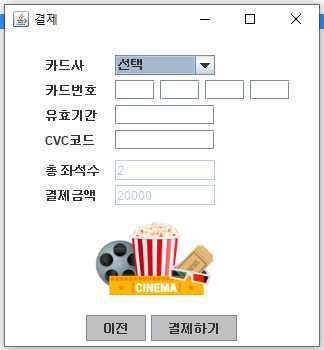

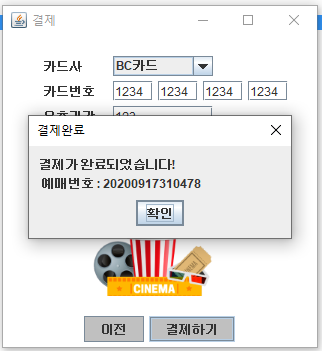

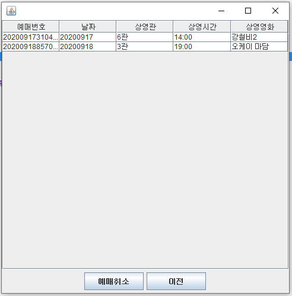

* DB연동

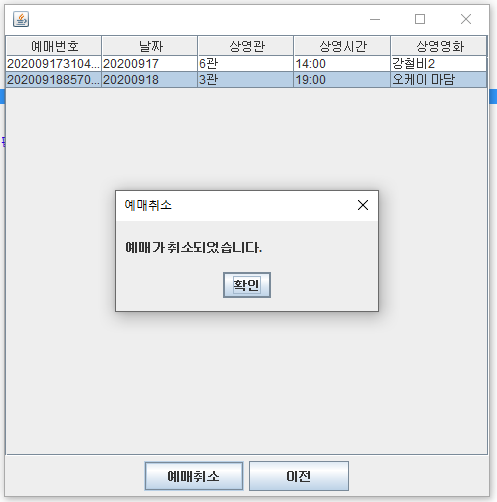

* DB연동

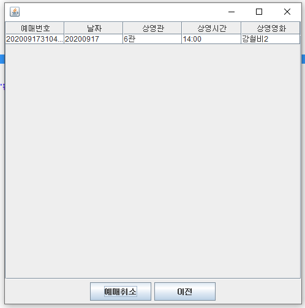

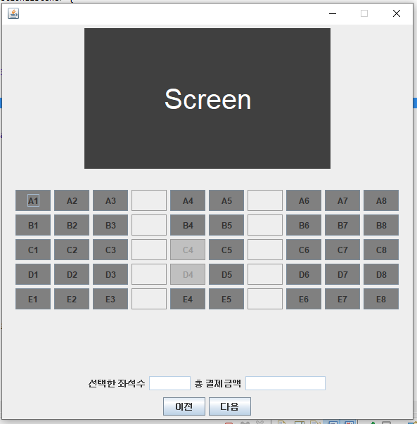

* DB연동, 중복검

