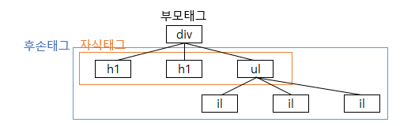

# 47 Days - JSP, Servlet, css선택자, JQuery사용,

### 사용 프로그램

* 사용언어 : JAVA\(JDK\)1.8.0\_261, JS, JQuery
* 사용Tool  - Eclipse : Eclipse.org - Toad DBA Suite for Oracle 11.5
* 사용 서버 - WAS : Tomcat

## 복습

### CSS

* HTML태그 내에 직접 사용할 수 있다. - 정적 표현 - &lt;table style = "width:60px;"&gt;
* CSS를 따로 외부에서 관리해야 동적처리가 가능해진다.

### html 객체, 선택자

* JS는 document객체를 통해 HTML노드에 접근해 브라우저에게 write한다.
* 요소 선택자는 id, name, class, tag name, 등이 있다.

### Html 작동 방식

1. 브라우저는 html로 작성된 마크업과 css로 작성된 스타일을 포함하고 있는 문서를 읽어들인다.
2. 브라우저는 페이지를 읽으면서 html마크업의 모든 요소를 포함하는 문서 내부 모델을 생성한다.
3. 브라우저는 페이지를 여는 동안 개발자가 작성한 JS코드도 읽어오는데, 이 코드는 일반적으로 페이지를 다 띄우고 난 뒤에 실행된다.
4. 여러 API덕분에 오디오, 비디오, 캔버스를 이용한 드로잉, 로컬 저장소, 그리고 애플리케이션을 구축하는데 필요한 기능을 활용할 수 있는것이다. - 마크업 + 자바스크립트 + CSS = HTML5

### JS API

* 소켓, 캔버스, 비디오, 로컬 저장소, 폼, 오디오, 지오로케이션

### JavaScript작동방식

1. 코드작성 : index.html과 index.js 같은 파일로 생성 할 수 있다.
2. 페이지 로딩 : 브라우저가 페이지 맨 위에서 아래까지 내용을 해석해 가며 보여준다. 인터프리터
3. 실행 : 자바스크립트는 계속 실행되면서 DOM을 사용해 페이지를 검사, 변경하거나 이벤트를 받거나 브라우저에게 웹 서버의 데이터를 읽도록 요청한다.

### JavaScript가 페이지와 상호작용하는 방식

* 어떻게 JS가 페이지에 있는 마크업과 상호작용을 하게 할까?

1. Html문서의 내부모델을 생성하는데 여기에는 Html 마크업의 모든 요소들이 포함되어 있다.
2. JS는 페이지의 각 요소들과 내용에 접근하기 위해 DOM과 상호작용 할 수 있으며 DOM을 사용해 요소들을 생성, 제거할 수도 있다.
3. JS가 DOM을 수정할 떄 브라우저는 동적으로 페이지를 갱신해, 사용자는 지속적으로 새로 갱신된 내용을 볼 수 있는 것이다.

## JSP, Servlet

### JSP

* HTML안에 자바코드를 사용해 동적으로 웹페이지를 생성할 수 있게 해주는 서버 쪽 페이지 - JSP파일이 요청하면 서버가 요청을 받아\(브라우저가\) 응답해야한다.
* 기존에 있던 Servlet을 내장 객체로 정리해 갖고 있어 사용이 더 편리하다.
* mime타입으로 사용언어를 구분한다. - text / teml, xml, java, css, javascript
* HTML에 작성된 java코드는 Tomcat과같은 서버가 해석해 html에 접근하는 것이다. - 인스턴스화 없이도 내장 객체 document를 이용해 html에 접근할 수 있다.

### JSP 동작방식

1. HTML\(View\)에서 브라우저에다가 JSP파일을 말하기한다. -&gt; 페이지 이동
2. JSP파일 안에서 서버에게 요청\(request\)하고, 서버가 요청을 받아 응답해야한다. - JSP의 내장객체 request - 브라우저가 url을 받아 응답해야하는데 java는 url이 없다. -&gt; servlet활용
3. WAS제품이 java코드를 해석해 브라우저에 적용되도록 해준다.
4. java코드를 작성했으므로 컴파일이 일어나고, print를 사용해 처음 화면과 다른 화면페이지에 출력된다.

* \(입구\)html이 브라우저에게 jsp호출 말하기 -&gt; 페이지 이동 -&gt; JSP이 서버에 요청, 처리 -&gt; 페이지이동 -&gt; 화면에 출력\(출구\)
* JSP - \(JSP API\) -&gt; Java - \(Servlet API\) -&gt; Class

### Servlet

### jQueryMemberShipAction.html, jsp

* 요청 객체로 사용자가 입력한 값을 읽어올 수 있다.  
  - ex\) String id = request.getParameter\("mem\_id"\);

           String pw = request.getParamenter\("mem\_pw"\);  
  - html body   
    &lt;input type="text" name="mem\_id"&gt;  
    &lt;input type="text" name="mem\_pw"&gt;

* 응답 객체로 페이지를 이동한다.
* name을 식별자로 사용해야한다.
* 값을 담기위해 배열이 필요하다. - 같은 index를 갖는 값을 담기위해 List에 담아야한다. - index보다는 key가 직관적이므로 **Map을 사용**한다.

## HTML CSS선택자

### CSS선택자

* 전체 : \(\*\)
* 아이디 : \("\#Id명"\)
* 클래스 : \(.클래스명\)
* 요소\(태그이름\) : \(요소명\)

### 자손, 후손태그

* 자손, 자식태그는 부모태그의 바로 하위 태그를 가리킨다.
* 후손태그는 부모태그의 모든 하위태그, 하위태그의 하위태그 까지 모두 가리킨다.



