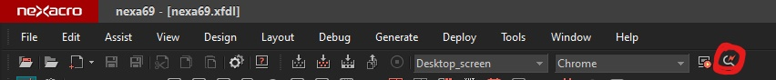
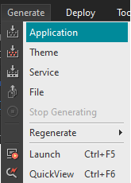

# 52 Days - combobox, table-style, API활용, nexacro화면, nexa-Eclipse연동, 내장객체,

### 사용 프로그램

* 사용언어 : JAVA\(JDK\)1.8.0\_261, JS, JQuery
* 사용Tool  - Eclipse : Eclipse.org - Toad DBA Suite for Oracle 11.5 - Visual Studio Code
* 사용 서버 - WAS : Tomcat

## 복습

### 화면

* HTML -&gt; e\(브라우저\)가 html해석 -&gt; dom 트리 구조 완료
* HTML - 처리주체 : client\(local\) - 정적 페이지 \(결정 되어있다\)
* JS -  html에게 동적 페이지 지원, 변수 지원, 함수 지원 - JS로는 화면을 그리지 않는다. 코드가 길어지므로 - JQuery를 사용해 코드를 더 줄 일 수 있다.
* CSS - html에 style지원

### 서버

* JSP, Servlet을 이용해 html과 java가 연결된다. - 처리주체 : 서버, 동적이다.\(미정\) - JSP : Servlet을 이용해 html에 자바코드를 작성 - Servlet : 자바에 html코드를 작성
* Servlet이 제공해주는 request, response객체 - 화면에 출력할 수 있는, 브라우저가 읽을 수 있게 하는 out내장객체를 지원한다.
* dataSet은 json형식을 사용

### 위치

* HTML : &lt;head&gt;, &lt;body&gt;의 차이점 - **재사용성 : &lt;head&gt;안에서 함수를 선언, &lt;body&gt;는 함수를 호출**한다. - &lt;head&gt;안에서 전역변수를 선언할 수 있다.   전역변수를 식별자\(pk\)로서 where절에 조건으로 사용할 수 있다.   global variable = member variable

### data

* Oracle - 역할 : 실질적인 DataSet - DataSet의 형태 : json, xml - Http프로토콜을 
* JAVA - 역할 : Data 수집 - SQL - DML - DTM -json, xml - 이벤트 처리 : 이벤트를 감지해 data를 꺼내와야하므로 - Servlet의 req, res객체를 주입받아 서버\(WAS\)에 DB data를 요청한다. - http통신을 지원해주는 Servlet과 JSP - 화면 - JSP - JAVA - Servlet - DB
* Servlet은 화면에 출력하려면 하나하나 out.print해야 하므로 비효율적이라 사용하지 않는다.
* Servlet기반으로 만들어진 JSP
* 화면 - 역할 : Data출력 - Http프로토콜을 이용해 조건을 전송한다. - 넥사크로같은 xml기반의 UI솔루션을 사용해 DataSet 중 xml구조를 가져와보자
* 화면에서 Data를 출력하기 위해 DB에서 Data를 꺼내오려면 JAVA를 경유해야만 한다.

## 필기

### 내장객체


* out은 브라우저의 내장객체, req,res는 WAS제품의 내장 객체
* WAS 파일의 라이브러리를 확인해보면 JSP, Servelet엔진이 들어 있음을 알 수 있다. - WAS가 req, res내장객체를 지원한다. - WAS가 JSP - JAVA - Servlet소통을 지원한다.
* jar : 서버에 배포하는 파일 - class덩어리 - JAVA자체를 배포해버리면 정보, 주석 등이 노출되어 버린다.
* jsp = html, xml, json타입을 담을 수 있는 파일

### myBatis - HTML, JSP 연동 주의사항

* NullPointerException발생시

1. WEB-INF / lib아래 ojdbc6.jar 와 myBatis.jar가 존재하더라도 반드시 build path메뉴에서 두개의 jar파일을 등록해 줄 것.
2. Configuration.xml 파일에서 드라이버 클래스 명이나 계정 정보, 서버의 IP주소, 포트번호가 일치하는지 반드시 확인 할 것.

## API활용

### API 사용

* API를 사용하려면 해당 API의 jar파일을 부여해주어야 한다. - WEB-INF의 lib폴더 안에 배치, 사용시 import, link - myBatis.jar, ojdbcd.jar, log4j.jar, ......
* API에서 제공하는 class들은 변수, 메서드를 갖는다. - 비슷한 계열의 class들은 같이 살펴본다 합쳐서 응용 활용할 수 있다.
* API에서 제공하는 함수를 사용할때에는 파라미터를 확인한다.

### UI/UX솔루션

* 스크립트 기반 UI : 넥사크로, easyui, 시맨틱UI, 부트스트랩 등 - XML기반 : 넥사크로, 안드로이드 등 - JS기반 : easyui, 부트스트랩, 시맨틱UI 등
* 솔루션을 잘 사용하기위해서 API를 보고 활용해야한다.

### 스크립트 API활용

* $\("\#아이디"\).객체이름\( \); - ID의 객체를 구체화시켜준다. - &lt;body&gt;의 해당 id 태그의 객체를 JS가 구체화 시킨다.
* $\("\#아이디"\).객체이름\( { } \); - 구현문 
* $\("\#아이디"\).객체이름\( 메서드이름, 값 \); - 열거형
* $\("\#아이디"\).객체이름\( { 속성명:값, 속성명: } \);
* $\("\#아이디"\).객체이름\( { 속성명:값, 속성명:값, 이벤트명:function\( \){ } } \);  - 이벤트까지 장착 가능
* $ = JQuery제공, **API를 부여하기위해 ID에 접근하려면 JS\(JQuery\)가 필요**하다. - id : html문서 내에 유일한 값으로 식별자로서 사용됨 - name : html문서 내에 중복 부여 가능한 값으로 배열로 사용할떄 사용됨

### 태그에 UI/UX솔루션 class 부여

* &lt;태그 class="접두어\(제공자\)-제공 클래스이름&gt; - &lt;input class="easyiui-dategrid&gt;
* JS에서 해당 태그에 접근할때 객체를 붙여 구체화 시켜준다.

### 태그 속성 우선

* 더 가까운, 더 나중에 부여된 속성이 적용된다. - &lt;tr width="300px"&gt; &lt;td width="200px"&gt;&lt;/td&gt;&lt;/tr&gt;   td의 width속성이 부여된다.

## empManager : table에 style부여

### 기존 화면


```markup
<table border="0" width="100%">
<!-- 조건 검색 화면 시작 -->
	<tr>
		<td>
			<table>
				<tr>
					<td>
						<input id="nb_empno" class="easyui-numberbox" value="0">
						<input id="nb_sal" 	class="easyui-numberbox" value="0"	 data-options="groupSeparator:','"></td>
						<input id="dd_hiredate" label="입사일자 : " class="easyui-datebox"   value="today" required="required" style="width:200px">
					</td>
				</tr>
			</table>			
		</td>		
	</tr>
<!-- 조건 검색 화면 끝 -->
</table>
```

* 기존 화면

### 스타일 적용화면


```markup
<table border="0" width="100%">
	<tr>
		<td>
			<table>
				<tr>
					<td width="300px">
						<label width="100px">사원번호 : </label>
						<input id="nb_empno" class="easyui-numberbox" value="0">
					</td>
					<td width="300px">
						<label width="100px">연봉 : </label>
						<input id="nb_sal" 	class="easyui-numberbox" value="0"	 data-options="groupSeparator:','">
					</td>
					<td width="300px">					
						<input id="dd_hiredate" label="입사일자 : " class="easyui-datebox"   value="today" required="required" style="width:200px">
					</td>
				</tr>
			</table>			
		</td>		
	</tr>
</table>
```

* 스타일과 여백을 주기위해 각 input태그를 &lt;td&gt;태그로 묶었다.

## API활용 : easyui - combobox

### combobox

* easyui제공 : [http://jeasyui.com/documentation/index.php\#](http://jeasyui.com/documentation/index.php#)


```markup
<body>
	<script type="text/javascript">
   		$(document).ready(function(){	   		 		
	   		$("#cb_search").combobox({
	   			//url:'../../cbsample.json'//xxx.jsp or xxx.do()
	   			data: [
	   				{code:11, subject:'java'},
	   				{code:22, subject:'html', selected:true},
	   				{code:33, subject:'javascript'},
	   				{code:44, subject:'css'}
	   			],
	   			onChange:function(){
	   				g_gubun = $("#cb_search").combobox('getValue');
	   				alert(""+g_gubun);//찍히는 값이 valueField일까 textField일까
	   				//'getValue'이므로 valueField값이 나올 것이다. id 값
	   				//textField가 출력되는 것이라면 text값 'java'등이 출력될 것이다.
	   			}////end of onChange 
	   		});////////end of combobox
   		});
    </script>
    <!-- combo box -->
    <!-- id와 name은 이름이 같아도 속성이 달라 같은 이름으로 선언, 사용해도 충돌이 일어나지 않는다. -->
    <input id="cb_search" class="easyui-combobox" name="cb_search"
    	   data-options="valueField:'code',textField:'subject'">
    <br>     
</body>
</html>
```

## 넥사크로

### Front-End

* xml기반의 UI/UX솔루션 - Web2.0 - DataSet객체를 별도 제공\(별도의 타입 제공\) - 마이플랫폼, 넥사크로, 엑스플랫폼, 트러스 폼 등
* Javascript기반의 API - 오픈소스 - DataSet객체를 제공하지 않는다. - JSON출력 내용\(스크립트를 이용해 잘라 사용하거나 필요한 정보만 찾아 활용\)

### 프로젝트 생성하기

* File - New - 이름지정 - Frame지정 - 화면 template설정 
* Form 생성하기 - Base폴더 - File - Form

### nexa화면 살펴보기




### Eclipse와 동기화 





1. nexacro - Tools - Options - Generate - 경로버튼 - 사용할 Eclipse의 프로젝트 폴더와 같은 위치 지정 - 기존의 Eclipse파일 밑에 Base폴더에 js확장자 파일이 생긴것을 알 수 있다.
2. nexacro - 동기화할 파일 실행 - URL저장 - 사용할 Eclipse jsp파일에 url입력 후 열어보기 - ulr경로 ip, port번호 수정 -&gt; 파일 경로 추가 
3. 이제 nexacro에서 작업하고, 저장한뒤 Generate - Application을 클릭하면 Eclipse와 동기화된다.
4. 넥사크로 라이센스를 Eclipse 프로젝트 파일의 WEB\_INF파일의 calsses파일에 배포한다. 

### nexa - Eclipse Jsp파일 호출하기

* Nexacro - TypeDefinition - Services PrefixID 추가\(SvcURL\)
* URL에 Eclipse에서 작성한 JSP파일 경로 작성 - ok  - URL : ip, port번호/프로젝트파일이름/파일이름

## PrintJson - DB연결, JSON, JSP

### Web.xml

```markup
<?xml version="1.0" encoding="UTF-8"?>
<web-app xmlns:xsi="http://www.w3.org/2001/XMLSchema-instance" xmlns="http://xmlns.jcp.org/xml/ns/javaee" xsi:schemaLocation="http://xmlns.jcp.org/xml/ns/javaee http://xmlns.jcp.org/xml/ns/javaee/web-app_4_0.xsd" id="WebApp_ID" version="4.0">
<!-- 
sever.xml은 톰캣서버가 기동할떄 디폴트, 기본으로 읽게되는데
xml의 규칙 내에서 포트번호를 결정하고 프로젝트를 배치한다. 
-->
<!-- log4j 환경파일 등록하기 서버가 기동된 동안에는 계속 유지된다. -->
	<context-param>
		<param-name>log4jConfigLocation</param-name><!-- 객체주입 -->
		<param-value>/WEB-INF/classes/log4j.properties</param-value><!-- 톰캣서버가 읽을 수 있게 한다. -->
	</context-param>
<!-- DD파일(Deployment Discriptor) = 배치서술자 -->
	<servlet>
		<servlet-name>commonJSON</servlet-name>
		<servlet-class>com.util.PrintJson</servlet-class>
	</servlet>
	<servlet-mapping>
		<servlet-name>commonJSON</servlet-name>
		<url-pattern>/common/toJson.do</url-pattern><!-- url -->
		<!-- 웹서비스를 할때에 자바를 인스턴스화할 수 없으므로 url로 접근한다. 이를 위해 xml dd파일에 url을 생성해야한다. -->
	</servlet-mapping>
</web-app>
```

* 배치서술자\(dd파일\)
* 로그, 한글처리 설정
* 클래스 정보 등록 : 객체주입을 자동으로 받기 위함
* WAS서버가 기동 될때 제일 먼저 스캔하는 파일
* 파일이 수정되었을 경우 반드시 서버를 재 기동 해야 반영된다.
* 서블릿 클래스를 web.xml에 등록할떄 사용하는 태그 - &lt;servlet&gt; &lt;servlet-class&gt;
* 서블릿을 브라우저에서 호출할떄 등록해야하는 태그  - &lt;servlet-mapping&gt; &lt;url-pattern&gt;

### import, build path, jar배포

* 사용될 jar파일을 해당 프로젝트의 WEB-INF의 lib폴더 안에 배포한다.
* 해당 프로젝트의 build path 라이브러리에 해당 프로젝트가 갖고있는 jar를 add한다. - 다른 프로젝트의 것을 가져오면 읽지 못함 - ClassNotFoundException, NullPointerException
* Configuration.xml mybatis.jar, ojdbc6.jar, log4j.jar
* 서블릿 등록시 Web.xml문서에서 읽는 순서는 url-pattern이 등록된 부분부터 먼저 읽고, 그 안에 등록된 서블릿이름으로 &lt;servlet&gt;태그를 찾는다. - 따라서 서블릿 이름을 서로 다르게 입력할 경우 에러 발생

후기 : 건조해..

