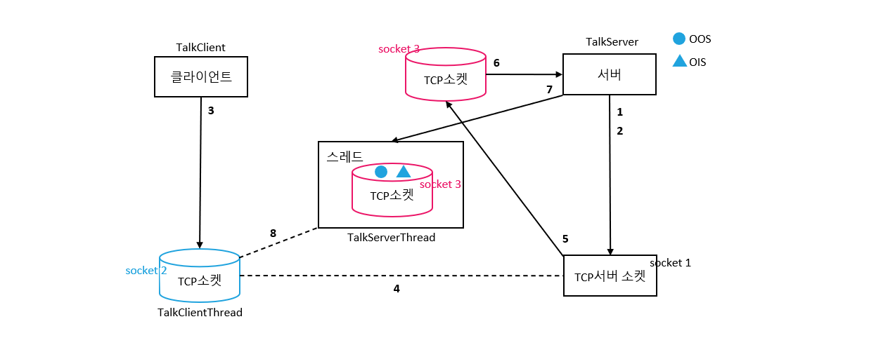
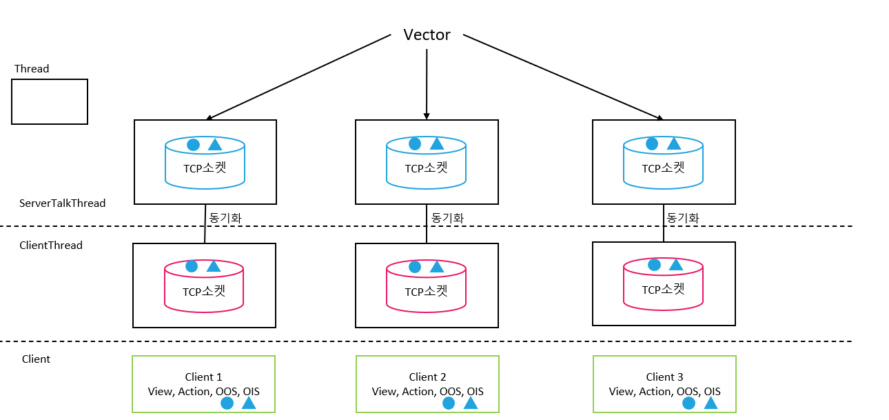

# 31 Days - Thread-revel2, Tokenizer, swicth-default, label, 로그인-프로시저

### 사용 프로그램

* 사용언어 : JAVA\(JDK\)1.8.0\_261 : Oracle.com
* 사용Tool  - Eclipse : Eclipse.org - Toad DBA Suite for Oracle 11.5

## 복습

### List

* List는 인터페이스이므로 new List로 생성될 수 없다. 구현클래스가 필요하다.
* 추상메서드는 { }, 실행문이 없다.
* Vector와 ArrayList가 있다.

### Thread

* 멀티스레드 : Vector     : TalkServer
* 싱글스레드 : ArrayList : TalkClient
* 서로 다른 모든 스레드들을 stack에 따로 저장하여 제어, 관리한다.

### if

* 양방향 서비스, 소통 함수

### run-start\( \)

* start함수와 run함수 사이에는 내부적으로 일어나는 작용이 있어 run메서드를 직접 호출해서 실행시키지 않는다.
* 호출 해주는 주체 : JVM

### Procedure



## TalkServer - level 1

### TalkServer-Thread

* TalkServer에서 서버소켓이 생성되고, 접속이 일어나 accept가 되기 전까지는 대기 상태에 빠진다.
* run메서드가 먼저 불리면, 화면은 실행되지 않을 수 있다.
* 따로 동시에 실행하기 위해 thread를 부여한다. - thread 1 : main-initDisplay\( \)   thread 2 : run\( \) - stack에 thread가 두 개 따로 저장된다. = 각자 관리하는 메모리 영역이 다르다.
* 모든 thread는 소유권\(key\)를 갖는다.

### 순서 도식화

1. 서버소켓 생성 후 대기 --소켓1 - ServerSocket\(port\) : 자신에게 port번호를 부여해 대문을 열어둔다.
2. 접속 준비 후 대기 - 접속 준비 : accept - TalkClient에서 접속발생시 진행된다.
3. 클라이언트 소켓 생성 --소켓2 - Socket\(ip, port\) : 접속할 서버의 ip, port번호를 담는다.
4. 소켓2와 소켓1이 접속되면서 소통할수 있는 채널이 열린다. - 서버소켓에는 port가 두개 존재한다. - port1\(local port\) : 서버의 대문 - port2 : 클라이언트의 소켓과의 채널이 생성되는 port - port2번의 채널이 열리면 정보수집이 가능해지므로 서버가 클라이언트의ip, port번호 를 알 수있게되어 관리가 가능해진다.
5. 서버에서 클라이언트 정보를 담는 소켓을 생성한다. --소켓3
6. 클라이언트의 정보를 담은 소켓3을 리턴한다. - =accept가 진행되었다.
7. 정보를 담은 소켓3에 thread를 부여해서 oos, ois를 구현해주고 데이터를  지속, 유지시킨다. - 여러 Socket을 관리하기 위해 접속 Socket마다 주소번지가 다른 thread를 복제, 부여한다.
8. 소켓3과 소켓2 사이에 채널이 열린다.  - 소켓3은 oos.writeObject함수를 이용해 말한다.

### Socket의 oos, ois구현

* Server에서는 각각의 클라이언트 정보를 유지시켜야하고, 접속자에 따라 갯수가 유동적이여야 한다. - Vector

## BandServer - Level 2

### 구분번호

* 입력된 대화나 버튼, 등의 행위를 구분하려면 구분 번호를 부여하는것이 좋다.
* 100\# : 입장
* 200\# : 다자간대화 : 200\#닉네임\#입력내용
* 300\# : 대화명변경 : 300\#현재닉네임\#변경닉네임\#변경알림문
* 400\# : 이모티콘
* 500\# : 종
* \# : 구분자, 토큰의 역할 - 자바 API중 StringTokenizer클래스를 이요한다.

### StringTokenizer

* 문자를 쪼개주는 클래스
* **StringToken st = new StringToken\(처리할 Object, 구분자\);**
* st.nextToken\( \);으로 값을 빼온다, 값이 없으면 false를 반환하는 메서드
* st.hasMoreElements\(\), 다음 값이 남아있으면 true를 반환하는 메서드

### switch문 단위테스트

* default 사용
* switch의 조건다음 구현문에 바로 default: 하면 case없이도 단위테스트가 가능하다.
* ex\) switch\(조건\) { dafault : System.out.println\( \) } 

### 프로시저

* 파라미터를 통해 값을 넘길수 있고 반환값이 존재한다.
*  파라미터를 통해 소통이 가능 : IN, OUT예약어
*  업무처리에 효과적이다.
*  if문, 반복문, 변수선언, 배열 모두 사용가능
*  commit, rollback 가능

### 함수

* MAX\( \), MOD\( \), ...
* SELECT절과 FROM절 사이에 사용가능

### 트리거

* 자동으로 백업, 동기화해주는 기능
* DML\(SIUD\)문 에서 사용 불가능

### 로그인구현

1. 프로시저 생성 : Toad와 CMD로 프로시저를 구현하고 실행시켜본다.
2. 로그인 버튼이 눌리면 Dao클래스를 호출한다.
3. Dao클래스에서 sql문 대신 PL/SQL문으로 프로시저를 호출한다.
4. 로그인이 성공하면 Client화면과 동기화한다.





### 대화 구현

1. 로그인이 이루어지면 모든 접속자들 간에 대화가 가능해야한다.
2. client클래스의 입력창에서 입력받은 대화내용을 server에 말한다. - 200번 구분번호 이용
3. serverThread클래스의 run메서드 에서 구현 - StringTokenizer로 구분번호, 닉네임, 대화내용을 추출하고 지정된 말하기를 진행한다. - String타입이여야 StringToken을 사용할 수 있으므로 Object타입을 형전환한다. - 현재 접속자 모두가 볼 수 있어야 하므로 broadCasting메서드를 이용한다.
4. clientThread클래스에서 듣고 화면에 대화를 출력한다.

### 나가기 구현

1. client클래스에서 나가기 버튼의 이벤트를 감지한다. - actionPerformed - 500번 구분번호이용
2. serverThread클래스의 run메서드에서 구현 - 대화구현과 비슷하지만 나가는 '나'를 제외한 모두에게 메세지를 말해야한다. - List의 remove 함수를 이용해 '나'를 제외한다. - broadCasting을 이용해 '나'를 제외한 모두에게 메세지를 말한다. - switch문의 마지막에 라벨을 사용해 나간 '나'는 while문을 종료시킨다.
3. clientThread클래스의 run메서드에서 구현 - 메세지를 듣고 화면에 출력한다. - 화면의 대화명이 나타나는 JTable의 해당 dtm데이터는 삭제해야한다. - 퇴장하는 사람이 계속 변하고, 여러명이므로 for문을 사용









후기 : 채팅방에서 사람이 나가는것으로 끝이 아니고, 나가는 사람을 데이터에서 제거하고, 남은 사람들에게 안내메세지를 보내고, 화면에서도 나간 사람을 지워야하는 수많은 작업이 필요함을 알게 되었다. 카카오톡의 기능에 대해 생각해보게되는 수업시간을 보냈다.

