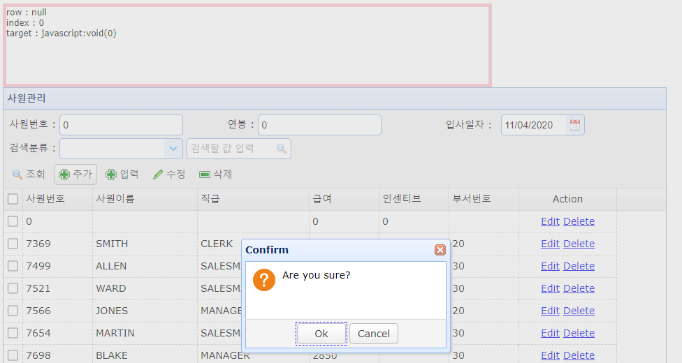

# empManagerFtype.jsp - checkbox, dialog, Edit

## empManagerFtype.jsp

```markup
<%@ page language="java" contentType="text/html; charset=UTF-8"
    pageEncoding="UTF-8"%>
<!DOCTYPE html>
<html>
<head>
<meta charset="UTF-8">
<title>사원관리(empManagerDType.html)</title>
<!-- 공통코드 추가 시작 
나중에는 이것들을 include를 사용해서 한 줄 추가로 하면 좋을거 같아요.-->
    <link rel="stylesheet" type="text/css" href="https://www.jeasyui.com/easyui/themes/default/easyui.css">
    <link rel="stylesheet" type="text/css" href="https://www.jeasyui.com/easyui/themes/icon.css">
    <link rel="stylesheet" type="text/css" href="https://www.jeasyui.com/easyui/themes/color.css">
    <link rel="stylesheet" type="text/css" href="https://www.jeasyui.com/easyui/demo/demo.css">
    <script type="text/javascript" src="https://www.jeasyui.com/easyui/jquery.min.js"></script>
    <script type="text/javascript" src="https://www.jeasyui.com/easyui/jquery.easyui.min.js"></script>
    <style type="text/css">        
       #d_msg {
          border: 5px solid pink;
          width: 700px;
          height: 120px;
       }
    </style>
<!-- 공통코드 추가   끝  -->
   <script type="text/javascript">
       var v_date;//사용자가 선택한 날짜 정보를 담을 변수 선언.  
       var test;
       var editIndex = undefined;
       
       function getEmpList(){
    	   $("#dg_emp").datagrid({
               url: "../../getEmpList2.jsp" });
       }
       function addEmp(){
    	   insert();
    	   $("#dlg_empINS").dialog({
	   			closed: false
   				,title: '입력'
   				,modal: true//배경, 뒷 화면 비활성화
   		   });
       }   
       function endEditing(){
            if (editIndex == undefined){return true}
            if ($('#dg_emp').datagrid('validateRow', editIndex)){
                $('#dg_emp').datagrid('endEdit', editIndex);
                editIndex = undefined;
                return true;
            } else {
                return false;
            }
        }
        function onClickCell(index, field){
            if (editIndex != index){
                if (endEditing()){
                    $('#dg_emp').datagrid('selectRow', index)
                            .datagrid('beginEdit', index);
                    var ed = $('#dg_emp').datagrid('getEditor', {index:index,field:field});
                    if (ed){
                        ($(ed.target).data('textbox') ? $(ed.target).textbox('textbox') : $(ed.target)).focus();
                    }
                    editIndex = index;
                } else {
                    setTimeout(function(){
                        $('#dg_emp').datagrid('selectRow', editIndex);
                    },0);
                }
            }
        }
        function onEndEdit(index, row){
            var ed = $(this).datagrid('getEditor', {
                index: index,
                field: 'EMPNO'
            });
           // row.DEPTNO = $(ed.target).combobox('getText');
        }
        /* param1 : 사용자가 searchbox에 입력한 값
        *  param2 : sreachbox에 등록한 name값, JSP나 서블릿에서 사용자가 입력한 값을 요청할때 사용한다.
        *  -> request.getParameter("sb_keyword")
        */
        function empSearch(){   	 
            $("#dg_emp").datagrid({            	
            url:'../../getEmpList2.jsp?cols='+$("#cb_search").val()+"&keyword="+$("#sb_keyword").val()//name을 쿼리스트링으로 넘긴다.
            ,onLoadSuccess:function(temp){            		
            	var result = JSON.stringify(temp);   
   			 	    alert("onload....."+result);
            	var test = result.split('"rows":',2);
            	var test2 = test[1].substring(0,test[1].length-1);
   			 	    alert("onload....."+test2); 
   			 	    var result2 = JSON.parse(test2);
   			 	    alert("onload....."+result2[0].ENAME);    			 		
   			    }		
            });
        }
        //너 조회할거야?
        function empList(){
           $("#d_msg").append("empList호출 성공<br>");
           $("#dg_emp").datagrid({
              url: "../emp.json"/* 서버의 이전이나 소스의 재사용성을 고려하여 상대경로로 작성할것. */    
           });         
        }  
        //////////////////////////////[[데이터그리드 입력|수정|삭제 구현]]//////////////////////////////////////
       	function empUpdate(){
    	   //$.messeger.progress();
    	    $("#dlg_empUPD").dialog('open')
        }
       	function insert(){
			    var row = $('#dg_emp').datagrid('getSelected');//선택한 row의 번호를 가져온다.=tbody
			    $("#d_msg").append('row : '+row+'<br>');//단위테스트용
			    if (row){//row = 0~n, row가 true라면, row를 선택했다면
				    var index = $('#dg_emp').datagrid('getRowIndex', row);
			    } else {
				    index = 0;
			    }
			    $('#dg_emp').datagrid('insertRow', {
				    index: index,
				    //넥사크로 DataSet header꾸미기와 유사
				    row: {
				    	 CK:0
					    ,EMPNO:0
					    ,ENAME:''
					    ,JOB:''
					    ,SAL:0.0
					    ,COMM:0.0
					    ,DETPNO:''
				 }
			 });
			 $("#d_msg").append('index : '+index+'<br>');
			 $('#dg_emp').datagrid('selectRow',index);
			 $('#dg_emp').datagrid('beginEdit',index);
		 }
        function getRowIndex(target){
			$("#d_msg").append('target : '+target+'<br>');
        	var tr = $(target).closest('tr.datagrid-row');
        	return parseInt(tr.attr('datagrid-row-index'));
        }
       	function editrow(target){
       	    $('#dg_emp').datagrid('beginEdit', getRowIndex(target));
       	}
       	function deleterow(target){
       	    $.messager.confirm('Confirm','Are you sure?',function(r){
       	        if (r){
       	            $('#dg_emp').datagrid('deleteRow', getRowIndex(target));
					$("#d_msg").append('지정 row : '+getRowIndex(target)+'<br>');
       	        }
       	    });
       	}
       	function saverow(target){
       	    $('#dg_emp').datagrid('endEdit', getRowIndex(target));
       	}
       	function cancelrow(target){
       	    $('#dg_emp').datagrid('cancelEdit', getRowIndex(target));
       	}
       //////////////////////////////[[데이터그리드 입력|수정|삭제 구현]]//////////////////////////////////////
   </script>
</head>
<body>
<script type="text/javascript">   
   $(document).ready(function (){
	  //2.콤보박스 초기화 및 설정
	  $("#cb_search").combobox({
		  data:[
			   {cols:'empno', label:'사원번호'}
			  ,{cols:'ename', label:'사원이름'}
			  ,{cols:'sal'  , label:'급여'}
		  ]
	  	 ,onSelect:function(rec){//콥보박스에서 선택했을떄 @param:object로서 row의 주소번지를 갖는다. row.empno, row.ename
	  		alert('당신이 선택한 검색조건은 '+rec.cols);
			//var url = '../../getEmpList2.jsp?cols='+rec.cols;
			test=rec.cols;
	  	 }
	  });
	   
      //1.datagrid에 대한 초기화
	   $("#dg_emp").datagrid({
            toolbar:'#tb_emp'
            ,columns:[[
        	   	{field:'CK'      , checkbox:true , width:50 , align:'center'}
        	   ,{field:'EMPNO'   , title:'사원번호', width:100, editor:'text'}
        	   ,{field:'ENAME'	 , title:'사원이름', width:150, editor:'text'}
        	   ,{field:'JOB'	 , title:'직급'   , width:160, editor:'text'}
        	   ,{field:'MGR'     , title:'그룹번호', width:100, editor:'text', hidden:'true'}
        	   ,{field:'SAL'     , title:'급여'   , width:100, editor:'text'}
        	   ,{field:'HIREDATE', title:'입사일자', width:100, editor:'text', hidden:'true'}
        	   ,{field:'COMM'    , title:'인센티브', width:100, editor:'text'}
        	   ,{field:'DEPTNO'  , title:'부서번호', width:100,
        	   	  editor:{
			  		 type:'combobox'
			  		 ,options:{
			  				 valueField:'deptno'//실제 서버에 넘어가는 필드
			  				,textField:'dname'
			  				,data:'deptno'
			  				//,method:'post' easyui를 사용해 기본이 post
			  				,url:'../dept.json'
			  	 	 		}
			   		 }
				 }
        	   ,{field:'action',title:'Action',width:140,align:'center',
                   formatter:function(value,row,index){
                       if (row.editing){
                           var s = '<a href="javascript:void(0)" onclick="saverow(this)">Save</a> ';
                           var c = '<a href="javascript:void(0)" onclick="cancelrow(this)">Cancel</a>';
                           return s+c;
                       } else {
                           var e = '<a href="javascript:void(0)" onclick="editrow(this)">Edit</a> ';
                           var d = '<a href="javascript:void(0)" onclick="deleterow(this)">Delete</a>';
                           return e+d;
                       }
                   }
               }
           ]]
       	   //////////////////////////////////////////[[데이터그리드 이벤트핸들러]]/////////////////////////////////////////////////
      	  /*
       	   ,onEndEdit:function(index,row){
            	var ed = $(this).datagrid('getEditor', {
               	 index: index,
               	 field: 'productid'
           	 });
           	 row.productname = $(ed.target).combobox('getText');
       	  }*/
      	 ,onBeforeEdit:function(index,row){
           	 	row.editing = true;
            	$(this).datagrid('refreshRow', index);
         }
         ,onAfterEdit:function(index,row){
          		row.editing = false;
            	$(this).datagrid('refreshRow', index);
         }
         ,onCancelEdit:function(index,row){
          		row.editing = false;
            	$(this).datagrid('refreshRow', index);
        }
       	   //////////////////////////////////////////[[데이터그리드 이벤트핸들러]]/////////////////////////////////////////////////
        });
   });
</script>
<!-- 이 페이지에 대한 에러 메시지나 힌트문을 출력하자. -->
<div id="d_msg"></div>
<!------------------------------------------------------ 툴바 추가 시작 ---------------------------------------------------------------->
<div id="tb_emp">
<table border="0" width="100%">
	<tr>
		<td>
			<table>
				<tr>
					<td width="300px">
						<label width="100px">사원번호 : </label>
						<input id="nb_empno" class="easyui-numberbox" value="0">
					</td>
					<td width="300px">
						<label width="100px">연봉 : </label>
						<input id="nb_sal" 	class="easyui-numberbox" value="0"	 data-options="groupSeparator:','">
					</td>
					<td width="300px">					
						<input id="dd_hiredate" label="입사일자 : " class="easyui-datebox"   value="today" required="required" style="width:200px">
					</td>
				</tr>
					<!-- combobox추가 (위치선택 -> 공간확보 -> 코드작성,추가) 이름|job|부서번호 -->
				<tr>
					<!--------------------추가 ----------------------->
					<td width="1000px" colspan="3">
						<label width="100px">검색분류 : </label>
						<input id="cb_search" class="easyui-combobox" data-options="
        					valueField: 'cols',
        					textField: 'label'
        					">
						<input id="sb_keyword" name="sb_keyword" class="easyui-searchbox" style="width:150px" 
							   data-options="searcher:empSearch,prompt:'검색할 값 입력'"></input>				
					</td>					
					<!-------------------- 끝 ----------------------->
				</tr>
			</table>			
		</td>		
	</tr>
<!-- 조건 검색 화면 끝 -->

<!-- 업무관련 버튼 추가 시작 -->
	<tr>
		<td>
			<!-- 사원목록 툴바 추가 -->
			<a href="javascript:void(0)" class="easyui-linkbutton" iconCls="icon-search" plain="true" onclick="getEmpList()">조회</a>
			<a href="javascript:void(0)" class="easyui-linkbutton" iconCls="icon-add"    onclick="insert()">추가</a>
			<a href="javascript:void(0)" class="easyui-linkbutton" iconCls="icon-add" plain="true" onclick="addEmp()">입력</a>
			<a href="javascript:void(0)" class="easyui-linkbutton" iconCls="icon-edit"   plain="true" onclick="empUpdate()">수정</a>
			<a href="javascript:void(0)" class="easyui-linkbutton" iconCls="icon-remove" plain="true" onclick="removeEmp()">삭제</a>
			<!-- 사원목록 툴바 추가 끝 -->
		</td>
	</tr>
</table>
</div>
<!------------------------------------------------------------[[ 툴바 추가 끝 ]]---------------------------------------------------------------------------->
<table id="dg_emp" class="easyui-datagrid" width="950" title="사원관리" data-options="onDblClickRow:function(index,row){var ename=row.ENAME}"><!-- index=몇번째row row=어떤 값 -->
</table>

<!--------------------------------------------------------- [[사원카드 등록하기 시작]] -------------------------------------------------------------------------->
<div id="dlg_empINS" class="easyui-dialog" data-options="closed:true, title:'사원정보 등록'">
	<form id="f_empINS">
		
	</form>
	<div>
	
	</div>
</div>
<!---------------------------------------------------------- [[사원카드 등록하기 끝]] -------------------------------------------------------------------------->

<!--------------------------------------------------------- [[사원카드 수정하기 시작]] -------------------------------------------------------------------------->
<div id="dlg_empUPD" class="easyui-dialog" style="width:500px; padding:30px 30px;" data-options="closed:true, title:'사원정보 수정', footer:'#d_upd'">
	<form id="f_empUPD">
		 <div style="margin-bottom:10px">
         	<input class="easyui-numberbox" id="u_empno" name="empno" label="사원번호" data-options="prompt:'Enter a EmpNO'" style="width:150px">
         </div>
         <div style="margin-bottom:10px">
         	<input class="easyui-textbox" id="u_ename" name="ename" label="사원명" data-options="prompt:'Enter a ENAME'" style="width:250px">
         </div>
         <div style="margin-bottom:10px">
         	<input class="easyui-textbox" id="u_job" name="job" label="JOB" data-options="prompt:'Enter a JOB'" style="width:250px">
         </div>
         <div style="margin-bottom:10px">
         	<input class="easyui-textbox" id="u_hiredate" name="hiredate" label="입사일자" data-options="prompt:'Enter a 입사일자'" style="width:250px">
         </div>
         <div style="margin-bottom:10px">
         	<input class="easyui-numberbox" id="u_sal" name="sal" label="급여" data-options="prompt:'Enter a 급여'" style="width:250px">
         </div>         
         <div style="margin-bottom:10px">
         	<input class="easyui-numberbox" id="u_comm" name="comm" label="인센티브"  data-options="prompt:'Enter a 인센티브'" style="width:250px">
         </div>         
         <div style="margin-bottom:10px">
         	<input class="easyui-combobox" id="u_deptno" name="deptno" label="부서번호" style="width:250px"
          		   data-options="prompt:'Enter a 부서번호'
                      			,valueField: 'DEPTNO'
                        		,textField: 'DNAME'
                         		,url: '../../getDeptList.jsp'
                         		,onSelect: function(rec){
                   				 }" 
         >
         </div>         
          <div style="margin-bottom:10px">
         	<input class="easyui-textbox" id="zipcode" name="zipcode" label="우편번호"  data-options="prompt:'Enter a ZIPCODE'" style="width:160px">
         	<a id="btn_zipcode" href="#" class="easyui-linkbutton">우편번호찾기</a>
         </div>

         <div style="margin-bottom:10px">
         	<input class="easyui-textbox" id="mem_addr" name="mem_addr" label="주소"  data-options="prompt:'Enter a ADDRESS'" style="width:420px">
         </div> 
	</form>
	<div>
		<!-- 저장과 닫기버튼 추가 -->
    	<!-- a태그는 문단이동(스크롤바 없이 특정문단으로 이동), link, JS함수호출 가능 -->
		<div id="d_upd" style="margin-top:10px; margin-bottom:5px;" align="right">   
      		<a href="javascript:updAction()" class="easyui-linkbutton" iconCls="icon-save" plain="true">저장</a>
      		<a href="javascript:$('#dlg_empUPD').dialog('close')" class="easyui-linkbutton" iconCls="icon-cancel" plain="true">닫기</a>
      	</div>
	</div>
</div>

<!---------------------------------------------------------- [[사원카드 수정하기 끝]] -------------------------------------------------------------------------->

</body>
</html>
```

## emp.xml

```markup
<?xml version="1.0" encoding="UTF-8"?>
<!DOCTYPE mapper
PUBLIC "-//mybatis.org//DTD Mapper 3.0//EN"
"http://mybatis.org/dtd/mybatis-3-mapper.dtd">
<mapper namespace="oracle.mybatis.EmpMapper">

<select id="getEmpList" parameterType="map" resultType="map">
	SELECT 0 CK, empno, ename, job, TO_CHAR(hiredate, 'YYYY-MM-DD') hiredate, mgr, sal, comm, deptno
	  FROM emp	 
	<where>
		<if test='uempno !=null'>
			and empno = #{keyword}
		</if>
		<if test='uename !=null and uename.length>0'><!-- 문자, 문자를 포함하니? -->
			and ename LIKE '%'||#{keyword}||'%'
		</if>
		<if test='usal !=null'><!-- sal=값 존재하니? -->
			and sal = #{keyword}
		</if>
	</where>
 </select>
</mapper>
```

## 실행





