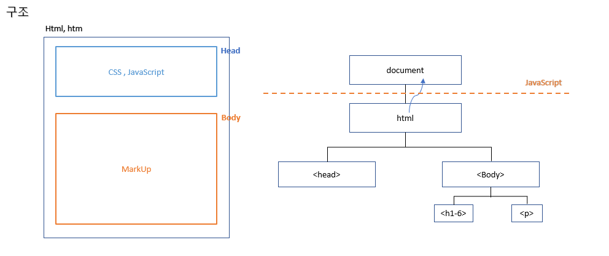

# 43 Days - HTML구조, 태그, 플러그인, 이미지, 링크, &lt;span&gt;, &lt;div&gt;

### 사용 프로그램

* 사용언어 : JAVA\(JDK\)1.8.0\_261 : Oracle.com
* 사용Tool  - Eclipse : Eclipse.org - Toad DBA Suite for Oracle 11.5
* 사용 FrameWork - MyBatis

## HTML

### HTML구조



```markup
<!DOCTYPE html>
<html>
 <head>
 <title>Page Title</title>
 </head>
 
 <body>
 <h1>This is a Heading</h1>
 <p>This is a paragraph.</p>
 </body>
</html>
```

* 1번 : HTML선언
* 2번 : 루트태그
* 3,7번 : HTML은 두 영역을 갖는다. - &lt;head&gt;영역. &lt;body&gt;영역
* &lt;head&gt;&lt;/head&gt; - 화면에 보여지지않는 영역 - CSS, Javascript가 올 수 있다. - 내부 html확장자, 외부확장자를 배치하는 영역
* &lt;body&gt;&lt;/body&gt; - 화면에 보여지는 영역 - MarkUp = 애니메이션, 이동이 구현되는 곳이다. - 태그들은 중복사용될 수 있다.
* 자바스크립트는 document객체로 HTML을 주입받아 사용한다.

### document

* JS에서 확장자가 html. htm인 문서 전체를 받는 최상위 객체
* 브라우저가 제공하는 내장객체로, 인스턴스화가 필요없다.
* File file = new File\(html\) 하는 것과 같이 html을 객체로 담는다.

### HTML특징

* 컴파일 하지 않는다. - 내용 변경시 컴파일 없이 화면을 새로고침하기만 해도 적용된다.
* 변수를 사용할 수 없다. - 제어문을 사용할 수 없고, 변환된 값을 읽어 가질 수 없다.
* 보이는 태그, 보이지 않는 태그를 갖는다.
* 페이지를 이동시켜주는 태그를 지원한다. ex\) &lt;a&gt;&lt;/a&gt;
* 단방향 서비스만 제공한다. 정적이다. - JS가 head영역에서 양방향 서비스, 동적구현을 지원해준다. - 듣기\(값 저장, 유지\)와 제어문을 사용 가능하게 해준다.

### Attribute\(속성\)

* 좌변에 속성, 우변에 값이 온다.
* &lt;h1 style = "font-size : 60px;"&gt;적용할 내용&lt;/h1&gt; &lt;열린태그 속성=예약어:값&gt; 컨텐츠 &lt;닫는태그&gt;
* ID 속성을 주로 UI솔루션에서 많이 사용하고, - JS, 넥사크로, ....
* name 속성은 주로 Java의 서블릿에서 사용한다. - JS에서는 자바와 연결될때 사용한다.

### 태그


```markup
<body>
html
그럴까
<br>좋아요
<p>줄바꿈</p>
</body>
```

* 브라우저가 인터프리터방식으로 읽어 body안의 contents만 보여준다.
* 모든 태그들은 열린 순서대로 닫혀야한다.
* 태그는 적용할 내용을 감싼다.
* **블럭요소** : Layer로서 자체 크기를 갖기때문에 자동 줄바꿈된다.  - 대표적인 태그 : &lt;div&gt;, .....
* **인라인요소** : 자체 크기가 없어 자동줄바꿈이 일어나지 않는다. - 대표적인 태그 : &lt;a&gt;, &lt;span&gt;, &lt;button&gt;, &lt;image&gt;, .... - 줄바꿈 태그 &lt;br&gt;로 줄바꿈효과를 줄 수 있다.

### Javascript

```markup
<body>
<!-- html 영역, java코드 작성 불가 -->
<!-- 사용하기전에 script선언 먼저 : 마임타입, 메인text서브javascript -->
<script type="text/javascript"> 
<!-- 자바스크립트 영역, 자바코드를 사용할 수 없다. -->
	document.write("나는<b><u>내장객체</u></b>를 지원하는 함수입니다.")
	document.write("<br>")
</script>
</body>
```

* &lt;head&gt;, &lt;body&gt;모든 영역에서 사용될 수 있다.
* 브라우저가 읽을수 있어 화면을 구현할 수 있지만 html보다 번거롭다. - 6,7번 처럼 html에 적는 document.write메서드를 매번 사용해야 하므로
* 4번 : 먼저 mime타입으로 선언이 이루어져야한다.
* 4-8번 : 스크립트 영역으로 선언된 곳에는 //주석을 쓸 수 있다.

### 플러그인

* 
### 애플리케이션, 하이브리드

* 
## HTML 태그

### &lt;a&gt;

```markup
<body>
<a href="http://localhost:9000/day1/hello.html">This is a link</a>
내용을 적으면 줄바꿈이 안된다.
<br>
인라인요소는 자체 크기가 없다.
</body>
```

* 페이지 이동 태그, hert속성에 URL을 지정해 줄 수 있다. - 화면에 해당 URL 링크를 출력한다.
* &lt;a&gt;태그는 인라인요소로, 자체 크기가 없다.
* 3번처럼 &lt;br&gt;태그 없이 텍스트를 작성하면 줄바꿈없이 옆에 이어서 출력된다.
* 아래 코드 처럼 &lt;a&gt;태그 사이의 버튼, 이미지등에 도 링크를 걸 수 있다.

### &lt;image&gt;

```markup
<body>
<a href="http://www.naver.com">

</a>
</body>
```

* 이미지 파일 호출 태그, src속성에 URL로 불러올 수 있다.
* 3번은 eclipse에서의 이미지 경로 URL이다.
* 이 코드를 실행해 이미지를 클릭하면 네이버로 페이지가 이동한다.

### &lt;span&gt;

* 보여지지않는 태그
* CSS영역으로, 부분적 style적용이 일어날때 사용한다.

### &lt;div&gt;

* 보여지지않는 태그
* 박스
* AJAX에서 가장 사용빈도가 높은 태그이기도 하다.
* div를 조작하기 위해 ID를 부여해서 사용한다.

후기 : 

