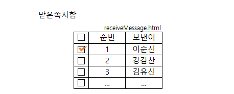

# 46 Days - &lt;table&gt;분석, WAS와 웹서버, span과 div분석, JS Event-onchange

### 사용 프로그램

* 사용언어 : JAVA\(JDK\)1.8.0\_261 : Oracle.com
* 사용Tool  - Eclipse : Eclipse.org - Toad DBA Suite for Oracle 11.5
* 사용 라이브러리 - JQuery

## 학습목표

* html과 JS의 역할에 대해 말할 수 있다. - html : 개발방법론에서 View계층 담당 - JS : Event와 View를 조작\(DOM\)하는 역할
* JS의 선언 위치에 대해 설명할 수 있다. - head영역 : 멤버변수, 함수선언 등 - body영역 : 지역변수, 함수구현\(부분페이지에 대한 처리만 담당, 유지보수\)
* mime타입에 대해 이해하고 페이지에 적절한 mime타입을 작성할 수 있다. - xxx.jsp가 xxx.html이나 xxx.xml이 될 수 있다. - 확장자를 보고 정하는 것이 아니라 mime타입을 보고 정체성을 정해야한다.

## &lt;table&gt;

### &lt;table&gt;

* DOM의 구조를 보기 위해 크롬의 개발자도구를 확인한다.
* html &lt;table&gt;, java table, easyui datagrid, ......
* &lt;table&gt;태그의 처리주체는 브라우저로 비동기상태이다. - 이미 읽어와서 완료되었으므로 
* 테이블 태그 안에서는 text노드를 사용하지 않는다.

### &lt;table class&gt;

```markup
<table class="easyui-datagrid">
```

* table태그 안에는 클래스 속성이 온다.
* **&lt;table class="제조회사-값"&gt;** - "easyui-datagrid"와 같은 값은 JS-JQuery에서 가져오므로 undefined가 일어날 수 있다. - 해당 속성값을 지원하는 언어가 추가되어있어야 한다.

### &lt;table id&gt;

```markup
<table id="dg"></table>
```

* JS가 table에 접근하기 위해 id를 사용한다. - name은 중복되지만 id는 유일한 값이므로
* &lt;table id="dg\_dept"&gt; - object이름-id명 - id는 값을 가져올 DB의 table명과 같이 해 구분하기 쉽도록 한다.
* 이렇게 id를 부여하는 것은 JS에서 나머지를 구현하려는 것이다. - 바로 닫힌 태그로 html에서 닫는다. - JQuery를 이용해 $\("\#dg\_dept"\)로 호출할 수 있다.
* **$\("\#dg\_dept"\).datagrid\( { } \);** - 위와 같이 접근한 id를 소유주 object로 datagrid를 구현할 수 있다.

### &lt;table data-options&gt;

```markup
<table class="easyui-datagrid" style="width:400px;height:250px"
        data-options="url:'datagrid_data.json',fitColumns:true,singleSelect:true">
    <thead>
        <tr>
            <th data-options="field:'code',width:100">Code</th>
            <th data-options="field:'name',width:100">Name</th>
            <th data-options="field:'price',width:100,align:'right'">Price</th>
        </tr>
    </thead>
</table>
```

* data-options="이름:값, 이름:값, 이름:값, ....." - 열거형 연산자를 사용한다.
* datagrid안에 들어가는 값을 구현한다. - dataSet과 같다.
* 웹에서는 JSON을 사용해 구현한다. - WAS에 JSON이 추가 되어 있어야 undefined가 일어나지 않는다.
* JSON을 담기 위해 URL을 사용한다. - data-options="URL:파일명, URL:파일명, ..."

### &lt;script JQuery - easyUI&gt;

```markup
<script type="text/javascript" src="https://www.jeasyui.com/easyui/jquery.min.js"></script>
<script type="text/javascript" src="https://www.jeasyui.com/easyui/jquery.easyui.min.js"></script>
```

* JQuery.js를 먼저 script한 다음에 easyUI.js를 script해야한다. - 자바에서는 객체지향언어이므로 상관없지만 HTML은 절차지향적 언어이므로 - 서로 의존관계에 있다.  - 2번이 1번위에 있다면 undefined가 발생할 것이다.
* min : 쓸모없는 공백을 모두 제거해 좀 더 가볍게 만든 파일, 가독성이 떨어진다.

### JSON 구조

```markup
<records>
    <record>
        <deptno컬럼명>10값</deptno>
```

* 기존에는 xml을 사용해 data를 처리했는데 대용량에서는 속도가 느려 사용할수가 없었다. - oracle을 대신할 수 없다.
* 그래서 JSON이 탄생했다.

```markup
{"컬럼명" : "값", "컬럼명 : 숫자, ...}, {"컬럼명" : "값", "컬럼명 : "값", ...}, ....
```

* JSON은 열거형 연산자로 data를 관리하는 dataSet이다.
* 문자는 모두 " "를 붙이고, 숫자는 " "없이 숫자만 기입한다.
* **컬럼명은 대소문자를 구분**하니 주의하자


* 대문자로 검색한 'SMITH'는 사원번호가 나오지만, 소문자 'smith'로 검색하면 null이다.

### 같은 태그 name주는 경우 - checkBox

* **이름이 같은 태그들은 브라우저가 자동으로 배열로 인식**한다.
* 이를 활용해 쪽지함 checkBox를 구현해보자





## WAS와 웹서버

### WAS

### 웹서버

### 차이점

## HTML4와 HTML5



## &lt;span&gt;과 &lt;div&gt;분석



## mime타입 분석

*  파일을 jsp파일로 생성했지만 mime타입에따라 다른 취급을 받기도 한다.
* sub타입에 따라 사용할 수 있는 태그들, 브라우저 표기방식이 달라지기도 한다.



## HTML - JS Event

### onchange

```markup
<input type="text" size="20" value="컵밥" onchange="check(this)">
```

* JS에서는 같은 이름을 갖는 메서드를 중복 선언할 수 없다. - 메서드 오버로드, 오버라이드를 지원하지 않는다.
* tag는 JS에서는 Element, DOM의 Node, java의 Object이다. - this를 사용할 수 있다. - value로 값을 갖는다. - 위 코드에 this.value를 찍으면 컵밥 이 출력될 것이다.
* onchange로 이벤트를 만들어 innerHTML과 value를 이용해 값을 출력해보자



## JQuery 분석

### JS표준과 JQuery

<table>
  <thead>
    <tr>
      <th style="text-align:center">JS&#xD45C;&#xC900;</th>
      <th style="text-align:center">JQuery</th>
    </tr>
  </thead>
  <tbody>
    <tr>
      <td style="text-align:center">window.onload</td>
      <td style="text-align:center">$(document).read</td>
    </tr>
    <tr>
      <td style="text-align:center">=function( ){ };</td>
      <td style="text-align:center">(function( ){ });</td>
    </tr>
    <tr>
      <td style="text-align:center">
        <p>CSS</p>
        <p>html &#xD0DC;&#xADF8;&#xC548;&#xC5D0; &#xC9C1;&#xC811; &#xAD6C;&#xD604;(&#xC815;&#xC801;)</p>
        <p>&#xBCC4;&#xB3C4; style&#xC0DD;&#xC131; &#xD6C4; &#xC801;&#xC6A9;(&#xB3D9;&#xC801;)</p>
      </td>
      <td style="text-align:center">
        <p>CSS
          <br />$(&#xD0DC;&#xADF8;&#xBA85;) : &#xBAA8;&#xB4E0; &#xD0DC;&#xADF8;&#xC5D0;&#xAC8C;
          <br
          />$(&quot;#id&quot;) : &#xD574;&#xB2F9; id &#xD558;&#xB098;&#xC5D0;&#xAC8C;&#xB9CC;
          <br
          />$( ).css(&quot;&#xC774;&#xB984;&quot;,&quot;&#xAC12;);</p>
        <p></p>
      </td>
    </tr>
  </tbody>
</table>

### JQuery 선택자

* 전체 : \(\*\)
* 아이디 : \("\#Id명"\)
* 클래스 : \(.클래스명\)
* 요소\(태그이름\) : \(요소명\)

## Eclipse의 web 소스관리


* 두 군데로 관리하고 있다.

  
후기 : 

