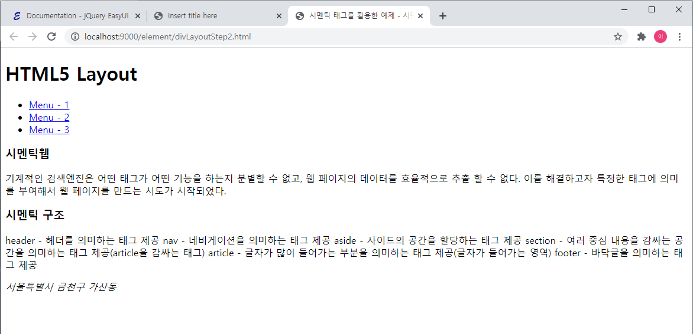

# HTML4와 HTML5

## HTML4


```markup
<!DOCTYPE html>
<html>
<head>
<meta charset="UTF-8">
<title>Insert title here</title>
</head>
<body>
<!-- bootstrap에서 layout사용하는 법 -->
	<div>
		<h1>HTML4 Layout</h1>
	</div>
<!-- ul태그와 li태그를 사용해 네비게이션 메뉴 바 구성 -->
	<div>
		<ul>
			<li><a href="#">Menu - 1</a></li>
			<li><a href="#">Menu - 2</a></li>
			<li><a href="#">Menu - 3</a></li>
		</ul>
	</div>
<!-- ul태그와 li태그를 사용해 네비게이션 메뉴 바 구성 -->
<!-- 메뉴 컨텐츠, 내용 -->
<!-- 시멘틱웹 : html과 html5를 구분하는 키워드 -->
	<div>
		<div>
			<h1>시멘틱웹</h1>
			<p>기계적인 검색엔진은 어떤 태그가 어떤 기능을 하는지 분별할 수 없고,
			웹 페이지의 데이터를 효율적으로 추출 할 수 없다.
			이를 해결하고자 특정한 태그에 의미를 부여해서 웹 페이지를 만드는 시도가 시작되었다.</p>
		</div>
		<div>
			<h1>시멘틱 구조</h1>
			<p>
				header - 헤더를 의미하는 태그 제공
				nav - 네비게이션을 의미하는 태그 제공
				aside - 사이드의 공간을 할당하는 태그 제공
				section - 여러 중심 내용을 감싸는 공간을 의미하는 태그 제공(article을 감싸는 태그)
				article - 글자가 많이 들어가는 부분을 의미하는 태그 제공(글자가 들어가는 영역)
				footer - 바닥글을 의미하는 태그 제공
			</p>
		</div>
		<!-- footer영역 -->
		<div>
			<span>서울특별시 금천구 가산동</span>
		</div>
	</div>
<!-- 메뉴 컨텐츠, 내용 -->
</body>
</html>
```

## HTML5



```markup
<!DOCTYPE html>
<html>
<head>
<meta charset="UTF-8">
<title>시멘틱 태그를 활용한 예제 - 시멘틱 웹</title>
</head>
<body>
	<header>
		<h1>HTML5 Layout</h1>
	</header>
<!-- ul태그와 li태그를 사용해 네비게이션 메뉴 바 구성 -->
	<nav>
		<ul>
			<li><a href="#">Menu - 1</a></li>
			<li><a href="#">Menu - 2</a></li>
			<li><a href="#">Menu - 3</a></li>
		</ul>
	</nav>
<!-- ul태그와 li태그를 사용해 네비게이션 메뉴 바 구성 -->
<!-- 메뉴 컨텐츠, 내용 -->
<!-- 시멘틱웹 : html과 html5를 구분하는 키워드 -->
	<section>
		<article>
			<h1>시멘틱웹</h1>
			<p>기계적인 검색엔진은 어떤 태그가 어떤 기능을 하는지 분별할 수 없고,
			웹 페이지의 데이터를 효율적으로 추출 할 수 없다.
			이를 해결하고자 특정한 태그에 의미를 부여해서 웹 페이지를 만드는 시도가 시작되었다.</p>
		</article>
		<article>
			<h1>시멘틱 구조</h1>
			<p>
				header - 헤더를 의미하는 태그 제공
				nav - 네비게이션을 의미하는 태그 제공
				aside - 사이드의 공간을 할당하는 태그 제공
				section - 여러 중심 내용을 감싸는 공간을 의미하는 태그 제공(article을 감싸는 태그)
				article - 글자가 많이 들어가는 부분을 의미하는 태그 제공(글자가 들어가는 영역)
				footer - 바닥글을 의미하는 태그 제공
			</p>
		</article>
		<!-- footer영역 -->
		<footer>
			<address>서울특별시 금천구 가산동</address>
		</footer>
	</section>
<!-- 메뉴 컨텐츠, 내용 -->
</body>
</html>
```

