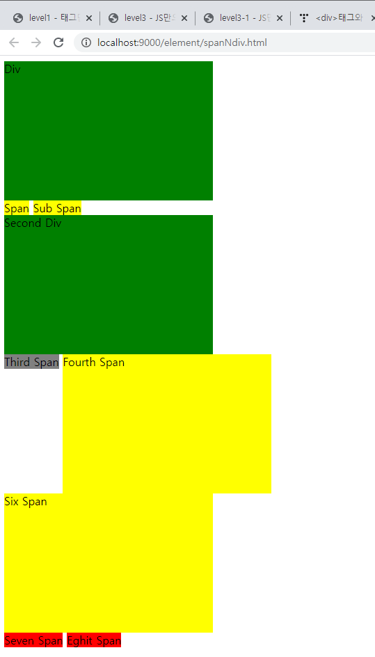

# &lt;div&gt;, &lt;span&gt;

## spanNdiv.html

```markup
<!DOCTYPE html>
<!-- 
	div와 span은 눈에 보이지 않는 태그이다.
	div : 자체크기가 있는 block요소
	span : 자체크기가 없는 inline요소
	눈에 보이는 태그가있고 보이지 않는 태그가 있다.
 -->
<html>
<head>
<meta charset="UTF-8">
<title>Insert title here</title>
<!-- head영역에 style을 구현할 수 있다. -->
<!-- CSS를 사용하면 문서 전체에 스타일 일괄처리가 가능하다. 
     display: none; 화면에 보이지않는다.
     display: inline-block 두가지 요소를 같이 사용할 수 있다.-->
<style type="text/css">
	div{
		width: 300px;
		height: 200px;
		background-color: green;
	}	
	span{
		width: 300px;
		height: 200px;
		background-color: yellow;
	}	
	span#sp_3{
		width: 300px;
		height: 200px;
		background-color: gray;
	}	
	span#sp_4{
		display: inline-block;
		width: 300px;
		height: 200px;
		background-color: yellow;
	}	
	span#sp_5{
		display: none;
		width: 300px;
		height: 200px;
		background-color: yellow;
	}	
	span#sp_6{
		display: block;
		width: 300px;
		height: 200px;
		background-color: yellow;
	}	
	span.color{
		width: 300px;
		height: 200px;
		background-color: red;
	}	
</style>
</head>
<body>
	<div>Div</div>
	<span>Span</span>
	<!-- <span>인라인 요소 태그 이므로 옆에 붙는다. -->
	<span>Sub Span</span>
	<!-- <div>블럭 요소 태그 이므로 밑으로 내려가 붙는다. -->
	<div>Second Div</div>
	
	<span id="sp_3">Third Span</span>
	<span id="sp_4">Fourth Span</span>
	<span id="sp_5">Five Span</span>
	<span id="sp_6">Six Span</span>
	<span id="sp_7" class="color">Seven Span</span>
	<span id="sp_8" class="color">Eghit Span</span>
</body>
</html>
```

* CSS로 div, span의 기본 요소를 변경 할 수 있다.
* 단 하나의 div, span에 효과를 적용하려면 id를 사용한다.
* 서로 다른 div, span에 같은 효과를 주려면 class를 사용한다. - id는 유니크 해야한다.
* 여러 클래스에 적용할 수 도 있다. - 열거형연산자 사용 가능 - .class명,.class명,......

## 실행



