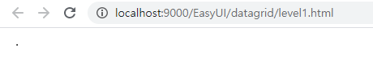

# &lt;table&gt; - datagrid level1

## ㅣ



```markup
<!DOCTYPE html>
<html>
<head>
<meta charset="UTF-8">
<title>level1 - 태그만으로 구성하기</title>
	<!-- 인터넷이 가능한 환경이므로 URL을 통해 import, link를 건다. -->
 	<link rel="stylesheet" type="text/css" href="https://www.jeasyui.com/easyui/themes/default/easyui.css">
    <link rel="stylesheet" type="text/css" href="https://www.jeasyui.com/easyui/themes/icon.css">
    <link rel="stylesheet" type="text/css" href="https://www.jeasyui.com/easyui/themes/color.css">
    <link rel="stylesheet" type="text/css" href="https://www.jeasyui.com/easyui/demo/demo.css">
    <script type="text/javascript" src="https://www.jeasyui.com/easyui/jquery.min.js"></script>
    <script type="text/javascript" src="https://www.jeasyui.com/easyui/jquery.easyui.min.js"></script>
</head>
<body>
	<table border="1" id="dg_dept"></table>
</body>
</html>
```


