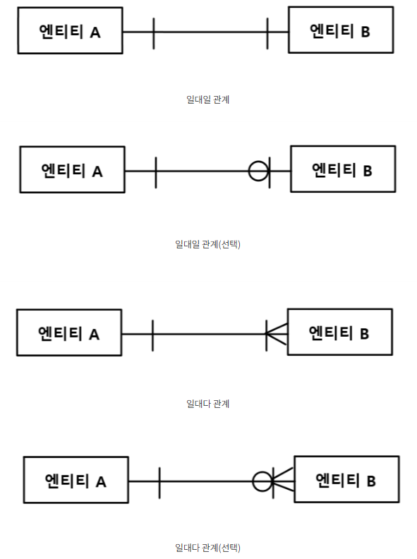

# 20 Days - pk, ak, fk, Server, Socket,ERD

### 복습

* SELECT\(조회\) -&gt; row n개, colum n개 -&gt; List에 담는다. -&gt; List&lt;memberVO - List는 배열타입으로 Vecter와 ArrayList를 갖고있다.

### 사용 프로그램

* 사용언어 : JAVA\(JDK\)1.8.0\_261 : Oracle.com
* 사용Tool  - Eclipse : Eclipse.org - Toad DBA Suite for Oracle 11.5 - CA ER-Win Data Modeler

## 필기

## ER-Win & Toad

### 역할

* ER-Win tool
* 시스템 유지보수\(SM\) 툴
* ERD = Entity\(개체\), Relation, Diagram
* 집합\(테이블\)의 구조와 관계를 그리는 프로그램
* Entity\(논리적 설계\) -&gt; Table\(물리적 설계가 끝나면 생성\)
* 자동으로 oracle에 테이블을 만들 수 있다.

### 관계의 종류

* 집합과 집합 사이의 관계
* 1 : 1
* 1 : n
* n : n -  n:n의 경우에는 SELECT문을 사용할수 없기때문에 다른 집합을 생성해서 n : 1, 1 : n으로 만들어주어야한다.
* 집합과 집합사이에도 상속관계가 있을 수 있다.

### 관계 표시

* 식별자를 받아올때에는 실선, 식별자를 받아올 필요가 없을때에는 점선 표시한다.
* 세로막대는 상속관계를 의미한다.
* 다리가 있는 쪽은 n개를 의미한다.

### O - 옵션

* ~일 수도 있다.
* A집합의 데이터에 해당하는 데이터가 B에 있을 수도 없을 수도 있다.
* exactly : A집합 하나랑 B집합 하나가 서로 대응 - 부서 하나, 사원 하나

### 관계 질문

부서 집합의 정의 : 현재 근무하고 있는 사원들의 정보를 관리하는 집합이다.  
부서와 사원집합의 관계는 어떤 종류인가?

1. 현재 근무하는 부서의 정보만 관리하려고 한다. - 사원은 한개 부서에서만 근무한다. - 부서는 속한 사원들의 정보를 관리하므로 부서의 입장에서 사원은 여러명이다. - 부서\(1\) : 사원\(n\)
2. 사원들이 과거 근무했던 부서정보의 정보까지도 관리하려고 한다. - 사원은 여러 부서를 거쳐왔다, 여러부서의 정보를 수용하고 있다. - 부서는 속한, 속했던 사원들의 정보를 수용하고 있다. - n : n

### Key 종류

* PK\(Primary Key\) - 기본 키, 식별자 - 그림에서 \#이 붙은 부분을 말한다. = 가장 똑똑한 인덱스 하나 - 인덱스\(색인\)를 자동으로 만들어준다. -&gt; 검색 속도를 빠르게 해준다. - 중복될 수 없다.
* AK\(Artificial Key\) - 인조 키 - 자연키와 반대되는 개념으로 개발자가 이름을 정해주는 키 - 부모가 누구인지 규명되지 않아 부모가 정확하진 않지만 인덱스의 크기값을 줄여주게 된다. -&gt; 검색속도 향상
* FK\(Foreign Key\) - 왜래키, 포링키 - 아빠 집합으로 부터 상속받은 PK

### 인덱스

* 색인의 개념으로,  옵티마이저의 검색을 도와준다.
* 부분처리가 가능하다.
* 부분처리 : 중복검사를 하거나 할때 중복값이 검색되는 순간 검색을 멈춘다. = 효율적  &lt;--&gt; 전체처리 : 반 평균을 구하는 것과같이 전체 검색을 하는것
* 삭제하게되면 인덱스는 빈 채로 남아 자리를 차지한다. 나중에는 검색속도에 영향을 끼칠 수 도 있다. 정리해야한다.

### 정렬 ORDER BY & index

* 정렬을하는 두가지 방법
* ORDER BY 컬럼명 acs \|\| desc - 오름차순 \|\| 내림차순 - 데이터를 표시해주고\(1차가공\) -&gt; 정렬\(2차가공\)한다 = 느리다.
* PK의 index는 오름차순 자동정렬기능이 있다. = 속도향상

### 예시

#### 부서 --\|&lt; 사원

* 부서의 pk : \#부서번호
* 사원의 사원번호는 복합키를 하나로 합친 AK이다. \(이름+직급+나이+...\)
* 사원집합은 부서집합을 상속받아 부서번호를 FK로서 받아온다.

#### 컴퓨터 조립 부품 주

* 부모 : 주문 마스터 테이블\(PK : 주문번호 : ord\_no\), 누가,언제와 같은 정보를 담고있다.  
* 자식 : 상세 테이블,\(AK : 상품코드\), 사용자가 구매하는 부품들이다. = 여러개
* 사용자가 품목 4중에 2개만 구매한다면, 이 사용자의 상세테이블에는 insert가 두번 이루어진다.
* 부모로부터 식별자를 받는경우\(실선, 식별자로 주문번호를 받는다.\)  - 주문번호만 pk로서 있으면 부품 식별이 불가능하다.  - PK = 주문번호 + 상품코드 - 주문번호 : 부모에서 받아온 식별자 FK
* 부모로부터 식별자를 받지않는경우\(점선, 비식별자로서 주문번호가 내려간다.\) - 상품 품목만큼 칸을 만들어 놓고 주문이 들어오면 들어오지 않은 곳 Null로 두는 표시를 한다. - 빈 방이 생겨 그만큼 비효율적이다.





## Server & Socket

### Socket의 말하기 & 듣기

* 소켓 안에는 out\(말하기\) 그리고 in\(듣기\) 기능이 있어야한다. - OIS : Object Input Stream - OOS : Object Output Stream
* 서버에서 시간을 소켓에 넣어준다. = 출력
* client의 단말기안에도 소켓이 있다. 
* client가 서버 소켓에게 output한다. - 단말기 안의 소켓에 ip와 port번호를 넣어 서버에 접속허락을 구한다. - client가 단말기를 맡겨서 소켓에 data를 받아온다.
* clilent들의 소켓마다 Thread를 배정해 주어야한다. - 유지가 된다.
* 서버가 시간을 소켓에게 1초마다 out\(말\)한다. - client는 in\(듣\)는다.
* client가 in\(들\)은것을 actionPerformed에서 out\(말\)한다.
* run메서드는 1초에 한번씩 듣기만한다.
* client는 받아온 정보를 자기만 사용한다. -&gt; run 메서드는 싱글 스레드에서 안전하다.

### Thread

* 동시접속, 경합이 벌어져 순서를 정해야 하거나 접속이 유지 되어야 할때 사용되는 클래스
* Thread를 extend하여 socket마다 배정해주고 run메서드를 사용하거나,
* Runnable를 implements하여 Thread는 표준에 정해진 것을 가져다 쓰면서 run메서드를 이용한다.
* client에서 server에서 시간정보를 받아오고자 할때,  - 다른 client의 소켓들도 접속할 수 있고, 시간은 계속 출력되어야 한다. - 동시작업, 지속 - 소켓마다 Thread를 배정해준다. = List&lt;Thread&gt;

### run메서드

* Thread클래스, Runnable인터페이스 안에 있다.
* run메서드는 시간을 건드리는 메서드로 동시 접속이 일어날때 순서대로 대기, 처리할 수 있게 해준다.
* 소유주.Notify\( \) : 대기하던 손님들 진행시작
* 소유주.Wair\( \) : 진행을 중단하고 대기시킨다.
* start메서드를 사용하면 시작된다.

### Server로부터 시간을 받아보자

1. **Thread를 상속하는 TimeServer 기동** - 인스턴스화 -&gt; 스레드호출\(=start\( \);\) - TimeServer ts = new TimeServer\( \); - 생성을 선언부에 하면 멤버변수의 성격을, 메서드에 탑재하면 지역변수의 성격을 갖는다.
2. **run\( \); 호출** - start\( \); -&gt; run\( \); 
3. **client = server.accept\( \);** - 클라이언트가 server에 자기 단말기의 Socket을 보내 접속 허락을 받는다. - 서버에 client socket이 있다. - 이를 담기 위해서는 socket에 out\(말하기\)와 in\(듣기\)가 필수적이다. - OutputStream, InputStream
4. **APP화면에 시간정보 띄우기** - 시간을 나타내주는 Client 원본을 인스턴스화 해야한다. - TimeClient JLabel 생성자에 App의 JLabel을 this로 인스턴스화한다. - new TimeClient\(JLabel\); - App에서 Server와 Client를 인스턴스화 하여 기동시킨다. - run메서드 안에서 JLabel.setText\( \); 호출한다.
5. 사용된 data, 자원은 반납한다.

### 응용 예제문제 

* 시간을 친구 서버에 접속하여 받아오시오
* **ip**와 **port번호**를 **변수**로 하자.





