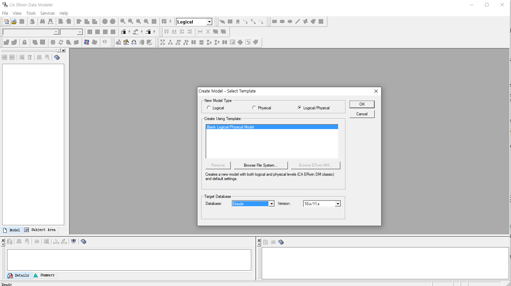

# ER-Win

## 이론

### 역할

* 테이블의 구조를 그림으로, 도형으로 그려주는 도구 

    = ERD

    Enlity\(개체\), Relation, Diagram

### 설치

* CAEDM73-b1666\(Data Modeler\) 
* 축풀기 -&gt; 관리자권한실행 -&gt; agree -&gt; 두번째 빈 입력창 : User -&gt; next -&gt; next -&gt;next -&gt;install
* 라이센스 키 입력

### 설정

## 설정

## 부서 - 사원

