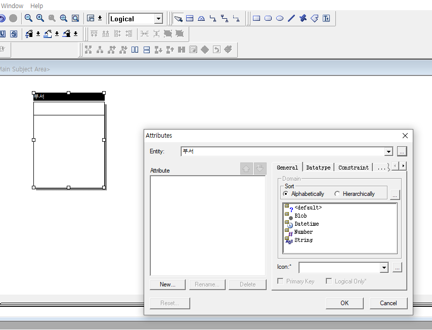
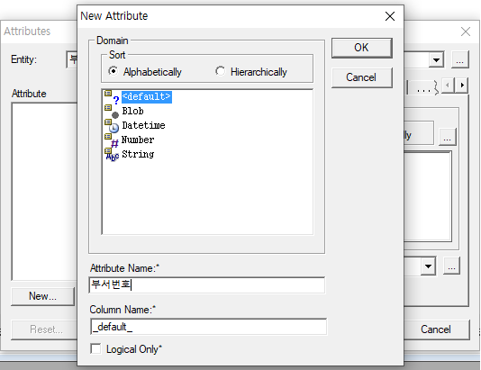
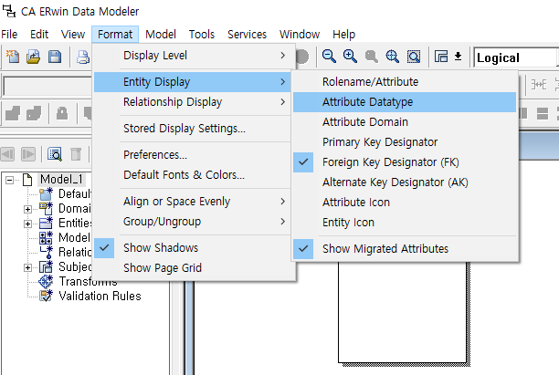
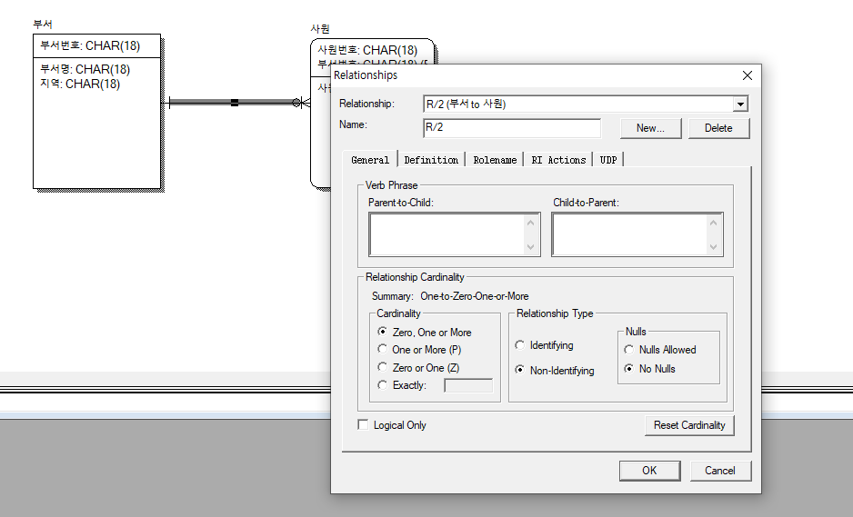

# ER-Win

## 이론

### 역할

* ER-Win tool
* 시스템 유지보수\(SM\) 툴
* ERD = Entity\(개체\), Relation, Diagram
* 집합\(테이블\)의 구조와 관계를 그리는 프로그램
* Entity\(논리적 설계\) -&gt; Table\(물리적 설계가 끝나면 생성\)
* 자동으로 oracle에 테이블을 만들 수 있다.

### 관계의 종류

* 집합과 집합 사이의 관계 - 1 : 1 - 1 : n -  n : n
* 집합과 집합사이에도 상속관계가 있을 수 있다.

### 관계 표시

### O - 옵션

* ~일 수도 있다.
* A집합의 데이터에 해당하는 데이터가 B에 있을 수도 없을 수도 있다.
* exactly : A집합 하나랑 B집합 하나가 서로 대응 - 부서 하나, 사원 하나

### 관계 예시

부서 집합의 정의 : 현재 근무하고 있는 사원들의 정보를 관리하는 집합이다.  
부서와 사원집합의 관계는 어떤 종류인가?

1. 현재 근무하는 부서의 정보만 관리하려고 한다. - 사원은 한개 부서에서만 근무한다. - 부서는 속한 사원들의 정보를 관리하므로 부서의 입장에서 사원은 여러명이다. - 부서\(1\) : 사원\(n\)
2. 사원들이 과거 근무했던 부서정보의 정보까지도 관리하려고 한다. - 사원은 여러 부서를 거쳐왔다, 여러부서의 정보를 수용하고 있다. - 부서는 속한, 속했던 사원들의 정보를 수용하고 있다. - n : n

### Key 종류

* PK\(Primary Key\) - 기본 
* AK\(Artificial Key\) - 인조 키 - 자연키와 반대되는 개념으로 개발자가 이름을 정해주는 키
* FK\(Foreign Key\) - 왜래키, 포링키 - 아빠 집합으로 부터 상속받은 PK

### 설치

* CAEDM73-b1666\(Data Modeler\) 
* 관리자 권한 실행 -&gt; agree -&gt; 두번째 빈 입력창 : User -&gt; next -&gt; next -&gt; next -&gt; install
* 라이센스 키 입력

### 주의할 점

* 읽기 모드에서는 저장이 안된다. 생성하기전에 저장을 미리 해놓고 진행하자

## 설정

* Logical \(논리적\) : 겉으로 보여지는 부분
* Physical\(물리적\) : 작성되는 코드, 실제로 저장되는 부
* 우리는 Oracle DB를 이용하므로 설정해준다.

* IE : 표준

## Test - 부서 & 사원

### Table, 집합 생성

* 상단 Logical옆 네모난 버튼이 집합 생성 버튼이다.
* 집합을 만들고 더블클릭하면 컬럼명 및 AK 추가할 수 있다.

* New... -&gt; 컬럼명 입력

* 입력결과
* pk = 부서번호

* Datatype표시하기

* 결과

* 사원 집합을 만들어 관계를 표시하자

## PK와 FK, AK 

