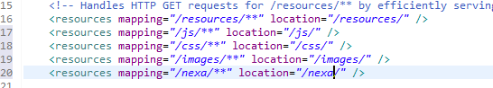

# 101 Days -

### 사용 프로그램

* 사용언어 : JAVA\(JDK\)1.8.0\_261, JS, JQuery, JSP, Servlet, HTML, JSON
* 사용Tool  - Eclipse : Eclipse.org, Toad DBA Suite for Oracle 11.5 , Spring, Android Studio, Visual Studio Code, Nexacro
* 사용 서버 - WAS : Tomcat

## Firebase와 Android

* 안드로이드는 세션과 쿠키를 지원받지 못한다.
* 로컬 데이터베이스 제품을 활용해 값을 유지한다. - NoSQL제품\(SQLite...\)
* 또는 클라우드 플랫폼을 활용해 값을 유지한다. - FireBase....

## Nexacro + 전자정부프레임워크

### 전자정부 프레임워크

* FireBase를 사용하는 경우 외부 API를 연계해야 하므로 자바\(JVM\)와의 의존성 문제를 일으키는 부분이 있으므로 이 문제를 피해가기 위해서는 다양한 프로젝트 생성 방법이 요구된다.
* firebase-admin과 tomcat-embed을 함께 의존성 주입을 할때 충돌이 발생한다. boot프로젝트로 생성시 pom.xml에 의존성주입을 하게되어 프로젝트에서 자동으로 모든것을 메이븐에서 내려받게된다. 의존관계에 있는 jar파일을 모두 내려받는다. 개발자가 모르는 jar파일이 추가되어 개발자가 알 수 없는 충돌이 발생한다.
* spring\(sts3\)툴에서는 spring legacy방식을 지원하고있다. Maven, xml 둘다 활용할 수 있어 firebase와 외부 API를 잘 맞춰볼 수 있는 방법을 지원받는다.
* 하지만 boot와 firebase같은 외부 API를 모두 활용하기 위해 eGovFrame의 Eclipse를 활용한다.

### 1. 전자정부 프레임워크 설치


* eGovFrame 의 개발환경 메뉴의 다운로드 클릭


* 왼쪽 메뉴바 상단의 노란 통합다운로드 선택
* 첨부파일 다운로드
* exe 실행 및 경로지정
* 설치 완료 후 바로가기 아이콘으로 실행


* 전자정부 Eclipse의 프로젝트 생성 목록을 보면, Spring Legacy와 Boot모두 지원하는 것을 볼 수 있다.
* Window &gt; Preference 에서 UTF-8설정과  Workspace : Refresh using natice hooks or polling 체크와 Workspace &gt; Build &gt; Save automatically before manual build 체크를 확인한다.

### 2. eGovFrame Eclipse 프로젝트 생성하기

* File &gt; New &gt; Other


* Spring Legacy Project 선택 &gt; Next


* 프로젝트 이름지정 &gt; Templates에 Spring MVC Project 선택
* Next &gt; yes &gt; 패키지이름 지정\(세 자리\) &gt; Finish


* 사용할 공통코드 폴더는 webapp 하위에 생성한다. - js, css, images 등.... - nexa와 연계할 것이므로 nexa 폴더도 생성한다.



* 생성된 공통코드 폴더는 servlet-context.xml에 등록해야 한다. 여기에 등록해야 폴더를 읽을 수 있게된다.

### 3. Spring 프로젝트 환경설정

```markup
<java-version>1.8</java-version>
<org.springframework-version>5.2.12.RELEASE</org.springframework-version>
```

* pom.xml의 자바가상머신의 version을 맞춘다.  spring version을 사용할 버전으로 맞춘다.


* Maven에서 제공하지 않는 jar파일 두가지를 WEB-INF하위의 lib폴더를 생성해 넣어준다.
* 프로젝트의 Build Path의 Library에 추가해준다.


* Library에서 자바가상머신의 버전도 맞춰준다.


* 서버탭에 Tomcat을 추가한다. 포트번호를 확인하고 admin port가 있어야 하므로 설정해준다. 왼쪽 하단의 publish module contents ....를 체크하고 저장한다.
* 테스트로 webapp하위에 jsp파일을 만들어 실행시켜본다.

### 4. Eclipse 외부 API추가 : MavenRepository

* Firebase Admin 6.16.0
* Gson 2.8.6

### 5. Nexacro : 프로젝트 파일 추가


* Nexacro에서 사용하는 폴더 내부의 projects 안에 프로젝트 파일을 배포한다. nexacro17\_Education\_Materials
* Nexacro를 실행해 파일 내부의 Sample &gt; EduProject &gt; EduProject 프로젝트를 Open한다.

### 6. Nexacro : 새 프로젝트 생성 및 Eclipse 연동

* File &gt; New &gt; Project
* 프로젝트 이름 지정 &gt; Next &gt; 제공할 screen선택 &gt; frame 선택
* 화면 그리기 Form 생성 Basic 폴더 선택 후 File &gt; New &gt; Form


* Generate &gt; Application 을 클릭해 파일을 말아주는 과정을 거친다.


* Tools &gt; Options &gt; Generate &gt; Path 우측 버튼 클릭
* eGovFrame Eclipse에서 생성한 workspace폴더에 들어가 생성해둔 nexa폴더로 경로를 변경한다.
* 확인 &gt; Ok &gt; yes


* Eclipse에서 해당 폴더를 확인해보면 문서들이 들어와있는 것을 확인할 수 있다.

```javascript
location.href="http://localhost:8000/nexa/quickview.html?screenid=Desktop_screen&formname=Base::DeptManager.xfdl";
```

* jsp에서 JS로 위 경로를 작성하면 nexacro에서 작성한 페이지를 확인할 수 있다.

