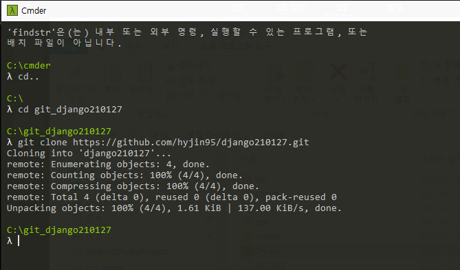

# 112 Days - rinux, cmder, ubuntu, Pycharm, git

### 사용 프로그램

* 사용언어 : JAVA(JDK)1.8.0\_261, JS, JQuery, JSP, Servlet, HTML, JSON
* 사용Tool  - Eclipse : Eclipse.org, Toad DBA Suite for Oracle 11.5 , Spring, Android Studio, Visual Studio Code, Nexacro
* 사용 서버 - WAS : Tomcat

## 필기

### VirtualBox

* 가상(소프트웨어)로 여러대의 운영체제를 운영할 수 있다.
* [https://www.virtualbox.org/wiki/Downloads](https://www.virtualbox.org/wiki/Downloads)\
  window hosts

### cmder

* 커맨더
* 윈도우명령어/리눅스/깃명령가능
* [https://cmder.net/](https://cmder.net)

### ubuntu 20.04

* 직접 서버를 운영해 보는 실습
* 자바가상머신, 오라클, 톰캣서버, 깃, 파이썬
* [https://ubuntu.com/download/server#download](https://ubuntu.com/download/server#download)

### 1. git 저장소 만들기

* .gitignore\
  문서에 해당 파일에 대한 등록을 진행해 이행하는데에 있어서 트러블이 발생하는 부분은배제되도록 해야 한다.
* 로컬 컴퓨터에 깃과 연동할 폴더 생성

.png>)

* 환경변수 > 시스템변수 > path 에 git경로 지정

### 2. 내 컴퓨터로 깃허브 저장소 클론하기 : cmder

* 로컬 컴퓨터와 깃허브 저장소 연결하기
* cmder.zip 압축 풀기\

.png>)

* 우클릭 > 관리자 권한으로 실행

* cd.. : 경로나가기
* cd + 생성한 로컬 폴더 이름
* git clone + git clone Https url 

### 3. PyCharm Community 설정

* 파이참으로 실습 환경 설정하기
* pycharm : python IDE

.png>)

* Toolbox > PyCharm Community 실행

.png>)

* File > Open > 로컬 깃 폴더 안에 클론되어 생성된 폴더 선택

.png>)

* File > Settings > Project : 프로젝트명 > Python Interpreter > 상단의 설정 버튼 > show all

.png>)

* git에서 클론된 폴더 지정

.png>)

* Python Interpreter > +(add) 클릭 > 패키지 pip, setuptools - install Pakage

### 4. cmder 환경설정

.png>)

* cmder 상단바 우클릭 > Settings
* General > Fonts > Main console font : 굴림체, Font Charset : Hangul

.png>)

* Star up > Environment\
  set LANG=ko_KR.UTF-8 입력 > Save settings

### 5. gitignore에 가상환경 폴더(venv)추가하기

* gitignore에 추가된 파일은 깃 버전관리에서 배제된다.

.png>)

* venv library root폴더가 흐리게 보인다.\
  venv를 가상환경으로 사용하기 위해서는 git으로 버전관리 되면 안된다.\
  배제시켜야 한다.
* venv : pythond의 가상환경

.png>)

* cmder 터미널에서 프로젝트 폴더 경로로 들어간다.\
  venv\scripts\activate.bat
* 프롬프트 앞에 (venv)라는 텍스트가 생성된다.\
  가상환경을 의미한다.
* 다른 프로젝트에서 환경설정한 파이썬 설정이 간섭되지 않도록 하기 위함

.png>)

.png>)

* (venv)가 보이는 상태에서 \
  pip install django 입력
* 아래 사진처럼 다운로드 된후
* 위 사진 처럼 deactivate 명령어로 빠져나온다.

### 6. pycharm의 idea폴더 배제

.png>)

* Pycharm에서 추가되는 idea폴더는 프로젝트 설정에 대한 내용을 담고 있으므로 배제한다.
* gitignore문서의 하단에\
  \#Pycharm\
  .idea/\
  작성

### 7. django 프로젝트 생성해서 웹 실행하기

.png>)

* django-admin startproject proj\_69
* venv상태에서 django-admin프로젝트를 생성한다.

.png>)

* 생성된 프로젝트로 이동\
  cd proj\_69

.png>)

* python manage.py runserver
* 서버 켜기
* 서버를 끄고 나가려면 \
  ctrl + c

.png>)

* 생성된 서버 주소로 이동하면 위와같이 성공적으로 실행되는 것을 볼 수 있다.

### 8. DB생성하기

.png>)

* DB 오브젝트 자동생성하기
* 장고 migration : 데이터베이스에 적용시켜야하는 변화에 대한 기록

### 9. 관리자계정 생성하기

.png>)

* python manage.py createsuperuser
* 사용할 id입력, email, pw입력 > 계정생성

.png>)

* 실행하기위해 서버 on

.png>)

.png>)

* 서버 주소에 + /admin 으로 실행하면 위와 같은 화면이 보여진다.

.png>)

.png>)

* id와 pw를 입력하면 위와같은 관리자 화면으로 이동된다.

### 10. git push해보기

.png>)

* 프로젝트 경로로 간다
* dir/w

.png>)

* git add .\
  폴더의 전체 변경사항 지정
* git commit -m "Django 프로젝트 생성"

.png>)

* git push

.png>)

* 깃 프로젝트에 생성한 proj\_69가 생성된 것을 확인할 수 있다.
