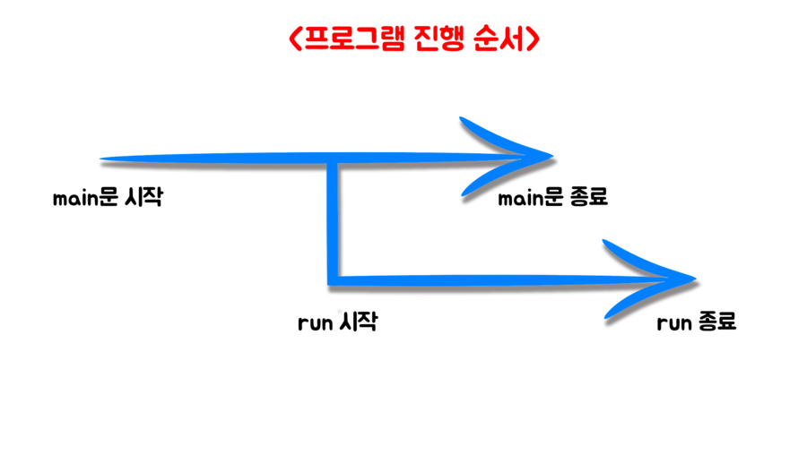

# 19 Days - 추상클래스, 인터페이스, Thread, Socket

### 사용 프로그램

* 사용언어 : JAVA(JDK)1.8.0\_261 : Oracle.com
* 사용Tool \
  \- Eclipse : Eclipse.org\
  \- Toad DBA Suite for Oracle 11.5

## 복습

* 참고 : StarCraft.java

### 설계 - UML

* 프로그램 설계시 UML을 그려보면 좋다.
* 클래스의 변수와 메서드를 적어보는 것이다.

### 다중구현

* 상속은 **단일상속**만 가능하다. 
* 인터페이스는 상속 **다중구현**이 가능하다. 
* 단일 상속의 단점을 보완하기 위한 것이 인터페이스이다.

### extends & implements

* extends 클래스\
  \- 추상클래스를 상속받으면 나도 추상클래스가된다.
* implements I\
  \- 인터페이스를 implements하면 나는 구현체 클래스가 된다.
* 인터페이스 : 행위는 특정개체에 종속적이면 안되는 것과 같이 추상적이여야한다.\
  \- Movable을 인터페이스로 한 이유는 Tank는 Marine과 다르게 움직이기 때문이다.\
  \- 유닛 추가, 수정이 가능하다.


[starcraft.md](starcraft.md)


## 필기

### 콜백메서드 & 추상메서드

* ActionListener 인터페이스\
  \- actionPerformed 추상메서드 = JVM이 호출하는 콜백메서드\
  \- 이벤트는 개발자가 정한다. 변화한다. -> 추상메서드를 이용하는 이유
* 콜백메서드는 추상메서드일 가능성이 높다.

### StringBuilder & StringBuffer

* StringBuilder 클래스는 싱글스레드에서 안전하다.
* StringBuffer  클래스는 멀티스레드에서 안전하다.

### UI & Server

* initDisplay와 Server중 먼저 실행되어야 하는것은 무엇인가?
* Server는 요청이 있을때까지 대기한다. -> 화면먼저
* 화면이 있어야 요청이 있을 수 있다.

## 스레드(Thread) 클래스

* 시간을 건드리는 API를 갖고있다.\
  \-> 변수와 메서드 들을 갖는다. -> 인스턴스화 -> 생성자 -> 파라미터 설정 -> 사용자의 입력
* **동시작업**, **지속작업**에 사용된다.
* 순서를 정해준다.
* 인터넷의 탭과 같이 병렬구조를 갖고 여러 작업을 진행해도 되게 해주는 클래스이다.\
  \- 작업마다 스레드 하나를 제공해야한다.\
  \- 서버 : 듣고, 말하기\
  \- 동시에 말할 수 있다. = 경합이 일어난다. = Thread가 필요하다.
* 스레드 하나로 작업을 여러개 하고싶다 -> Runnable 인터페이스

### 스레드 상속

* extends Thread
* run( ) { } 메서드를 갖고있다. Override해서 사용한다.

### Runnable 인터페이스 이용

* implements Runnable
* run메서드를 갖고 있다. Override해서 사용한다.

### run( ) { }

* 콜백메서드이다.
* run메서드의 역할\
  \- **순서**를 정해준다. (순서대로 듣고, 차례대로 말한다.)\
  \- **지속**되는 경우 (ex)네비게이션의 길 안내)
* 순서를 정해주고 지속을 유지해주는 것은 run메서드 안에서 일어나는 일이다.\
  \- 사용시 Override해야한다.

## Socket

### ServerSoket

* 서버 안의 socket은 port번호만 있으면 된다. 
* port지정 = 열어둔다.
* 서버소켓안에는 a의 소켓, b의 소켓, 등이 있다.
* ServerSoket server = new ServerSoket( );

### Client

* 클라이언트도 가져올 값을 받을 socket을 선언한다.
* 이 소켓은 ip, port번호 둘다 있어야 들어갈 수 있다.
* 서버의 ip와 port번호가 필요하다 -> 서버에게 물어보자 -> 인스턴스화
* Socket s = server.accept( );
* 소켓에 쓰여져있는 것을 읽어오려면\
  \- InputSting : read의 역할\
  \- OutputString : write의 역할\
  \- 두가지가 필요하다.

## Thread 활용

### TimeServer.java

* TimeClient 클래스\
  \- 클라이언트, 핸드폰\
  \- 스레드를 Runnable인터페이스를 implement해서 사용한다.\
  \- run메서드 Override\
  \- 화면에 시간을 표시한다. -> 1초마다 이루어지는 지속적인 작업
* TimeServer 클래스\
  \- 서버, 기지국\
  \- 스레드를 extends Thread, 상속해서 사용한다.\
  \- run메서드 Override\
  \- 시간을 제공한다. String PushTime( );
* Calenda 클래스\
  \- API : util -> Calenda -> 생성자(Timezone, Local) 존재 -> static 메서드 이므로 -> static field에서 사용할 변수를 찾는다. -> getInstance메서드가 있으므로 생성자를 통해 인스턴스화 한다.

### TimeServer2.java

TimeServer보다 더 개선된, 더 안전한 Server 만들기

* Server : TimeServer2 클래스\
  \- JFrame, Runnable 상속\
  \- run 메서드 Override
* Server : TimeServerThread\
  \- ObjectOutputStream : oos\
  \- ObjectInputStream : ois
* TimeServer2에서 Socket선언
* TimeServerThread에서 TimeServer2 인스턴스화, 생성자를 이용한다.\
  \- TimeServer2의 멤버변수 사용가능\
  \- Socket을 사용하기 위해 ts2의 주소번지를 생성자의 파라미터로 넘긴다.

##

후기 : 세미 프로젝트와 병행하려니 하루가 30시간이였으면 좋겠다는 생각을 한다..
