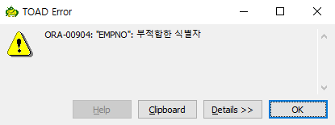

# Toad

## TOAD Error

* 위와같이 부적합한 식별자 오류 가 뜨면 식별자를 확인해 보아야한다.

.png>)

* dept부서 집합에서 ( )를 조회하는 것인데 empno사원번호는 dept 집합이 아니라 emp집합에 있는PK이기 때문이다.
* 26번과 같이 PK와 집합을 맞춰주면 오류가 발생하지 않는다.

## SELECT 활용

DB의 테이블 구조를 있는 그대로 출력하는 경우는 거의없다. \
SELECT문을 잘 사용할줄 알아야한다.

.png>)

* zipcode_t 주소 테이블집합에서 지역zdo를 조회\
  \- distinct(zdo) : zdo 중복값 제외\
  \- 중복되지않는 것만 SELECT한다.

.png>)

* 29번 : 1차 배열로 나타내진다.\
  \- row가 1개 colum이 5개인 가상 테이블
* 31-35번 : row를 늘어나게 하는 방법\
  \- UNION ALL

.png>)

* 13번 : zdo는 ALIAS명이다.
* '전체'문자열을 row에 추가한다.\
  \- UNION ALL
* zdo SELECT문을 괄호로 묶지 않으면 '전체'가 내가 원하는 위치인 row의 상위가 아니라 기존 row들과 섞여서 같이 정렬이된다. = 인라인뷰

.png>)

* SELECT문과 FROM절에 집합이 n개 올 수 있다.
* 20번 : 조회한다.
* 21번 : d의 deptno, e의 ename
* 22번 : d는 dept, e는 emp 에서
* 23번 : d의 deptno 값과 e의 deptno값이 같은 곳을 조회한다.
* 왼쪽항의 deptno는 d 의 PK 이고, 오른쪽항의 deptno는 e의 FK이다.

.png>)

* 25번 : emp집합의 empno row의 갯수 count를 조회한다.
* 27번 : dept집합의 deptno row의 갯수 count를 조회한다.

.png>)

* zdo가 '서울'이고 dong이 '가산동%'인 address를 조회
