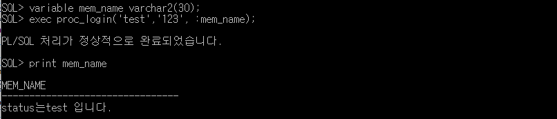

# Toad&CMD - PL/SQL : procedure&refcursor

## CMD

### sql 접속

* sqlplus 사용자/암호@아이피:port/사용자명 - sqlplus scott/tiger@192.168.0.187:1521/orcl11

### 프로시저 & refcursor 생성

* OR REPLACE는 옵션으로 생략가능하다.
* PROCEDUSER의 파라미터는 반드시 하나 이상을 갖고있어야한다.
* proc\_dept인자를 프로시저로 생성한다.
* refcusor인 p\_rc는 자바에서의 리턴값과 같은 역할이다.
* IS : 선언부
* BEGIN : 실행문 시작
* END; : 종료

### 실행 및 출력

* OUT되는 p\_rc를 refcursor로, exec\(실행\) 한다.
* p\_rc를 출력

* oracle에서 직접 호출 성공 -&gt; 자바로 구현해야한다.

## Toad

### refcursor - 실행 및 출력

* 토드에서의 실행 및 출력문도 도스와 같다.

### 프로시저 생성문 & 실행문 & DB출력문, 스칼라변수

* 위 v\_name과 같이 선언되는 변수를 스칼라 변수라고 한다.

### 프로시저 로그인 - 생성 & 인자 선언 & NVL 

* proc\_login이라는 프로시저 생성
* IN : 사용자에게서 수집해오는 값
* OUT : 리턴 값
* status라는 인자를 선언한다.
* 실행문 : member69집합의 mem\_id와 사용자 입력 값인 u\_id가 일치하는 mem\_id가 null이면 -1을 status에 담는다.
* 리턴값 msg에 status를 입력

### 프로시저 로그인 - 실행 & 출력

* 리턴 변수의 타입을 맞춘다.
* 프로시저 실행, 파라미터를 맞춰 IN값을 넣어준다.
* 리턴값 출력

