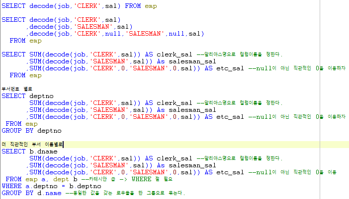

# Toad - GROUP BY, 변수=컬럼

## GROUP BY & 컬럼 & Decode 활용

* job이 'CLERK'이면 연봉값 반환
* job이 'CLERK'이면 연봉값 합계를 clerk\_sal 컬럼에 반환 job이 'SALSEMAN'이면 연봉값  합계를 salseman\_sal 컬럼에 반환 job이 'CLERK'이 아니고, 'SALSEMAN'도 아닌 Job 연봉값 합계를 etc\_sal 컬럼에 반환
* GROUP BY절을 이용해 부서번호 별로 나타내기
* 카테시안 곱 + GROUP BY절을 이용해 더 직관적이게 부서 이름으로 나타내기 - 부서이름과 부서번호는 다른 테이블에 있으므로 카테시안곱 + WHERE절을 이용한다. - GROUP BY절로 같은 값을 갖는 로우를 그룹으로 묶는다.

