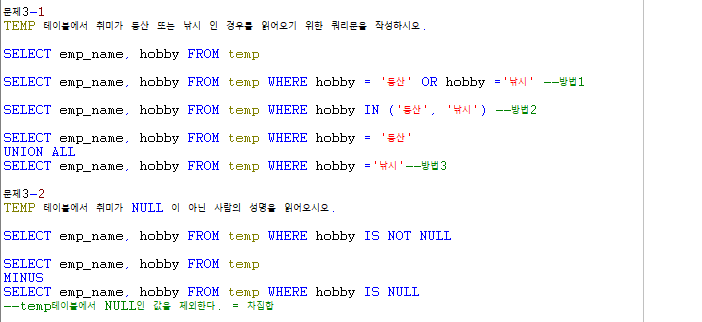
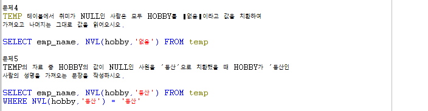
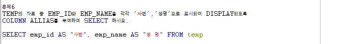
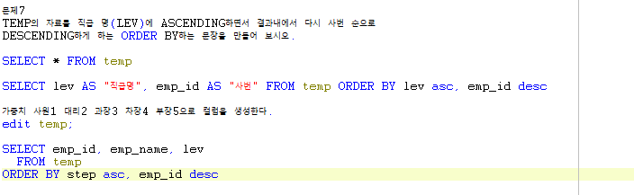
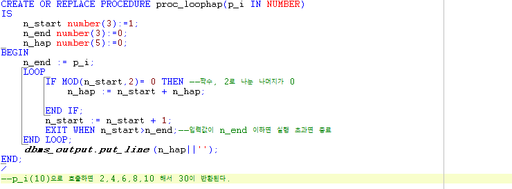

# Toad - 문제풀이

### ROUND & TO\_CHAR

* 월 급여는 연봉을 18로 나눠 홀수달에는 연봉/18, 짝수달에는 연봉\*2/18이 지급될때,  홀수달과 짝수달에 받는 금액을 나타내시오
* 홀수달 급여 : 1\*salary컬럼/18
* 짝수달 급여 : 2\*salary컬럼/18
* Round함수를 이용해 나눈 값의 소수점을 반올림해서 표시한다.
* To\_char함수를 이용해 값의 형식을 정해준다.
* Alias명을 이용해 컬럼명을 정해준다.

### ALIAS & TO\_CAHR 

* 위 월 급여에 교통비가 홀수달은 10만원, 짝수달은 20만원씩 지급됨을 나타내시오

### NULL & UNION ALL & MINUS

* TEMP테이블에서 취미가 등산 또는 낚시인 경우를 나타내시오
* 방법 1 : WHERE 컬럼 = 값1 OR 값2 ...
* 방법 2 : WHERE 컬럼 IN\(값1, 값2, ...\)
* 방법 3 : WHERE 컬럼 = 값1 UNION ALL WHERE 컬럼 = 값2
* TEMP테이블에서 취미가 NULL이 아닌 사람의 이름을 나타내시오
* 방법 1 : WHERE 컬럼 IS NOT NULL
* 방법 2 : 전체 TEMP MINUS WHERE 컬럼 IS NULL

### NULL & NVL

* TEMP테이블에서 취미가 NULL인 사람은 모두 Hobby를 \|없음\|이라고 값을 치환하여 취미컬럼을 나타내시오
* NVL\(치환시킬값, 치환할값\)
* TEMP테이블에서 hobby가 NULL인 사원을 '등산'으로 치환하고 hobby가 등산인 사람의 이름을 나타내시오.
* SELECT 이름, NVL\(취미를 등산으로 바꾸기\) FROM temp WHERE NVL\(취미를 등산으로 바꾸기\) = '등산'

### ALIAS

* TEMP의 테이블에서 emp\_id와 emp\_name을 '사번', '성명'으로 나타내시오

### ORDER BY

* TEMP테이블을 직급명은 오름차순, 사번은 내림차순으로 나타내시오

### LOOP

* 파라미터 입력 값 이하의 수 중에서 짝수값을 더한 값을 나타내시오

