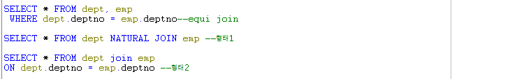
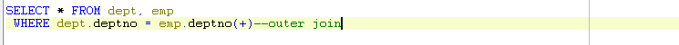

# 28 Days - equi\&outer join, vue, 인라인뷰, 도서관리 마무리

### 사용 프로그램

* 사용언어 : JAVA(JDK)1.8.0\_261 : Oracle.com
* 사용Tool \
  \- Eclipse : Eclipse.org\
  \- Toad DBA Suite for Oracle 11.5

## Toad

### Join

* 두 개 테이블 사이에 공통되는 컬럼이 있으면 Join할 수 있다.

### Equi Join(Natural Join)

* 공통되는 컬럼의 row 중, 같은 값을 가진 row를 기준으로 한다.
* 값이 같은지만 비교할 수 있다.
* **FROM 테이블명 NATURAL JOIN 테이블명**
* **JOIN-ON : **임의조건을 지정해야 하거나 컬럼을 지정하는 조인 조건은 ON절에, 다른 검색이나 필터조건은 그 다음에 WHERE절을 사용한다.

### OUTER JOIN

* 조인 조건의 컬럼에 테이블 중 어느 테이블이더라도 NULL값이 있지만 결과로 출력해야하는 경우에 사용하는 JOIN이다.
* '(+)'기호를 사용해 NULL값이 존재하는 테이블명에 표시한다.

### NON EQUI JOIN

* 크거나 같다. 또는 범위를 정할 때 사용하는 JOIN이다.

### 뷰(VUE)

* n개 테이블(join 등)이나 다른 뷰를 이용해 생성되는 가상테이블이다.
* 이 테이블은 실질적으로 데이터를 디스크에 저장하지는 않고, 뷰가 정의된 쿼리문만 저장된다.
* 외부에 노출되지 않는 테이블로, 컬럼을 숨길 수 있다.
* 보안상의 이점으로 금융기관 이나 회계기관 등에서 많이 사용된다.

### 인라인뷰

.png>)

* 여러개의 조건 중 하나만 비교하거나 할때 사용하면 집합 원소의 갯수를 줄일 수 있다.
* SELECT 문이 FROM절 안에서 사용되면 인라인뷰라고 한다.\
  \- 이 때에는 SELECT한 컬럼이나 ALIAS명을 밖에서 사용할 수 있다.\
  \- FROM절은 집합이므로

### 서브쿼리

* 직접조건 대신 간접조건이 주어질때 사용한다.
* WHERE절 안에 SELECT문이 사용되면 서브쿼리라고한다.\
  \- 이때에는 SELECT한 컬럼이나 ALIAS명을 밖에서 사용할 수 없다.\
  \- WHERE절은 조건이므로


[toad-t_giftpoint-t_giftmem.md](toad-t_giftpoint-t_giftmem.md)



[toad-t_worktime.md](toad-t_worktime.md)


## Java

### 도서관리를 통한 학습목표

1. 인스턴스화를 분리하고, 선언과 생성의 위치를 정할 수 있다.
2. 생성자를 선택할 수 있다.
3. 클래스나 DB의 연결되는 부분(인터페이스)을 처리할 수 있다.\
   \- 객체주입, 클래스 쪼개기

### UPDATE문

* UPDATE 테이블명 SET 컬럼 = 변경할값, ... WHERE 조건;

### DELETE문

* DELETE FROM 테이블명 WHERE 조건;


[java-update-delete.md](java-update-delete.md)


후기 : oracle SQL, Toad 에 대해 많이 찾아서 예습, 복습을 열심히 해야할 것같다. 화이팅!
