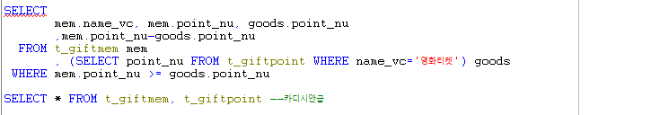

# Toad - t_giftpoint, t_giftmem 숙제풀이

### 문제1

#### 영화 티켓을 받을 수 있는 사람의 명단과 현재 가지고 있는 포인트, 영화 티켓의 포인트 그리고 그 티켓을 사용한 후 남은 예상 포인트를 출력하시오. - equi join과 인라인뷰를 이용하시오.

.png>)

* 집합이름 : t_giftpoint, t_giftmem
* 상품포인트\[point_nu]를 주지 않는다.\
  \- 간접조건 -> 서브쿼리를 사용해야한다.
* 영화 티켓을 받을 수 있는 집합 : 상품집합 = t_giftpoint
* 사람의 명단과(+, add) 보유 포인트 : t_giftmem
* 잔여포인트 : 회원포인트 - 상품포인트
* 조건1 : 영화티켓\
  \- 영화티켓의 포인트 : 포인트는 제공해주지 앟는 대신 영화티켓을 제공해 주었다.\
  \- SELECT point_nu FROM t_giftpoint WHERE name_vc = '영화티켓' -> 15000\
  \- 이 조건이 있어야 비교를 할 수 있게된다.
* AND OR 어떤것을 써야할까?\
  \- 영화티켓이 기준이 된다. 상품집합에 있는 모든 상품이 비교대상은 아니다.\
  \- 그 중에서 영화티켓 = 15000포인트 보다 크거나 같으면 되는 것이다.\
  \- AND 사용
* 조건2 : 상품포인트보다 회원포인트가 커야한다.\
  \- mem.point_nu >= goods.point_nu

.png>)

### 문제 1-2

#### 김유신씨가 보유하고 있는 마일리지 포인트로 얻을 수 있는 상품 중 가장 포인트가 높은 것은 무엇입니까? - 서브쿼리를 이용하시오.

* 김유신씨의 보유 포인트가 50012점이므로 위와 같은 SELECT 구조가 필요하다.

* 김유신씨의 보유포인트보다 작거나 같은 상품 포인트 중에 최댓값을 검색한다.

* 서브쿼리를 이용해 쿼리문을 완성한다.
