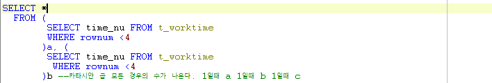

# Toad - t_worktime 숙제

## 문제

#### time_nu가 작업코드(workcd_vc)에 대한 작업시간일때, 작업시간이 작은 순서대로 순위를 나타내시오

## 이론

### Join 사용

* 기본적으로 한테이블에서는 다른 로우를 비교할 수 없다.\
  \-> 같은 두개의 테이블이 있다면 로우를 서로 비교 하면 된다.
* a테이블과 b테이블을 카테시안 곱으로 두고, \
  \- a테이블 값과 같거나 큰것 보여줘 : Count(b테이블) -> 1개는 1등, 2개면 2등, 3개면 3등\
  \- a테이블 값과 같거나 작은것 보여줘 : Count(b테이블) -> 1개는 3등, 2개면 2등, 3개면 1등

### GROUP BY 사용

## 풀이

.png>)

.png>)

