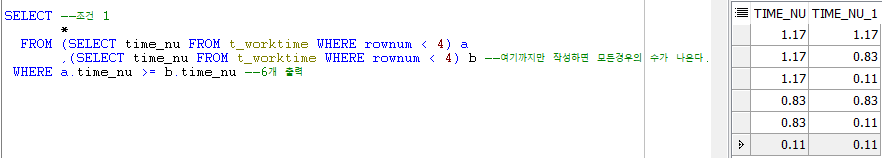
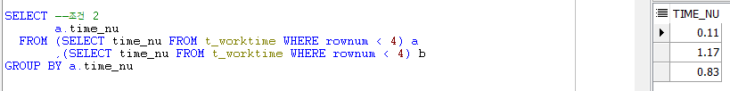
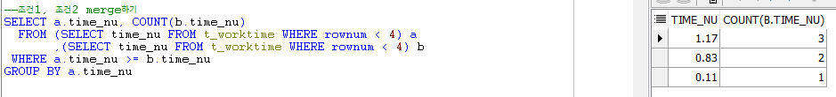
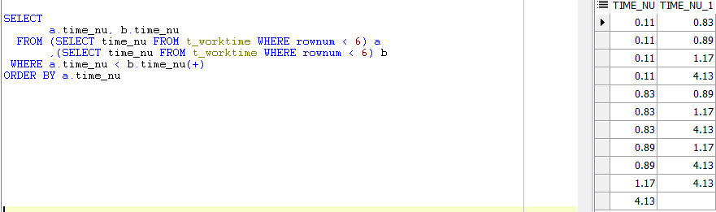
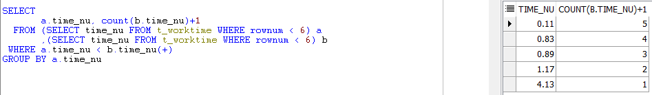

# Toad - t\_worktime 풀이

## 문제

#### time\_nu가 작업코드\(workcd\_vc\)에 대한 작업시간일때, 작업시간이 작은 순서대로 순위를 나타내시오

## 풀이

* 비교하려면 테이블이 하나 더 있어야 하므로 카다시안 곱을 이용해 테이블을 복제한다.

* 필요한 row값을 출력해본다.

테이블을 복제하고 필요한 row값, Count함수와 GROUP BY절을 이용해 결과를 출력한다.

## 번외

* outer join은 a테이블에 값이 있으면 b테이블의 null값도 표시해주는 것이다.

* 일반 컬럼과 count\(\)+1을 이용해 GROUP BY절을 사용했다.

