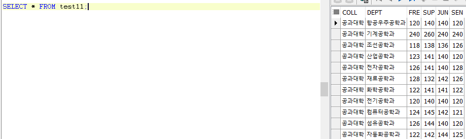
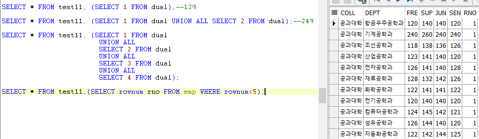
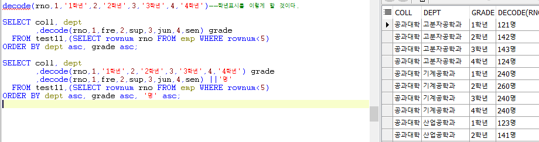

# Toad - test 11 풀이

#### 주어진 테이블의 fre를 1학년의 정원, sup을 2학년 정원, ...이라고 할때, 테이블을 과별로, 학년별로 나타내시오.

* 총 4개의 학년이므로 테이블이 4개 복제되어야 한다. 
* rownum이 5 이하인 만큼 복제한다.

* 대학별, 과별, 학년별로 정원이 나타내진다.
* decode함수와 rownum을 이용해 학년컬럼을 나타내고, grade별칭을 주었다.
* 마찬가지의 방법으로 정원 컬럼을 나타내고, '명'을 붙여주었다.
* FROM절에는 복제된 테이블이 온다.
* ORDER BY를 이용해 과, 학년, 정원을 오름차순하여 정리한다.

