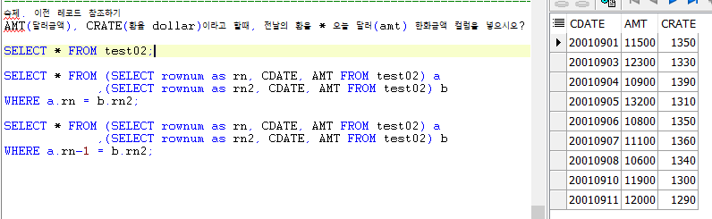
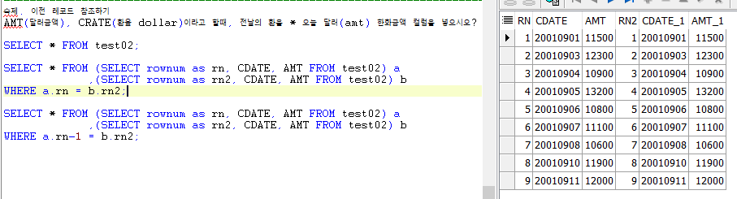
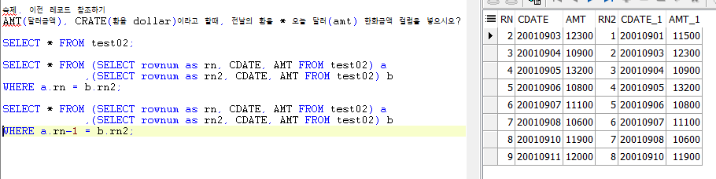

# Toad - test02 숙제

## rownum을 이용한 이전 레코드 참조

#### AMT\(dollar\)이고, CRATE\(환율\)일때, 전날의 환율 \* 오늘 달러 하여 한화금액을 나타내시오.

* CDATE :날짜, AMT : dollar금액, CRATE : 환율 컬럼이다.

* 전날 값과 오늘 값을 이용해야 하므로 복제된 테이블이 필요하다.
* 인라인뷰와 rownum, WHERE절을 이용해 옆으로 나타낸다.

* 전날을 표시하기 위해 WHERE절로 한 테이블의 rownum에 -1한다.

