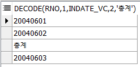
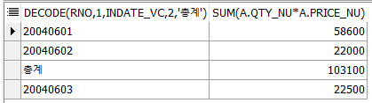
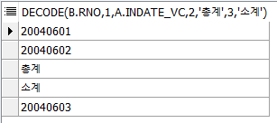
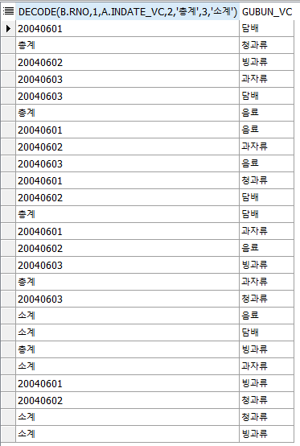
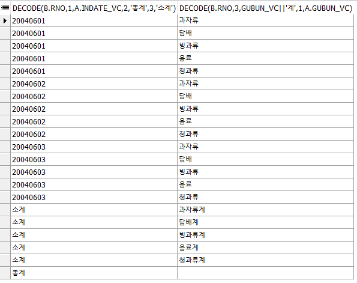
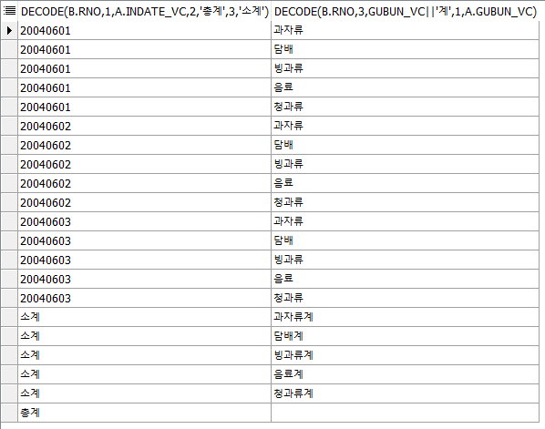

# t\_orderbasket

#### decode, sum, group by, alias, where, from, select, order by, 인라인뷰, 

## t\_orderbasket Table


## 문제 1

#### t\_orderbasket 테이블에서 분석함수를 사용하지 않고 각 날짜별로 총 몇개의 물건이 얼만큼 팔렸고 총 매출액을 얼마인지 나타내시오. 윗줄 3줄은 날짜를, 마지막 줄에는 총계를 나타내는 SQL문을 작성하시오. 


### 1단계 카타시안의 곱, 데이터 복제

```sql
SELECT *
  FROM t_orderbasket, (SELECT rownum rno FROM dept WHERE rownum<3)
  --2배수, 54X2=108개 출력
```

* 기준이 날짜와 총매출액 이므로 테이블이 2개가 필요
* rownum&lt;3 이므로 테이블의 2배수, 54 x 2 =108개가 출력되도록 한다.
* rno 1은 날짜별, rno 2는 총 계가 될 것이다.

### 2단계 - 그룹화



```sql
SELECT DECODE(rno,1,indate_vc,2,'총계')
  FROM t_orderbasket, (SELECT rownum rno FROM dept WHERE rownum<3)
GROUP BY DECODE(rno,1,indate_vc,2,'총계')
```

* DECODE함수와 GROUP BY 절을 이용해 그룹화 한다.
* 1번 : rno가 1이면 indate\_vc\(날짜\)를 출력하고, 2라면 '총계'라고 출력한다.
* 2번 : t\_orderbasket테이블을 두번 출력한다.
* 3번 : rno 1번은 날짜로, rno 2번은 '총계'로 그룹화한다.

### 3단계 - 필요 수식 구하기

```sql
a.qty_nu*a.price_nu
```

* 총 매출액을 계산하기 위한 공식이 필요하다.
* 공식 : 판매개수 \* 개당 판매가격 을 모두 더한 값일 것이다.
* a = t\_orderbasket의 알리아스명

### 4단계 - GROUP BY와 그룹함수



```sql
-- 1번 : GROUP BY절에 추가한다.=효과없음
-- 2번 : 그룹함수를 사용한다.
SELECT DECODE(rno,1,indate_vc,2,'총계'), sum(a.qty_nu*a.price_nu)
  FROM t_orderbasket a, (SELECT rownum rno FROM dept WHERE rownum<3)
GROUP BY DECODE(rno,1,indate_vc,2,'총계')
```

* GROUP BY절에는 GROUP BY 표현식이 아닌 것은 사용될 수 없다.
* 총 매출액 = sum\(판매개수 \* 개당 판매가격\)으로 그룹함수를 이용해 묶으므로 에러가 발생하지 않는다.
* 출력된 첫번째 컬럼은 2단계와 같고, select절에 sum컬럼이 추가되어 두번째 컬럼이 출력된다.

### 4-2단계 - 판매 갯수 추가


```sql
SELECT DECODE(rno,1,indate_vc,2,'총계'), sum(a.qty_nu*a.price_nu), sum(a.qty_nu)
  FROM t_orderbasket a, (SELECT rownum rno FROM dept WHERE rownum<3)
GROUP BY DECODE(rno,1,indate_vc,2,'총계')
ORDER BY DECODE(rno,1,indate_vc,2,'총계')
```

* 사용자가 판매된 갯수도 알고싶다고 한다면, - count를 사용해야할까 sum을 사용해야할까?
* count를 사용하게되면 row의 갯수만을 세므로 그날 계산 횟수를 세는 것이 된다.
* sum을 사용해야 그날 계산된 모든 판매개수를 셀 수 있다.
* SELECT문에 모든 판매개수를 담는 sum컬럼이 추가되어 결과에도 컬럼이 세번째 컬럼이 출력된다. 이 sum함수로 묶인 컬럼은 그룹함수로 이미 묶여있으므로 아무런 문제 없이 진행된다.
* ORDER BY절을 추가해 보기좋게 정렬한다.

## 문제 2

#### 아래와 같은 테이블을 출력하는 SQL문을 작성하시오.


### 1단계 - 카타시안의 곱



```sql
SELECT * FROM t_orderbasket a, t_orderbasket b

--1단계 .
SELECT DECODE(b.rno,1,a.indate_vc,2,'총계',3,'소계')
  FROM (SELECT indate_vc, price_nu FROM t_orderbasket)a
     , (SELECT rownum rno FROM dept WHERE rownum<4)b
GROUP BY DECODE(b.rno,1,a.indate_vc,2,'총계',3,'소계')
```

* 나타내야하는 조건, 기준이 3개 이므로 테이블이 3개 필요하다. - 날짜, 소계, 총계 - 날짜는 3종류, 소계는 제품별로 5종류, 총계는 단 하나만 출력되면 된다. - 날짜는 또 제품별로 나뉘어져야 하므로 3 x 5 = 15개의 row가 나와야한다.
* 4번 : SELECT문의 컬럼은 일단 하나 - b.rno가 1이면 날짜를, 2이면 '총계'를 3이면 '소계'를 출력한다.
* 5번 : FROM절 첫번째 집합 - t\_orderbakset에서 날짜와 개당 가격을 SELECT한다.
* 6번 : FROM절 두번째 집합 - 카타시안의 곱을 이용해 테이블을 3개 출력하는 집합
* 7번 : GROUP BY절에 b.rno가 1이면 날짜로, 2이면 '총계'로, 3이면 '소계'로 그룹화한다.

### 2단계 - 제품종류 추가



```sql
SELECT DECODE(b.rno,1,a.indate_vc,2,'총계',3,'소계'), gubun_vc
  FROM (SELECT indate_vc, price_nu, gubun_vc FROM t_orderbasket)a
     , (SELECT rownum rno FROM dept WHERE rownum<4)b
GROUP BY DECODE(b.rno,1,a.indate_vc,2,'총계',3,'소계'),gubun_vc
```

* 1번 : 날짜별+제품별, 소계+제품별 로 나타내야하므로 SELECT절에 제품구분 컬럼을 추가한다.
* 2번 : 컬럼을 사용하기 위해 FROM절 첫번째 집합에서 해당 컬럼을 SELECT해야한다.
* 4번 : 날짜, 소계, 총계 모두 제품구분 컬럼으로 그룹화 될 수 있기 때문에 그룹함수 없이 추가가 가능하다.

### 3단계 - 필요 수식 구하기

```sql
decode(b.rno,3,gubun_vc||'계',1,a.gubun_vc)
```

* 복제된 테이블 3번의 제품구분 컬럼이라면 '계'를 붙이고, 
* 복제 테이블 1번의 제품구분 컬럼은 그대로 나타낸다. 
* 소계를 그룹화한 제품구분 컬럼의 값들에 '계'를 붙이고, 날짜를 그룹화한 제품구분 컬럼은 그대로 나타낸다.

### 4단계



```sql
SELECT DECODE(b.rno,1,a.indate_vc,2,'총계',3,'소계')
      ,DECODE(b.rno,3,gubun_vc||'계',1,a.gubun_vc)
  FROM (SELECT indate_vc, price_nu, gubun_vc FROM t_orderbasket)a
     , (SELECT rownum rno FROM dept WHERE rownum<4)b
GROUP BY DECODE(b.rno,1,a.indate_vc,2,'총계',3,'소계')
        ,DECODE(b.rno,3,gubun_vc||'계',1,a.gubun_vc) 
```

* 위 3단계 에서 총계는 제품구분 컬럼에 따라 5개 이다.
* 총계는 여러 row가 아닌 단 하나의 row로 표시되어야 한다.
* 2번 : SELECT에 두번째 컬럼이 변경되었다. - 두번째 컬럼은, 1번 테이블\(날짜\)의 구분제품컬럼은 그대로 나타내고,                               3번 테이블\(소계\)의 구분제품컬럼은 '계'를 붙여서 나타낸다.
* 6번 : 추가된 컬럼으로 한번 더 묶어 위 테이블처럼 나타낸다.

### 4-2단계



```sql
SELECT DECODE(b.rno,1,a.indate_vc,2,'총계',3,'소계')
     , DECODE(b.rno,3,gubun_vc||'계',1,a.gubun_vc)
  FROM (SELECT indate_vc, price_nu, gubun_vc FROM t_orderbasket)a
     , (SELECT rownum rno FROM dept WHERE rownum<4)b
GROUP BY DECODE(b.rno,1,a.indate_vc,2,'총계',3,'소계')
     ,DECODE(b.rno,3,gubun_vc||'계',1,a.gubun_vc)
ORDER BY DECODE(b.rno,1,a.indate_vc,2,'총계',3,'소계')
```

* 보기 좋게 정렬한다.

### 5단계


```sql
SELECT DECODE(b.rno,1,a.indate_vc,2,'총계',3,'소계') as "판매날짜"
     , DECODE(b.rno,3,gubun_vc||'계',1,a.gubun_vc) as "물품구분"
     , SUM(a.qty_nu)||'개' as "판매개수"
     , SUM(a.qty_nu*a.price_nu)||'원' as "판매가격"
  FROM (SELECT indate_vc, gubun_vc, qty_nu, price_nu FROM t_orderbasket)a
     , (SELECT rownum rno FROM dept WHERE rownum<4)b
GROUP BY DECODE(b.rno,1,a.indate_vc,2,'총계',3,'소계')
     ,DECODE(b.rno,3,gubun_vc||'계',1,a.gubun_vc)
ORDER BY DECODE(b.rno,1,a.indate_vc,2,'총계',3,'소계')
```

* 위 테이블처럼 출력되도록 알리아스명을 붙이고, 판매개수와 판매가격을 추가한다.
* 3번 : 판매개수는 sum 그룹함수로 묶고, '개'를 붙인다.
* 4번 : 판매가격은 해당 제품의 그날 총 판매가격이여야 하므로 sum그룹함수를 이용해 나타낸다. -  sum\(판매개수 x 개당가격\) -'원'을 붙인다.
* 위 추가된 컬럼들은 sum함수로 그룹화되어있으므로 GROUP BY 절에 넣지 않아도 된다.

