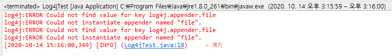

# 41 Days - Log4j, properties, transaction, POOL, mybatis-insert, multiInsert, foreach

### 사용 프로그램

* 사용언어 : JAVA(JDK)1.8.0\_261 : Oracle.com
* 사용Tool \
  \- Eclipse : Eclipse.org\
  \- Toad DBA Suite for Oracle 11.5
* 사용 FrameWork\
  \- MyBatis

## 복습

### myBatis의 역할

* sql문, DB연결을 도와주는 오픈 프레임워크
* 코드를 줄여주어 오타의 위험성을 낮춘다.
* 반복되는 코드를 줄여주어 일괄처리 할때의 번거로움을 줄여준다.

### Select문의 result 타입

* \<select \~ resultType="Map"/>\
  \- List\<Map<>>으로 받는다.\
  \- 기본 제공되는 타입
* \<select \~ resultType="com.vo.xxVO"/>\
  \- List\<xxVO> 로 받는다.\
  \- 개발자가 지정한 파일 타입이므로 경로를 포함해 지정해주어야 mybatis가 찾을 수 있다.

### JSON

* 자바와 html
* 자바와 javascript
* 자바와 브라우저  를 연결시켜준다.

## MyBatis, Properties

### XML

* 무언가를 감싸주는 marking 역할
* 구성요소 : tag, 속성
* xml파일을 자바로 가져오려면 제일 먼저 xml문서를 스캔해야한다,

### MyBatis API 제공 XML설정 소스

```markup
<?xml version="1.0" encoding="UTF-8"?>
<!DOCTYPE configuration
 PUBLIC "-//mybatis.org//DTD Config 3.0//EN"
 "http://mybatis.org/dtd/mybatis-3-config.dtd">
<configuration>
	<environments default="development">
		<environment id="development">
			<transactionManager type="JDBC" />
			<dataSource type="POOLED">
				<property name="driver" value="${driver}" />
				<property name="url" value="${url}" />
				<property name="username" value="${username}" />
				<property name="password" value="${password}" />
			</dataSource>
		</environment>
	</environments>
	<mappers>
		<mapper resource="oracle/mybatis/zipcode.xml"/>
	</mappers>
</configuration>
```

* 1번 : xml파일의 첫 코드는 xml선언으로 시작한다.
* 2-4번 : 두번째 코드는 루트태그 \<configuration>으로, dtd 루트문서를 이용해 유효성검사를 한다.\
  \- dtd파일 = 명세서\
  \- dtd파일안에 명시된 태그, 속성들만 사용가능하다.
* 6번 : 루트태그의 첫번째 자식태그인 \<environments>태그\
  \- environments태그는 \<environment>, \<transactionManager type>, \<dataSource type>자식태그를 갖는다.
* 7번 : envoronment 태그 안에는 id가 정의된다.\
  \- 이 xml파일은 DB연결을 담당하는 파일로, java에서 mybatis의 sqlSession으로 db와 연결할때 호출을 구분하기위한 id이다.
* 8번 : transacrionManager태그안에는 db와 연결될 파일의 타입이 정의된다.\
  \- 자바 = JDBC
* 9번 : dataSource태그는 dataSource의 타입을 결정한다.\
  \- POOLED : 데이터 소스를 미리 만들어 두는것.
* 10-13번 : dataSource태그는 property자식 태그를 갖는다.\
  \- DB연결에 필요한 정보, 속성들이 정의된다.
* 17번 : 루트태그의 두번쨰 자식태그인 \<mappers>태그, 자식태그로 \<mapper>태그를 갖는다.
* 18번 : 이 db연결 xml을 사용할 SQL문 xml파일을 매핑하는 곳, SQLxml파일의 물리적 위치를 갖는다.

### Properties

* java : 컴파일
* xml : parsing\
  \- java와 xml은 각각 약속을 지키기위한 작업이 이루어진다.
* Properties파일은 약속을 지키기위한 검토 작업이 없다.
* 응용 프로그램의 구성 가능한 파라미터를 저장하기위해 자바관련 기술을 사용하는 파일들을 위한 확장 파일의 개념
* 각 파라미터는 문자열의 일부로 저장되어 문자열은 파라미터의 key를, 다른 하나는 값을 저장한다.
* Properties의 각 줄은 일반적으로 하나의 프로퍼티를 저장한다.
* 키=값, 키:값, 키 값, 등 여러 형태로 사용된다.
* **자주 변경되지 않는**, 설정파일과 같은 **정보를 프로퍼티 파일**로 저장해 관리한다.
* 자바의 클래스파일로 해도되지만, 정보 변경시 컴파일을 다시 해줘야하는 번거로움이 있다.


[properties.md](properties.md)


### 태그

* < > : 열린태그
* \</> : 닫힌태그
* 위 태그는 항상 한쌍으로 같이 사용된다.

### Type = POOL

* thread pool\
  \- 스레드를 미리 만들어 준비해 사용자 수를 조절에 용이하다.\
  \- 사용자가 빠져나가면 반드시 반납되어야한다.
* 바로바로 제공이 가능하므로 시간이 절약된다.
* 적정한 정원으로 제어가 가능하다.

### transaction

* DB의 **DML명령이 있는 SQL구문의 한 작업 단위**를 트랜잭션이라고 한다.
* **commit** : \
  \- 트랜잭션의 결과를 **DB에 반영**, 해당 SQL을 사용하면 수행했던 트랜잭션이 **로그에 저장**되며, 후에 rollback시 연산을 수행했던 트랜잭션단위를 rollback하는것을 돕는다.
* **rollback **\
  \- 트랜잭션의 **결과를 미반영**한 상태, 하나의 트랜잭션처리가 비정상적 종료되어 원자성이 깨진경우, 트랜잭션을 처음부터 다시 시작하거나 부분적으로만 연산된 결과를 다시 취소시킨다. \
  \- 해당 SQL작업단위의 기본개념이 유지되어야한다.=일관성
* **원자성(Atomicity)**\
  \- 모든작업은 같이 완료되어야한다. 하나라도 에러발생시 모든 작업이 rollback(미반영) 되어야 한다.
* **일관성(Condidtency) **\
  \- 작업 처리 결과가 항상 일관성이 있어야 한다는 것\
  \- 트랜잭션이 진행되는 동안에 DB가 변경 되더라도 업데이트된 DB로 트랜잭션이 진행되는것이 아니라, 처음에 트랜잭션을 진행 하기 위해 참조한 데이터베이스로 진행된다. \
  \- 각 사용자는 일관성 있는 데이터를 볼 수 있는 것이다.
* **격리성(Isolation)** :\
  \- 두개 이상의 트랜잭션이 동시에 실행되고 있을때 어떤 트랜잭션이라도 다른 트랜잭션의 연산에 끼어들어서는 안된다.\
  \-  해당 트랜잭션이 완료되기 전까지 다른 트랜잭션은 해당 트랜잭션의 결과를 참조할 수 없다.
* **지속성(Durability)** \
  \- 트랜잭션이 완료된경우 시스템고장, 네트워크 에러 등으로 데이터가 유실되지  않고 영구적으로 반영,기록되어야한다.

### MyBatis의 transaction

* JDBC - JDBC의 commit, rollback을 처리하기위한 타입
* MANAGED - 외부 컨테이너가 관리한다.

### namespace

* \<book.title>해리포터\<book.title/>\
  \<movie.title>해리포터\<movie.title/>
* book, movie = namespace\
  \- 해당 태그의 주인, 해당 태그가 저장되는 곳을 가리킨다.
* title = node, elements(XML), tag(HTML)

### 설정

.png>)

## MyBatisZipCodeSearch

* 화면의 JComboBox에 값이 {ZDO = XX}이렇게 나타나고 있다.\
  \- **Map의 value는 Object타입**이므로 {ZDO=XXX}라는 구조체가 Obejct로서 덩어리로 담긴다. \
  \- String zdo = rmap.get("ZDO").toString();해서 출력하면 덩어리가 나온다. \
  \- map으로 key, value를 나눠 담아야한다. \
  \- mybatis를 통해 값을 꺼낼때, **key는 대문자**여야한다.\
    **mybatis가 map에 put할때 key값을 대문자로 넣기 때문**이다.
* 세션은 사용이 끝나면 close함수로 session을 닫아줘야한다.\
  \- try {  } catch( ) { } finally { session.close( ): }


[mybatiszipcodesearch-2](mybatiszipcodesearch-2/)


## Apache - log4j

### Log4j 란

* Log for JAVA\
  \- 자바의 예외를 처리하기위해 디자인되었다.
* 로그 출력을 다양한 대상으로 할수있도록 도와주는 오픈소스 도구\
  \- 소스분석이나 디버깅 시에 용이하다.
* 설정파일은 property파일 또는 xml파일\
  \- 실행중에도 수정 적용이 가능하다.
* 멀티스레드 환경에서도 안전하다. thread-safe
* 6단계 장애레벨을 사용\
  \- TRACE, DEBUG, INFO, WARN, ERROR, FATAL
* 로그 출력 대상, 출력방법은** Appender인터페이스**로 지정한다.
* 한 logger에 n개의 출력을 담당하는 Appender를 할당할 수 있다.

### Log4j 구조

* Logger\
  \- 로그메세지를 Appender에게 전달한다.\
  \- 개발자가 직접 로그출력여부를 런타임에 조정할 수 있다.\
  \- 로그레벨을 갖고, 로그문의 레벨과 로거의 레벨을 가지고 로그의 출력여부를 결정한다.
* Appender\
  \- 로그의 출력위치를 결정하는 인터페이스 ( 파일, 콘솔, DB 등)\
  \- log4j API문서의 Appender로 끝나는 클래스의 이름으로 출력위치를 짐작할 수 있다.
* Layout\
  \- Appender가 어디에 출력할 것인지 결정했다면, 어떤 형식으로 출력할지, 출력 Layout을 결정한다.

### Log4j 레벨

* FATAL\
  \- 심각한 에러\
  \- 시스템적으로 문제가 발생해 애플리케이션작동이 불가능한 경우가 해당된다.\
  \- 일반적으로 애플리케이션에서는 사용할 일이 없다.
* ERROR\
  \- 요청을 처리하는 중 문제가 발생한 상태
* WARN\
  \-처리가능한 문제이지만, 후에 시스템 에러의 원인이 될 수 있는 경우에 경고성 메세지를 출력한다.
* INFO\
  \- 로그인, 상태변경과 같은 정보성 메세지를 출력한다.
* DEBUG\
  \- 개발시 디버그 용도로 사용한 메세지를 출력한다.
* TRACE\
  \- Appender로 지정된 클래스를 추적해 사용된 로그를 출력한다.
* FATAL > ERROR > WARN > INFO > DEBUG > TRACE
* DEBUG, TRACE레벨로 작석하면 INFO-FATAL레벨까지 모든 로그를 출력한다.

### 출력내용



### Log4jTest.java

```java
package oracle.mybatis;

import java.io.FileInputStream;
import java.util.Properties;
import org.apache.log4j.Logger;
import org.apache.log4j.PropertyConfigurator;

public class Log4jTest {
	static Logger logger = Logger.getLogger(Log4jTest.class);

	public static void main(String[] args) {
		try {
			FileInputStream fis = new FileInputStream("src//log4j.properties");
			Properties prop = new Properties();
			prop.load(fis);
			PropertyConfigurator.configure(prop);
			logger.info("여기");
		} catch (Exception e) {
			logger.info("Exception : "+e.toString());		
	}//////////////////////////end of main/////////////////////////
}
```

* org.apache가 제공하는 클래스로, apache의 log4j jar파일이 build path에 추가되어있어야 한다.
* 9번 : Logger클래스를 테스트 클래스의 로그를 얻도록 객체주입해 싱글톤 패턴으로 생성한다.
* 12번 : xml파일과 연동해야하고, log를 찍어보기위해 예외처리를 넣어준다.
* 13번 : 첫번째로, logger의 설정파일을 읽어와야한다. 여기서는 properties파일로 저장했다.\
  \- FileInputStream클래스 이용
* 14번 : Properties타입의 파일을 load하기위해 Properties클래스를 인스턴스화한다.
* 15번 : FileInputStream으로 읽어온 properties파일을 생성한 인스턴스 변수에 load하기
* 16번 : Properties파일의 설정을 설정파일을 담은 인스턴스 변수로 지정한다.
* 17번 : test를 위해 "여기" String정보를 담은 log를 출력한다.
* 18,19번 : catch문에서 Exception발생시 logger클래스를 통해 info 로그를 출력한다.

### log4j.properties 파일

```markup
#log4j.properties
log4j.rootCategory=info, stdout, file
log4j.debug=false
log4j.appender.stdout=com.p6spy.engine.logging.appender.StdoutLogger
log4j.appender.stdout=org.apache.log4j.ConsoleAppender
log4j.appender.stdout.layout=org.apache.log4j.PatternLayout
log4j.appender.stdout.ImmediateFlush=true
log4j.appender.stdout.Target=System.err

log4j.appender.stdout.layout.ConversionPattern=[%d] [%p] (%13F:%L) %3x - %m%n


log4j.appender.file.DatePattern = '.'yyyy-MM-dd
log4j.appender.file.layout=org.apache.log4j.PatternLayout
log4j.appender.file.layout.ConversionPattern=[%d] [%p] (%13F:%L) %3x - %m%n

log4j.logger.java.sql.Connection=INFO
log4j.logger.java.sql.Statement=INFO
log4j.logger.java.sql.PreparedStatement=INFO
log4j.logger.java.sql.ResultSet=INFO
```

* 설정파일, properties 파일 타입으로 저장
* 주석 : #

### lof4j 활용


[mybatiszipcodesearch.md](mybatiszipcodesearch-2/mybatiszipcodesearch.md)


## mybatis - insert, mutiInsert

### for each문

* List에 담긴 n개의 값을 한번에 DML문을 적용할때 사용하는 구문이다.
* 요소 내부에서 key로 사용할 수 있는 것은 item과 index를 허용한다.
* 파라미터로 List나 Map타입을 받을 수 있다.\
  \- MyBatis가 파라미터로 받은 List, Map변수를 자동으로 감싸 이름을 key로 사용한다.\
  \- List인스턴스는 "list'"를, 배열 인스턴스는 "array"를 key로 사용한다.

### foreach 제공 메서드

```markup
 <insert id="multiDeptInsert" parameterType="list">
 	insert all 
 	<foreach collection = "list" item="item" index="index" separator=" ">
 		into dept(컬럼1, 컬럼2, 컬럼3)
       values(#{item.컬럼1 값},#{item.컬럼2 값},#{item.컬럼3 값}) 
 	</foreach>
 	select * from dual
 </insert>
 
 <delete id="multiDeptDelete" parameterType="list">
   delete from dept where deptno in 
   <foreach open="(" close=")" collection = "list" item="item" index="index" separator=",">
 		#{item.deptno}
   </foreach>
 </delete>
</mapper>
```

* **collection **\
  \- 전달받은 인자값 반드시 Array또는 List가 되어야한다. 
* **index **\
  \- 목록의 위치값(index, count, first, last, ....)
* **item** \
  \- 전달받은 인자값의 이름 재정의시, 반복해서 다른 값을 넣을떄\
  \- (foreach구문에서 사용할 변수명) 
* **open **\
  \- 해당 구문이 시작할떄 넣을 문자(foreach구문이 시작할때 넣을 문자) 
* **close** \
  \- 해당 구문이 끝날떄 넣을 문자(foreach 구문이 끝날 떄 넣을 문자) 
* **separator **\
  \- 한번이상 반복할 떄 반복되는 사이에 해당문을 넣어준다.(구분자)\
  \- separator가 ','라고 한다면\
    insert구문은 foreach태그 안에 into 구문이 들어가므로 끝에 ,가 들어가는 순간 오류가 발생한다.\
    into dept(-) values(-), into ...가되므로 sql에러가 발생한다.\
   delete의 경우에는 foreach 태그안에 값만 들어가므로 끝에 ,를 넣어 구분하는 역할\
   사용자가 직접 forea태그의 값, 을 붙여버리면 마지막 값뒤에도 ,이 들어가 sql오류가 발생한다.
* insert문 자체를 반복하는 것이 아니다.\
  \- 반복되는 부분을 into구문으로 자동으로 만들어주어 한번에 insert all해준다.\
  \- INSERT All\
      into dept(컬럼1, 컬럼2, 컬럼3)\
       values (컬럼1값, 컬럼2값, 컬럼3값)\
      into dept(컬럼1, 컬럼2, 컬럼3)\
       values (컬럼1값2, 컬럼2값2, 컬럼3값2)\
     ....\
  \- 이런식으로 mybatis가 \<foreach>태그로 자동으로 into구문을 n개만들어 insert all한다.


[insert-mutiinsert.md](insert-mutiinsert.md)


후기 : 날씨가 추워지고 있다!! 코트를 입고싶은데 도대체 언제 꺼내서 입어야하는 거지??
