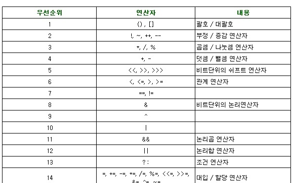
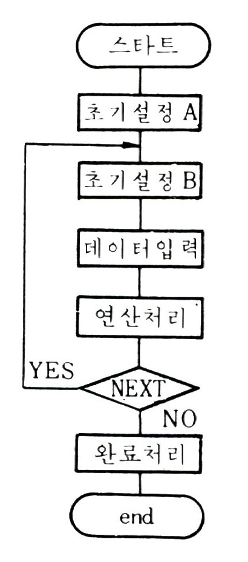

# 5 Days - for, if문과 연산자 활용, 객체, DB Oracle설치

### 4일차 복습

* 형전환은 무엇인가 double i = int x; 변수의 타입을 전환하는 것으로 오른쪽항의 타입이 왼쪽항의 타입보다 작아야한다.
* 강제형전환은 무엇인가 i = \(int\)f; 변수의 타입을 강제로 전환하는 것으로 오른쪽항의 타입이 왼쪽항보다 클때 사용된다. 이때 괄호안의 타입을 캐스트연산자라고 한다.

### 사용 프로그램

* 사용언어 : JAVA\(JDK\)1.8.0\_261 : Oracle.com
* 사용Tool : Eclipse : Eclipse.org

### 학습목표

* 사용언어 : JAVA\(JDK\)1.8.0\_261 : Oracle.com
* 사용Tool : Eclipse : Eclipse.org
* DB : Toad for Oracle 11g
* 조건문\(if,switch\)과 반복문\(for,while\)을 자유롭게 사용할 수 있다.
* 제어문을 만들기 위해 순서도를 그릴 수 있다.
* 필요한 변수의 개수를 판단할 수 있다.
* 변수의 타입을 정할 수 있다.
* 메소드의 파라미터에 왜 변수를 선언해야 하는지 설명할 수 있다.

### Oracle 이해하기

* **WAS**\(Web Application Server, 웹서버\) 정보를 불러오는 서버
* **DB**\(Data Base\) 정보가 저장되어있는 곳 보통 기업들은 DB를 전문관리업체에 맡긴다. = 물리적거리가 생긴다. -&gt; ip를 이용해서 여러사람이 같은 시간에 접속가능하게 한다. web을 꺼도 기록이 유지된다. = 영속성, 기록을 오래 보관한다.
* **API** 자바 규칙을 준수하여 만들어진 클래스 꾸러미 API활용능력 = 변수를 정할 수 있다.
* WAS의 바닥에는 java가 있고, DB가 사용하는 언어는 또 다르기 때문에  API가 이때 사용된다.
* 순서 사용자의 요청,입력 -&gt; WAS -&gt; DB -&gt; 사용자에게 응답 사용자의 요청 변수가 DB까지 유지되어야한다.  사용자가 끄면 변수는 초기화된다.
* 변수 -&gt; 배열 -&gt; 자료구조\(유지\) -&gt; 세션,쿠키\(연결\)
* PL/SQL : 표준 SQL

### 연산자

* 단항 연산자  : ++, --
* 삼항 연산자 : 조건식 ? 반환값1 : 반환값2                          조건식이 참이면 반환값1을, 거짓이면 반환값2를 반환한다.
* 대입 연산자 : 대입연산자인 = 를 이용해 오른쪽 값을 왼쪽 값에 대입한다.
* 관계 연산자 : 비교할때, 제어문에서 사용하는 연산자로 결과값이 True 또는 False로 반환된다. : &gt;, &lt;, &gt;=, &lt;=, ==, !=
* 


### 순서도 그리기

* **순서도\(flow chart\)** : 코드의 도면, 설계도 개념
* 코드를 작성하기 전에,  순서도 먼저 그리는 연습이 필요하다.



### 제어문

* **제어**  흐름의 방향을 **강제**하거나, **허락**하거나 방향을 바꾸는 것을 말한다. 이렇게 방향을 바꾸는데에는 변수가 필요하다. ex\) 사용자가 아이디를 생성할때 중복검사를 진행하면 컴퓨터가 DB에 등록되어있는 아이디들을 검색한다. 그러다 500번째에서 같은 아이디가 발견되면 검색을 멈추고 응답을 하는데, 이때 멈추는 것 ==제어 이다.
* 실행문 : 변수와 연산자를 연결한다.
* 변수 :  실행문의 안에서 방향을 바꾸는 역할로, 값을 기억시킨다. = 값을 재정의 할 수 있다.
* 상수 : 변하지 않는, 고정된 값 : 값을 재정의 할 수 없다.
* 양방향 서비스 : 소통, 대화
* 단방향 서비스 : 일방적 송출  ex\) TV, 라디오 선택==if : true==1, false==0 \(boolean\) 같은 시간대에 다른 사람들이 다른 채널들을 보는것
* boolean : 논리형 타입으로, 결과값으로 True 또는 False를 갖는다. \(기본값==false\)

### 조건문

* 조건문 : if, switch, 삼항연산
* 조건문을 사용하는 이유 양방향서비스를 하기 위함이다. 사용자와의 소통, 선택을 듣는다.
* 사용자의 선택 == \(파라미터\)를 기억시키는 것이 변수이다.
* if, switch : 만약 ~라면
* else : 그렇지 않다면, if가 참이되는 경우를 제외한 나머지
* if-else : 여러 조건에 대한 값을 정의할때 사용한다. ex\) 동서남북 : if, if-else, if-else, if-else, else
* 값을 판단하는 분기가 된다. 선분조건 : 구간 검색 점조건 : 값 비교\(==\)
* 결과값은 True아니면 False이다.

### 반복문

* 반복문 : for문, while문 : for\(초기화,조건식,증감연산자\)
* 단점 : 변수 하나만 지정할 수 있다.
* 조건식을 만족하지 않으면 실행되지 않는다. 

### 객체

* 모든 클래스의 부모는 Object\(==객체\) 이며, 생략이 가능하다. 자식객체는 부모객체를 사용할 수 있다.\(부모가 갖고있는 메소드를 사용할 수 있다.\)
* class 자식클래스이름 extend 부모클래스이름{ } class ifTest extends Object : class 부모 객체이다.\(자식객체를 움직인다.\)
* extend : 상속의 개념 내 메소드만으로만은 해결할 수 가 없어 다른 클래스의 메소드에 의존한다.=재사용성이 떨어진다. 효율성이 떨어진다.
* showInputDialog\(\) : 메소드, \(파라미터==object==객체\)

### 잠깐!  코드 작성 요령

1. 변수 선언 후 해당 변수가 어떤 정보를 담는지 주석을 단다.
2. if문에 들어갈 질문을 한글로 풀어 적어본다.
3. 반복문과 조건문이 둘 다 필요한 경우에는 flow chart를 그려본다. \(==N-S chart, 순서도, 낱말카드\)

### for, if 이해하기

```java
package book.ch4;

public class ForTest {

	public static void main(String[] args) {
		//for(int i=1; i<=3; i=i+1) {
		//System.out.println(i);//1,2,3	
		//sum은 짝수인 i값의 합을 담는다.
		int sum = 0;
		for(int i=1; i<=5; i= i+1) {
			if(i%2==0) {
				System.out.println(i);//2,4
				sum+=i;
			}			
		}
		System.out.println(sum);//6
	}

}

```

* i가 i++로 증가하면서, 1이상 5이하인 동안 i가 짝수면 짝수 값을 모두 더한다. 필요한 변수 : 2개\(i와 sum\)
* 변수 sum의 초기화 값이 결과에 영향을 미치므로 반드시 0으로 초기화한다.
* 결과 출력 : 6

### for, if 사용하기

```java
package book.ch4;

import javax.swing.JOptionPane;
//모든 클래스는 Object로 부터 상속받아서 만들어진 것이다.
public class IfTest extends Object//상속(의존적), 부모객체
                                   {

	public static void main(String[] args) {
	        //사용자로부터 점수를 입력 받고, 점수 변수를 선언하세요.
		//"점수를입력하세요."=객체
		//String보다 상위이다.
		String score = JOptionPane.showInputDialog("점수를 입력해주세요.");
		//요청=파라미터
		//score는 string타입이다.
		//범위가 int이므로 비교값도 int로 형변환 해야한다. 
		//타입이 다르면 비교가 불가능하므로
		int score2 = Integer.parseInt(score);
		//너 90점 이상이니?
		//if()괄호 안에는 T나 F로 결과가 나오는 묻는값이 나와야한다. 
		//그러므로 단항연산자만은 있을 수 없다.
		//90은 상수
		if(score2>=90) {
			System.out.println("당신은 A학점을 받았습니다.");//응답			
		}
		//else if는 조건식이 있다. else는 조건식 없이 참이아 나머지를 말한다.
		//위의 if에서 90점 이상인 score2는 참이기때문에 내려오지 않는다.
		//= &&조건을 쓰지 않아도 된다.
		else if(score2>=80) {			
			System.out.println("당신은 B학점을 받았습니다.");//응답
		}
		else if((score2>=70)&&(80>score2)) {			
			System.out.println("당신은 C학점을 받았습니다.");//응답
		}
		else if((score2>=60)&&(70>score2)) {			
			System.out.println("당신은 D학점을 받았습니다.");//응답
		}
		else if((score2>=50)&&(70>score2)) {			
			System.out.println("당신은 F학점을 받았습니다.");//응답
		}
		else {
			System.out.println("당신은 낙제하였습니다.");
		}
		//System.out.println(score2);		

	}

}

```

* String 변수이름 = JOptionPane.showInputDialog\("점수를 입력해주세요."\); 사용자의 요청 값을 듣는다.
* int 변수이름 = Integer.parseInt\(score\); int로 형전환시켜주는 예약어로, score이라는 string타입 변수를 int로 전환한다.
* 입력한 점수가 90점 이상이면 A, 90점 미만 80점 이상이면 B, .....50점 미만은 낙제가 출력된다.

### 예제 문제

1부터 10까지 세면서 짝수의 합과 홀수의 합을 동시에 구해주는 프로그램의 순서도를 그리고 코딩해보시오.

값이 1이상 10미만이면서 1씩 증가할때 짝수 값의 모든 합과 홀수 값의 모든 합을 구하는 프로그램을 작성하시오.

```java
package book.ch4;

public class Test_forif {

	public static void main(String[] args) {
		int sum1 = 0;
		int sum2 = 0;
		
		for(int i=1; i<=10; i=i+1) {
			if(i%2==0){
				sum1 = sum1+i;//sum1+=i					
			}//if종료
			else {
				sum2 = sum2+i;//sum2+=i (i%2!=0) 홀수면
			}//else종료			
		}//for종료
		System.out.println("짝수의 합 = "+sum1);
		System.out.println("홀수의 합 = "+sum2);

	}

}

```

* 결과 출력 짝수의 합 = 30 홀수의 합 = 25

### 예제 문제 2

0~9 사이의 임의의숫자를 채번하여 그 숫자를 맞추는 게임을 작성하시오.  
필요한 정보는 검색해서 작성하\(java.util.Random\)  
먼저 메인메소드에 모두 작성하고, 메소드를 쪼개보도록 한다.

```java
package book.ch4;

import java.util.Random;//ramdom import
import javax.swing.JOptionPane;//JOpionPana import

public class Test_random {
	
	int random(int num) { //0~9사이 임의의 숫자를 지정하는 메소
		                
		   //random 클래스 사용시 객체선언을 해주어야한다.
        Random tr = new Random();        
      
        num = tr.nextInt(num);//num=컴퓨터가 고른 임의의 숫자         
        
        return 0;
	}
	
		
	public static void main(String[] args) {
		
		//클래스 인스턴스화, random 메소드를 이용하기 위함
		Test_random tr = new Test_random();
		
		int num1;
		String input;//사용자의 입력, 요청값
		
		input = JOptionPane.showInputDialog("0~9중에서 숫자를 고르세요.");
	    int num2 = Integer.parseInt(input);
	    //random메소드에 0~9라는 파라미터를 담는다.
	    num1 = tr.random(10);
	    
	    if(num2==num1){
        	System.out.println("정답입니다.");
        }
        else {
        	System.out.println("틀렸습니다.");
        }
        //System.out.println(num1);//컴퓨터가 고른 임의의 숫자
        //System.out.println(num2);//사용자가 고른 숫    
       

	}

}

```

* 참고 링크 : [https://hyeonstorage.tistory.com/160](https://hyeonstorage.tistory.com/160)
* 임의 지정 클래스 : Random class import를 설정해주어야 하고, 클래스 객체 선언을 해주어야한다. Random 클래스이름 = new Random\(\); 
* 임의 지정 예약어 : next타입\(변수\);
* 변수 갯수 : 4 input : 사용자가 입력한 string 변 num : 컴퓨터가 고른 임의의 숫자를 담는 변수 num1 : num에 값을줘서 나온 변수 num2 : input을 int로 형전환한 변
* 만약 사용자입력값과 random 메소드 값이 같다면 정답, 아니라면 틀림을 출력한다.

### SQL

* 질의어\(DQL : Data Query Language\) SELECT : 데이터 검색, 조희 \(==네이버지식인\)
* 데이터조작어\(DML : Data Manipulation Language\) : 데이터에 변화를 일으킨다. INSERT : 데이터 입력, 등록 UPDATE : 데이터 수정 DELETE : 데이터 삭제, 탈퇴

### 숙제

1~100을 출력하는데, 5의 배수는 "fizz", 7의 배수는 "buzz", 5와7의 공배수는 "fizzbuzz"로 출력되도록 순서도를 그리고 코드를 작성하시오.

```java
package book.ch4;

public class Test0805 {

	public static void main(String[] args) {
		
		for(int i=1; i<=100; i=i+1) {
			
			if((i%5==0)&&(i%7==0)) {
				System.out.println("fizzbuzz");
			}//end of if
			
			else if(i%5==0) {
				System.out.println("fizz");
			}//end of else if
			
			else if(i%7==0) {
				System.out.println("buzz");
			}//end of else if
			
			else {
				System.out.println(+i);
			}
		}//end of for

	}

}

```

후기 : 모르는 것을 검색하는 것도 중요하다. 검색 키워드를 바로 알고 검색하도록 하자!  
새로배운 예약어 : JOptionPane.showInputDialog\("String"\); : 입력창 띄우기Integer.parseInt\(변수이름\); : int로 형전환

