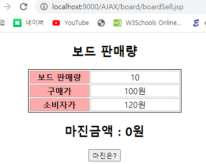

# 65 Days - boardSell.jsp, coffeeMaker.jsp : textNode접근, 수동 비동기통신 구현\(XMLHttpRequest\), JS와 CSS 외부관리

### 사용 프로그램

* 사용언어 : JAVA\(JDK\)1.8.0\_261, JS, JQuery, JSP, Servlet, HTML, JSON
* 사용Tool  - Eclipse : Eclipse.org - Toad DBA Suite for Oracle 11.5
* 사용 서버 - WAS : Tomcat

## 필기

### JSP의 mime type

1. HTML
2. JSON
3. XMl : nexacro

### MVC패턴

* view와 logic을 구분해서 작업할 수 있는 개발방식

### 서블릿 관리

* 배치 서술자 파일에 url-pattern을 등록해 WAS, 프레임워크가 운영과 라이프사이클을 관리하게 한다.
* LifeCycle을 이렇게 외부에서 관리받는 것을 역제어 라고 한다.
* 외부에서 관리를 받으려면 배치서술자 파일에 url을 등록하는 것이 필수조건이다.

### JSP, Servlet, Web.xml 경로 맞추기

* Jsp문서가 a폴더 밑에 있다면, 서블릿도 src밑에 a패키지 밑에 만들고, 배치 서술자 파일의 url-pattern등록시에도 /a/test.do 이렇게 경로를 맞춘다.
* \*를 사용해 모든 경로를 인터셉트 하는 경우에는 /가 없어도 된다. - \*.do

### ajax의 의의

* html은 정적이므로 부분을 변경하기위해서는 전체를 다시 읽어야하므로 비효율적이다.
* 부분만을 동적처리\(변경\)하기 위해서 &lt;div&gt;나 &lt;span&gt;태그로 감싸 해당 &lt;div&gt;, &lt;span&gt;의 id에 접근해 부분처리하는 것이 ajax의 핵심 역할이다.

### React.js

* ajax보다 더 진화된 방법이라고 할 수 있다.
* 리액트는 페이지 이동에 가상DOM을 이용한다.
* 게임에서 많이 사용하는 방식으로 가상DOM을 만들어 미리 갱신될 부분을 띄워놓는 것이다.
* 미리 렌더링된 파일을 출력하므로 속도가 빠르고 버퍼링같은 딜레이가 없다.
* 가상DOM의 정보를 부분 렌더링 할 수 있다.
* JS기반이지만 객체처럼 움직이고 사용된다. - 별도 API를 사용해 상속도 가능  

### JS, CSS 외부에서 관리하기

* JS와 CSS를 html\(jsp\)에서 분리해 외부에서 관리할 수 있다.
* 해당 html\(jsp\)는 외부 JS와 CSS를 src를 이용해 import해서 사용한다. - JS : &lt;script type="text/javascript" src="coffee.js?12"&gt;&lt;/script&gt; - CSS : &lt;link rel="stylesheet" type="text/css" href="coffee.css?12"/&gt;
* 이렇게 외부에서 불러와 사용할 때에는 외부파일이 수정되어도 적용되지 않는 경우가 발생한다.
* src, href로 불러오는 url의 끝에 ?와 문자 한두개를 붙여 수정하더라도 적용되게 한다.

## boardSell.jsp : textNode에 접근해서 마진금액 구하기

## boardSell.jsp : 제공

### 주어진 코드 : View



```markup
<h2>보드 판매량</h2>
<table width="300px" height="80px">
   <tr>
      <th width="120px">보드 판매량</th>
      <td width="180px"><span id="boardSold">10</span></td>
   </tr>
   <!-- 
   소비자가-구매가=보드 한개당 마진 금액
   한개당 마진 금액*판매량=마진금액계산
    -->
   <tr>
      <th>구매가</th>
      <td><span id="cost">100</span>원</td>
   </tr>
   <tr>
      <th>소비자가</th>
      <td><span id="price">120</span>원</td>
   </tr>
</table>
<h2>마진금액 : <span id="cash">0</span>원</h2>
<button onclick="getBoardSold()">마진은?</button>
```

* body부분 코드

```css
 body {
      font-family: sans-serif;
      text-align: center;   }
   table {
       margin-left: auto;
       margin-right: auto;
      border: 1px solid black;   }
   td,th {
      border: 1px dotted gray;
      text-align:center;   }
   th {
      background-color: #FFAAAA;   }
```

* CSS style코드

### 주어진 코드 : API - getText\( \)

```javascript
   //span태그가 가지고 있는 텍스트 노드값을 읽어오기
   function getText(el){
      var text="";
      if(el!=null){
         if(el.childNodes){
            for(var i=0;i<el.childNodes.length;i++){
               var childNode = el.childNodes[i];
               //너 텍스트 노드니?
               if(childNode.nodeValue !=null){
                  text = text+childNode.nodeValue;
               }      
            }
         }
      }
      return text;
   }
```

* 2번 getText\(el\) : el=태그의 주소번지
* 5번 if\(el.childNodes\) : 자식노드가 있으면 true, 없으면 false - el.childNodes = 태그의 자식노드 = text Node
* 9번 if\(childeNode.nodeValue!=null\) : 자식노드가 null이 아니라면
* 이런 data를 가져올때에는 항상 null인경우를 대비해야한다. if문을 사용하자.
* 반복적으로 text노드에 접근해야하므로 재사용가능한 메서드로 만든다.

### 주어진 코드 : API - replaceText\( \)

```javascript
   //기존 TextNode의 값을 다른 문자열로 바꾸기
   /***********************************************
   param1 :document.getElementById("boardSold")
   param2 :xhrObject. 
   ************************************************/
   function replaceText(el, value){
      if(el !=null){
         clearText(el);//기존에 있던 10을 지워주세요.
         //새로운 텍스트 노드 생성하기
         var newNode = document.createTextNode(value);
         //위에서 생성한 텍스트 노드 값을 el에 붙이는 함수 호출하기
         el.appendChild(newNode);
      }
   }
```

* 첫 번째 파라미터 : 메서드를 적용할 주소번지
* 두 번째 파라미터 : 메서드로 적용할 값
* 8번에서 파라미터로 받은 주소번지의 기존 text를 지운다.
* 10번에서 파라미터로 받은 값을 새로운 textNode로 만든다.
* 12번에서 새로 만들어진 textNode를 주소번지의 자식노드에 append한다.

### 주어진 코드 : API - clearText\( \)

```javascript
   //기존 태그안에 문자열 지우는 함수 구현
   function clearText(el){
      if(el !=null){
         if(el.childNodes){
            for(var i=0;i<el.childNodes.length;i++){
               var childNode = el.childNodes[i];
               el.removeChild(childNode);
            }
         }
      }
   }
```

* 주어진 메서드를 활용하자

## boardSell.jsp : Level1 - JS, JQuery를 사용해 마진금액 구하기

## boardSell.jsp : Level1 - JS로 textNode접근하기

### 작업지시서

1. 마진금액 = \(소비자가 - 구매가\) \* 보드 판매량
2. 구매가를 가져오는 함수를 활용해 그 값을 변수에 담는다. 같은 방식으로 필요한 데이터를 가져온다.
3. 2번에서 가져온 값으로 보드의 개당 마진금액을 계산해본다.
4. 총 마진금액을 구해 화면에 출력한다.

## boardSell.jsp : Level2 - ajax를 사용해 비동기통신 하기

### textNode에 접근하기

* textNode의 값을 가져와 사용해야한다.
* textNode는 nodeName을 갖지않고, nodeValue만을 가지기 때문에 id를 가질 수 없다.
* 외적 변화가 없는 태그&lt;span&gt;을 사용해 감싸 id를 부여해 접근한다. - div도 외적변화가 없지만 자체크기를 갖는 블록요소이기때문에 &lt;span&gt;을 사용한다.
* Id에 접근해 해당 id를 가진 node의 주소번지 가져오기 - JS : document.getElement\("id"\) - JQuery : $\("\#id"\)

### getBoardSold\( \)메서드 정의

* "마진은?" 버튼을 클릭할때 호출되는 함수
* &lt;span&gt;태그의 id에 접근해 주소번지를 담는 변수를 선언하고,  해당 변수를 getText메서드의 파라미터로 넘겨 text를 가져온다.
* consol.log\( \)메서드로 가져온 값을 담은 변수를 출력해 단위테스트 할 수 있다. - 브라우저의 개발자도구의 console 탭에 출력된다.
* 꺼내온 값들을 사용해 필요한 데이터를 출력한다. 

### UI에 마진값 보여주기

* 값을 성공적으로 꺼내왔다면, replaceText메서드를 활용해 값을 UI에 출력해준다.

### JQuery로 바꿔보기

* JS는 표준이지만, JQuery는 표준이 아니기 때문에 JS에서 자유롭게 사용하던 표준 API들을 사용하지 못하는 경우도 있으니 주의하자.



## boardSell.jsp : Level2 - JSP, JS로 비동기통신 구현하기

* JQuery의 ajax를 이용한 비동기 통신이 아닌 JS만을 이용해 수동 비동기 통신을 구현해본다. = DOM부분처리

### 작업지시서

1. '마진은?' 버튼이 눌리면 서버에 접속해 집계한다. - 동기화를 위해 서버를 경유한다. - 동기화 하기 위해 request + url\(통신\) 이 필요하다.   url을 통해 요청을 하는데, 요청을 하려면 채널이 필요하다.
2. 재사용성을 위해 JSP가 아닌 Servlet을 사용한다.
3. 통신객체 XMLHttpRequest\( \)를 생성해 이 객체로 통신한다. - 이 작업을 ajax는 ajax가 해준다. - 객체이기때문에 함수, 속성을 사용할 수 있다.   xhrObject = new XMLHttpRequest\( \);   xhrObject.onreadystatechange=sold\_process; - 상태 체크 속성

### 채널 사용하기

* 배웠던 방법 : socket
* 오늘 사용할 방법 : XMLHttpRequest\( \)
* 아마존, 스프링클라우드 등 시스템, 디바이스 마다 채널을 제공하는 방법이 다르다. - 그 안에서 공통되는 부분을 활용해야한다.

### 통신상태 : xhrObject.readyState

* xhrObject = new XMLHttpRequest\( \);
* 0\(uninitialized\) : open메서드가 호출되기 전
* 1\(loading\) : HTTP요청 준비가 된 상태
* 2\(loaded\) : HTTP요청을 보내 처리하는 중 - 헤더는 읽을 수 있는 상태   get방식인지 post방식인지, http프로토콜의 버전, 브라우저 타입을 확인할 수 있다.
* 3\(interactive\) : 데이터를 받는중, 하지만 완전히 받지는 못한 상태
* 4\(complete\) : 데이터까지 완전히 받은 상태 - 비로소 responseText나 혹은 responseXML속성으로 데이터를 읽을 수 있는 상태



## boardSell.jsp : Level2\_2 - 서블릿으로 구현하기



## coffeeMaker.jsp : Level3 - 두 개의 요청객체

* 주어진 코드에서 ?처리된 부분과 빈 공간을 채워 구현하자
* 요청을 받을 수 있는 커피머신이 두 개 이다. - 스레드가 두개있는것과 같다. - 요청객체를 2개로 나누어 관리한다.

### 주어진 코드 : JSP

```java
<%@ page language="java" contentType="text/html; charset=UTF-8"
    pageEncoding="UTF-8"%>
<%
   String coffeemaker = request.getParameter("coffeemaker");
   String name = request.getParameter("name");
   for(double i=0;i<900000000.0;i++){
      //커피를 만드는 시늉을 한다.
   }
   //기존에 갖고 있던 정보를 출력버퍼에서 삭제하기
   //이걸 안하면 계속 1번 머신 정보만 유지될 수도 있다.
   out.clear();
   out.print(coffeemaker+name);
%>
```

### 주어진 코드 : CSS

```css
@CHARSET "EUC-KR";
body {
  font-family: "Lucida Grande", Verdana, Arial, sans-serif;
  text-align: center;
  font-size: small;
  margin: 10px;
  background-color: silver; }

h1 {
  font-size: 140%; }

h2 {
  font-size: 120%;
  padding-top: 10px; }

h3 {
  font-size: 100%;
  text-decoration: underline; }

p {
  margin-bottom: 20px; }

img {
  height: 100px;
  padding: 10px; }

form {
  margin-top: 20px; }

div#wrapper {
  position: absolute;
  width: 746px;
  left: 410px;
  margin: 10px auto;
  padding: 10px;
  color: #333;
  background-color: white;
  border: 1px solid black; }

div#coffeeorder {
  position: absolute;
  top: 20px;
  left: 240px;
  width: auto;
  margin: 0;
  padding: 10px; }

div#coffeemaker1 {
  position: absolute;
  top: 10px;
  padding: 10px;
  width: 200px;
  background-color: #f5f5f5;
  border:double medium black;
  left: 10px; }

div#coffeemaker2 {
  position: absolute;
  top: 10px;
  padding: 10px;
  width: 200px;
  background-color: #f5f5f5;
  border:double medium black;
  left: 530px; }

#clear {
  clear: both; }
```

### 주어진 코드 : JS

```javascript
<html>
 <head>
  <meta charset="UTF-8">
  <title>Ajax-powered Coffee Maker</title>
  <link rel="stylesheet" type="text/css" href="coffee.css?12" />
  <script language="javascript">
    var request1 = createRequest();
   var request2 = createRequest();
    function createRequest(){
       var xhrObject = null;
        try{
            xhrObject = new XMLHttpRequest();
        }catch(trymicrosoft){
            xhrObject = null;
        }
        if(xhrObject==null){
            alert("비동기 통신객체 생성 실패!!!");
        }else{
           return xhrObject;
        }
    } 
     function getSize(){
        var sizeGroup = document.forms[0].size;// => 3
        for(var i=0;i<sizeGroup.length;i++){
          if(sizeGroup[i].?==XXX){
             return ?;
          }
        }        
     }        
     function getBeverage(){
        var beverageGroup = document.forms[0].beverage;// => 3
        for(var i=0;i<beverageGroup.length;i++){
          if(beverageGroup[i].checked==true){
             return ?[i].value;
          }
        }         
     }
     function sendRequest(xhrObject, url){
        xhrObject.onreadystatechange = XXXXXXXXXX
        xhrObject.open("GET",url,?);
        xhrObject.?(null);
     }
     function serveDrink(){
        alert("serveDrink호출");
        if(request1.readyState == 4){
           if(request1.status == 200){
              //응답 받아오기 ==> 1김유신
              var res = request1.?;
              var machine = res.substring(0,?);//1
              var name = res.substring(1,?);
              if(machine == "1"){
                 //주문한 커피가 나왔으므로 머신 상태를 Idle로 변경함.
                   var coffeemaker1 = document.getElementById("coffmaker1Status");
                   replaceText(?,"Idle");                 
              }
              else{//2번 머신인 경우
                   var coffeemaker2 = document.getElementById("coffeemaker2-status");
                   replaceText(?,"Idle");                     
              }
              alert(name+", your coffee is ready!");
              request1 = ?);
           }/////////////end of 200
           else{
              alert("Error"+ request1.status);
           }
        }/////////////////end of 4
        else if(request2.readyState == 4){
           if(request2.status == 200){
              //응답 받아오기 ==> 2애플
              var res = ?.responseText;
              var machine = res.substring(?,1);//1
              var name = res.substring(?,res.length);  
              if(machine == "1"){
                   var coffeemaker1 = document.getElementById("coffmaker1Status");
                   ?(coffeemaker1, "Idle"); 

              }else{
                   var coffeemaker2 = document.getElementById("coffeemaker2-status");
                   ?(coffeemaker2, "Idle");                   
              }
              alert(name+", your coffee is ready!");
              request2 = createRequest();
           }
           else{
              alert("Error"+ request2.status);
           }
        }
     }
     function orderCoffee(){
        //주문자의 이름 정보 출력
        var name = document.getElementById("name").value;
        var size = getSize();
        var beverage = getBeverage();
        alert(name+", "+size+", "+beverage);   
        //insert here
        //첫번째 머신의 아이디값 가져오기
        var coffeemaker1 = document.getElementById("coffmaker1Status");
        var status = getText(coffeemaker1);
        if(status=="Idle"){
           //insert here - 누구님 컵사이즈, 커피를 준비중입니다.
           replaceText(coffeemaker1
                    ,name+"님의 "+beverage+"("+size+")"+"를 준비중입니다.");
           //커피 주문서에 작성된 내용을 초기화 함.
           document.forms[0].reset();
           //커피를 내리는 시늉을 하는 jsp페이지의 url정보를 담음.
           var url = "coffeeMaker.jsp?coffeemaker=1&name="+name+"&timestamp="+new Date().getTime();
           sendRequest(request1,url);
        }
        else{
           //두번째 머신의 아이디값 가져오기
           var coffeemaker2 = document.getElementById("coffeemaker2-status");
           var status = getText(coffeemaker2);
           if(status=="Idle"){
              replaceText(coffeemaker2
                       ,"Brewing "+ name+"'s "+size+" "+beverage);
              //두번째 주문이 처리가 된 경우임.
              document.forms[0].reset();
              var url = "coffeeMaker.jsp?coffeemaker=2&name="+name+"&timestamp="+new Date().getTime();
              sendRequest(request2,url);
           }else{//두 대가 다 일하는 경우
              alert("Sorry! Both coffee makers are busy. \n"
                  +"Try again later.");
           }
        }
     }
     function getText(el){//el => $('#id')
         var text="";
         if(el!=null){//태그가 존재하지 않으면
             if(el.childNodes){//태그안에 여러개 노드가 있으면 컬렉션으로 담음
                 for(var i=0;i<el.childNodes.length;i++){
                     //여러개 노드중 한개 - 700000
                     var childNode = el.childNodes[i];
                     //너 텍스트 노드니?
                     if(childNode.nodeValue!=null){//700000!=null
                         text = text+childNode.nodeValue;
                     }
                 }
             }
         }
         return text;
     }  
     function clearText(el){
         if(el!=null){
             if(el.childNodes){//0만 false
                 for(var i=0;i<el.childNodes.length;i++){
                     var childNode = el.childNodes[i];
                     el.removeChild(childNode);
                 }
             }
         }
     }     
     function replaceText(el,text){
         if(el!=null){
             //기존 노드에 들어있는 값은 초기화
             clearText(el);
             //새로운 텍스트 노드를 추가
             var newNode = document.createTextNode(text);//12
             el.appendChild(newNode);
         }
     }     
  </script>
 </head>
```

### 주어진 코드 : HTML\(JSP\) View

```markup
 <body>
   <div id="header">
    <h1>Ajax-powered Coffee Maker</h1>
   </div>
  <div id="wrapper">
   <div id="coffeemaker1">
    <h2>Coffee Maker #1</h2>
    <p></p>
    <div id="coffmaker1Status">Idle</div>
   </div>
   <div id="coffeeorder">
    <p></p>
    <h2>Place your coffee order here:</h2>
    <div id="controls1">
     <form action="#">
      <p>Name: <input type="text" name="name" id="name" /></p>
      <h3>Size</h3>
      <p> 
       <input type="radio" name="size" 
              value="small" checked="true">Small</input>&nbsp;&nbsp;
       <input type="radio" name="size" value="medium">Medium</input>&nbsp;&nbsp;
       <input type="radio" name="size" value="large">Large</input>
      </p>
      <h3>Beverage</h3>
      <p> 
       <input type="radio" name="beverage" 
              value="mocha" checked="true">Mocha</input>&nbsp;&nbsp;
       <input type="radio" name="beverage" 
              value="latte">Latte</input>&nbsp;&nbsp;
       <input type="radio" name="beverage" 
              value="cappucino">Cappucino</input>
      </p>
      <p>
       <input type="button" onClick="orderCoffee()" value="Order Coffee" />
      </p>
     </form>
    </div>
   </div>
   <div id="coffeemaker2">
    <h2>Coffee Maker #2</h2>
    <p></p>
    <div id="coffeemaker2-status">Idle</div>
   </div>
   <p id="clear"></p>
  </div>
 </body>
</html>
```

