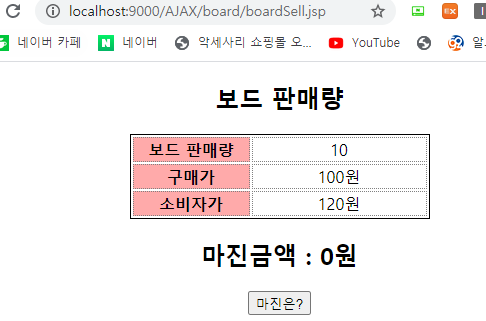
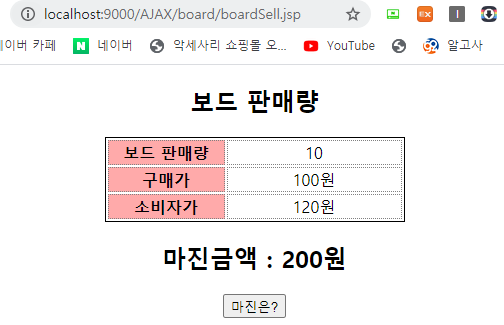
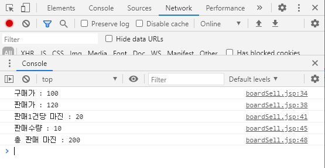

# boardSell.jsp : Level1 - JS로 textNode접근하기

## boardSell.jsp : Level1 - JS로 textNode접근하기

### 화면1 : 기본화면



### 화면2 : 버튼 클릭시



### 화면3 : F12 - console



### 코드 : boardSell.jsp

```markup
<%@ page language="java" contentType="text/html; charset=UTF-8"
    pageEncoding="UTF-8"%>
<!DOCTYPE html>
<html>
<head>
<meta charset="UTF-8">
<title>보드 판매량 - 마진금액 계산</title>
    <script type="text/javascript" src="https://www.jeasyui.com/easyui/jquery.min.js"></script>
	<script type="text/javascript" src="jsUtil.js"></script>
<style type="text/css">
   body {
      font-family: sans-serif;
      text-align: center;
   }
   table {
       margin-left: auto;
       margin-right: auto;
      border: 1px solid black;
   }
   td,th {
      border: 1px dotted gray;
      text-align:center;
   }
   th {
      background-color: #FFAAAA;
   }	
</style>
<script type="text/javascript">
	function getBoardSold(){
		//var cost = document.getElementById("price").textContent;
		//var buy = document.getElementById("cost").textContent;
		//var many = document.getElementById("boardSold").textContent;
		//alert("판매가격 : "+user_buy+", 구매가격 : "+buy+", 판매수량 : "+many);
		var costEL = document.getElementById("cost");//구매가를 감싸는 <span>태그의 주소번지를 담을 변수
	    var cost = getText(costEL);//구매가 100(text)을 담을 변수 
	    console.log("구매가 : "+cost)
	    
		var priceEL = document.getElementById("price");
	    var price = getText(priceEL);
	    console.log("판매가 : "+price)
	    
	    var margin = price-cost;
	    console.log("판매1건당 마진 : "+margin);
	    
		var boardSoldEL = document.getElementById("boardSold");
	    var boardSold = getText(boardSoldEL);
	    console.log("판매수량 : "+boardSold)
	    
	    var total_margin = margin*boardSold;
	    console.log("총 판매 마진 : "+total_margin);
	    
		var cashEL = $("#cash");
		replaceText(cashEL, total_margin);
	}

</script>
</head>
<body>
<h2>보드 판매량</h2>
<table width="300px" height="80px">
   <tr>
      <th width="120px">보드 판매량</th>
      <td width="180px"><span id="boardSold">10</span></td>
   </tr>
   <!-- 
   소비자가-구매가=보드 한개당 마진 금액
   한개당 마진 금액*판매량=마진금액계산
    -->
   <tr>
      <th>구매가</th>
      <td><span id="cost">100</span>원</td>
   </tr>
   <tr>
      <th>소비자가</th>
      <td><span id="price">120</span>원</td>
   </tr>
</table>
<h2>마진금액 : <span id="cash">0</span>원</h2>
<button onclick="getBoardSold()">마진은?</button>
</body>
</html>
```

## jsUtil.js : 공통JS따로 관리하기

```javascript
	   //span태그가 가지고 있는 텍스트 노드값을 읽어오기
	   function getText(el){
	      var text="";
	      if(el!=null){
	         if(el.childNodes){
	            for(var i=0;i<el.childNodes.length;i++){
	               var childNode = el.childNodes[i];
	               //너 텍스트 노드니?
	               if(childNode.nodeValue !=null){
	                  text = text+childNode.nodeValue;
	               }      
	            }
	         }
	      }
	      return text;
	   }
	   //기존 TextNode의 값을 다른 문자열로 바꾸기
	   /***********************************************
	   param1 :document.getElementById("boardSold")
	   param2 :xhrObject. 
	   ************************************************/
	   function replaceText(el, value){
	      if(el !=null){
	         clearText(el);//기존에 있던 10을 지워주세요.
	         //새로운 텍스트 노드 15를 생성하기
	         var newNode = document.createTextNode(value);//15
	         //위에서 생성한 텍스트 노드 값을 el에 붙이는 함수 호출하기
	         el.appendChild(newNode);
	      }
	   }
	   function replaceTextJQ(el, value){
	      if(el !=null){
	         clearText(el);//기존에 있던 10을 지워주세요.
	         //새로운 텍스트 노드 15를 생성하기
	         var newNode = document.createTextNode(value);//15
	         //위에서 생성한 텍스트 노드 값을 el에 붙이는 함수 호출하기
	         el.html(newNode);
	      }
	   }
	   //기존 태그안에 문자열 지우는 함수 구현
	   function clearText(el){
	      if(el !=null){
	         if(el.childNodes){
	            for(var i=0;i<el.childNodes.length;i++){
	               var childNode = el.childNodes[i];
	               el.removeChild(childNode);
	            }
	         }
	      }
	   }
```

