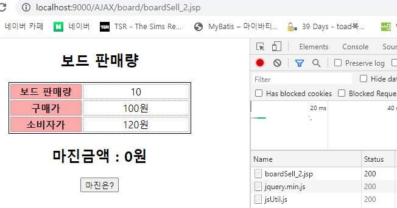
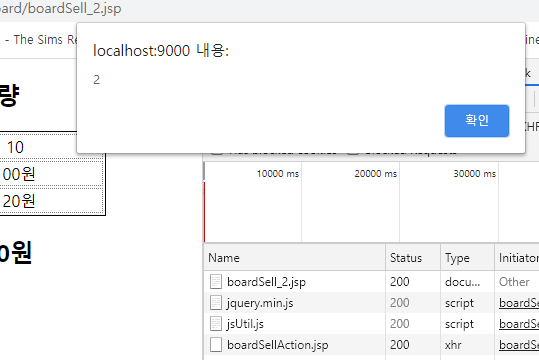
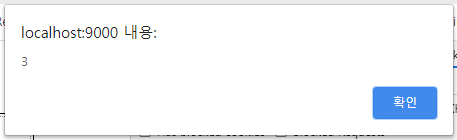
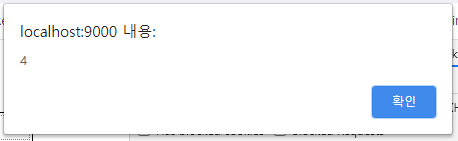
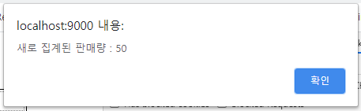
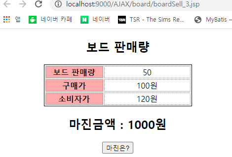

# boardSell.jsp : Level2 - Servlet, JS으로 비동기통신 구현

### 기본, 공통코드 



## boardSell.jsp : Level2 - Servlet, JS으로 비동기통신 구현

### 화면1 : 기본화면



### 화면2 : 버튼 클릭시, readystate=2



### 화면3 : readystate=3



### 화면4 : readystate=4



### 화면5 : servlet에서 가져온 값



### 화면6 : 결과 



### 코드 : boardSell.jsp

```markup
<%@ page language="java" contentType="text/html; charset=UTF-8"
    pageEncoding="UTF-8"%>
<!DOCTYPE html>
<html>
<head>
<meta charset="UTF-8">
<title>보드 판매량 - 마진금액 계산</title>
    <script type="text/javascript" src="https://www.jeasyui.com/easyui/jquery.min.js"></script>
    <script type="text/javascript" src="/js/jsUtil.js"></script>
<style type="text/css">
   boardSell.jsp와 같음
</style>
```

* html &lt;head&gt;영역

```javascript
<script type="text/javascript">
	//비동기 통신 객체 담을 변수 선언
	var xhrObject = null;//멤버변수
	
	//비동기 통신객체 생성하기
	function createRequest(){
		try{
			xhrObject = new XMLHttpRequest();//IE 8.0이상, 사파리, 오페라, 크롬, 파이어폭스에서 생성할 때 
		}catch(trimicrosoft){
			try{
				xhrObject = new ActivityObject("Msxml2.XMLHTTP");//IE 6.0에서 생성할떄
			}catch(e){
				xhrObject = null;
			}
		}////////////////end of try
		if(xhrObject == null){
			alert("비동기 통신 객체 생성 에러");
		}
	}///////////////////통신 객체 생성 메서드
```

```javascript
	//콜백함수 선언
	function sold_process(){
		alert(xhrObject.readyState);
		//크롬 : 2, 3, 4가 출력된다. 브라우저마다 출력 숫자가 다를 수 있다.
		//3 : 다운로드 중입니다.
		//4 : 다운로드 완료. - 개발자가 처리를 시작하는 단계
		if(xhrObject.readyState == 4) {
			if(xhrObject.status == 200){//요청에 대한 응답 성공, 브라우저에 200번이 떳니?
				//보이지 않는 곳에서 몰래 처리하기, 내부적으로 처리하기, url은 변하지 않는다.
				var newTotal = xhrObject.responseText;//url요청해서 나온 값 가져오기, XML이라면 responseXML을 사용한다.
				alert("새로 집계된 판매량 : "+ newTotal);
				var boardSoldEL = document.getElementById("boardSold");
			    replaceText(boardSoldEL, newTotal);
			}else{//200번이 아니다 = error발생
				alert("에러발생")
				return;//콜백함수 탈출
			}
		}
	}////////////////////콜백함수 
```

```javascript
	function getBoardSold(){
		 createRequest();//생성된 통신 객체 호출 - 통신준비, 이메서드를 호출해야 xhrObject를 사용할 수 있다.
		 var url = "./boardSellAction.jsp";//요청 url작성
		 xhrObject.open("Get", url, true)//(전송 방식, 어디서 처리할 것인지 지정, true=비동기 || false=동기)
		 xhrObject.onreadystatechange=sold_process;//비동기 통신하기 위한 상태 체크
		 //괄호가 없다=속성, 객체가 제공해주는 상태체크 속성, 준비가됐니? 나갈까? 다운로드하고있니? 다운로드완료했니? 비동기이므로 상태를 계속 체크해줘야한다. data를 다 가져왔는지 확인해야하니까
		 //대입연산자가 오른쪽에 있다 = 콜백함수, 자동으로 불려올것이니까 괄호가 필요없다.
		 xhrObject.send(null);//전송
		 //전송을 타버리기때문에 하위에 적힌 코드들은 진행되지 않는다.		
	}	
</script>
</head>
```

```markup
<body>
 	boardSell.jsp와 같음
</body>
</html>
```

* html &lt;body&gt;영역

## boardServlet.java : 서블릿

```java
package com.ajax;

import java.io.IOException;
import java.io.PrintWriter;
import javax.servlet.RequestDispatcher;
import javax.servlet.ServletException;
import javax.servlet.http.HttpServlet;
import javax.servlet.http.HttpServletRequest;
import javax.servlet.http.HttpServletResponse;
import org.apache.log4j.Logger;

public class BoardServlet extends HttpServlet {
	Logger logger = Logger.getLogger(BoardServlet.class);

	@Override
	public void doGet(HttpServletRequest req, HttpServletResponse res) 
		throws ServletException, IOException{
			logger.info("doGet 호출성공");
		    res.setContentType("text/html;charset=utf-8");
		    PrintWriter out = res.getWriter();
		    out.print(60);
		}
}
```

## boardAction.jsp : 결과 data

```java
<%@ page language="java" contentType="text/html; charset=UTF-8"
    pageEncoding="UTF-8"%>
<%
	out.print(50);
%>
```

## web.xml : 배치서술자

```markup
<?xml version="1.0" encoding="UTF-8"?>
<web-app xmlns:xsi="http://www.w3.org/2001/XMLSchema-instance" xmlns="http://xmlns.jcp.org/xml/ns/javaee" xsi:schemaLocation="http://xmlns.jcp.org/xml/ns/javaee http://xmlns.jcp.org/xml/ns/javaee/web-app_4_0.xsd" id="WebApp_ID" version="4.0">

<!-- log4j 환경파일 등록하기 서버가 기동된 동안에는 계속 유지된다. -->
	<context-param>
		<param-name>log4jConfigLocation</param-name><!-- 객체주입 -->
		<param-value>/WEB-INF/classes/log4j.properties</param-value><!-- 톰캣서버가 읽을 수 있게 한다. -->
	</context-param>
	
<!-- DD파일(Deployment Discriptor) = 배치서술자 -->
<!-- AJAX 실습 -->
	<servlet>
		<servlet-name>BOARDServlet</servlet-name>
		<servlet-class>com.ajax.BoardServlet</servlet-class>
	</servlet>
	<servlet-mapping>
		<servlet-name>BOARDServlet</servlet-name>
		<url-pattern>/board/bsell.do</url-pattern><!-- 주소앞에는 업무명이온다. 업무마다 구분하기위해 -->
	</servlet-mapping>
</web-app>
```

