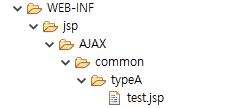

# WEB-INF하위 jsp파일 접근 : getServletContext\( \)

## WEB-INF하위 jsp파일에 url접근하기 : getServletContext\( \)

### 불러올 jsp문서 : test.jsp



```markup
<%@ page language="java" contentType="text/html; charset=UTF-8"
    pageEncoding="UTF-8"%>
<!DOCTYPE html>
<html>
<head>
<meta charset="UTF-8">
<title>test.jsp</title>
</head>
<body>
test 페이지 입니다.
</body>
</html>
```

### 서블릿 : BoardServlet2.java

```java
package com.ajax;

import java.io.IOException;
import java.io.PrintWriter;

import javax.servlet.RequestDispatcher;
import javax.servlet.ServletException;
import javax.servlet.http.HttpServlet;
import javax.servlet.http.HttpServletRequest;
import javax.servlet.http.HttpServletResponse;

import org.apache.log4j.Logger;

public class BoardServlet2 extends HttpServlet {
	Logger logger = Logger.getLogger(BoardServlet.class);
	
	public void init() { }

	@Override
	public void doGet(HttpServletRequest req, HttpServletResponse res) 
		throws ServletException, IOException{
			logger.info("doGet 호출성공");
		    res.setContentType("text/html;charset=utf-8");
		    String command = req.getParameter("command");
		    String pageName = req.getParameter("pageName");
		    PrintWriter out = res.getWriter();
		    out.print(60);
		    //ajax관련부분
		    if("ajax".equals(command)) {
		    	logger.info("여기");
		    	//연결을 위한 WEB-INF 하위의 jsp위치
		    	String url = "/WEB-INF/jsp/AJAX/common/typeA/"+pageName+".jsp";//중간에 변수처리 해서 jsp문서를 구분해서 요청한다.
		    	//res.sendRedirect(req.getServletContext()+url);
		    	RequestDispatcher view = req.getServletContext().getRequestDispatcher(url);
		    	view.forward(req, res);
		    }		    
		}
}
```

* getServletContext함수를 사용한다.
* 경로를 지정하는 RequestDispatcher클래스 구문에서 사용되어야 할 것이다.
* 34번

### 테스트 : 쿼리스트링


* 서블릿 url뒤에 쿼리스트링으로 파라미터로 jsp를 호출하는 요청을 하면, test.jsp를 불러올 수 있다.

