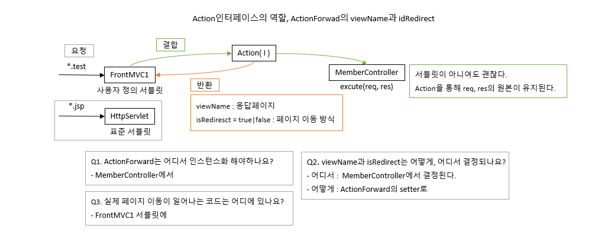
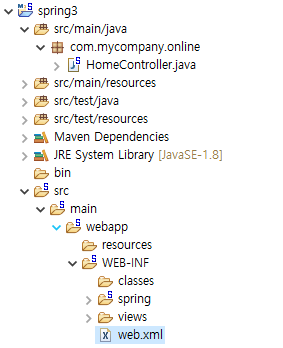
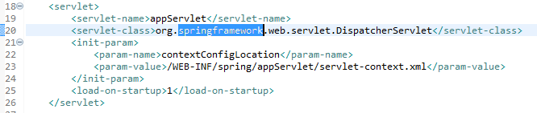

# 72 Days - 인터페이스와 서블릿, DI 복습 QnA, 서버기동과 &lt;context&gt;, Spring 환경설정 및 xml활용

### 사용 프로그램

* 사용언어 : JAVA\(JDK\)1.8.0\_261, JS, JQuery, JSP, Servlet, HTML, JSON
* 사용Tool  - Eclipse : Eclipse.org - Toad DBA Suite for Oracle 11.5 - Spring
* 사용 서버 - WAS : Tomcat

## QnA : 복습

### Q1. Action 인터페이스의 역할은 무엇인가요?

* 동일한 역할을 수행하는 메서드의 이름, 파라미터를 통일해 제공한다. =일원화
* Action은 인터페이스이므로 혼자 인스턴스화가 불가능하다. 이때 필요한것이 구현체 클래스 MemberController인데,  서블릿을 상속받으면 doGet혹은 doPost메서드만 오버라이드하여 사용할 수 있고,  톰캣 서버는 다른 메서드에게는 req, res객체를 주입해주지 않는다.
* 우리는 시스템을 구축할때 필요한 솔루션 엔진 컨테이너등을 직접 만들어 독자적인 시스템을 만들기 위해 returnType이 void가 아닌 클래스타입인 메서드를 활용하기로 했다.  이때 Action 인터페이스를 활용한다.
* 이렇게 설계하면 여러 변수나 메서드를 재사용할 수 있게하는데 의미가 있다.

### Q2. Action 인터페이스에서 정의된 메서드 이름은 무엇인가요?

* execute
* returnType은 ActionForward클래스
* 사용자의 요청을 모두 처리하는 메서드이므로 if문 코드가 길어진다.

### Q3. doGet과 doPost메서드가 일반 다른 메서드와 다른점은 무엇인가요?

* 서버로부터 req, res객체를 주입받고, 외부에서 라이프사이클을 관리받는다.
* 이 메서드들은 WAS로부터 request와 response를 주입받는다. - 이 객체들로 브라우저에 태그를 출력하거나 JS, CSS를 작성할 수도 있다. - 자바 언어까지도 담을 수 있어 오라클 서버와 통신하는데에도 필요하다.\(소통과 결과를 받아오는데\)
* 두 메서드의 단점 - HttpServlet의 메서드를 오버라이드 한 것이므로 리턴타입은 무조건 void이여야만 된다. - 파라미터도 정해져있다.

### Q4. ActionForward의 설계 목적에 대해 이야기할 수 있나요?

* Q3번에 대한 단점을 보완하기위한 설계
* returnType이 void가 아닌 ActionForward클래스이다.
* 응답페이지의 이름을 결정 짓고, 해당 페이지 이동 방식을 결정하는 용도로 사용하려 한다. - 페이지 이동방식 : forward, sendRidirect

### Q5. FrontMVC1클래스는 일반적인 클래스 인가요? 

* 아니오
* 일반 클래스의 필요조건 - Object 상속 - 하지만 HttpServlet을 상속받은 서블릿이다.
* 일반 자바 클래스가 아닌 브라우저와 소통가능한, 브라우저가 실행 주체가 될 수 있는 새로운 자바이다. 그래서 브라우저와 소통하는데 필요한 request, response를 WAS로부터 제공 받는다. 이 두가지가 있어야 웹에서 무엇이든 할 수 있고, 모바일, 패드와 같은 다른  다양한 디바이스에서도 재사용가능해진다.

### Q6. DI에 대해서 그림으로 설명할 수 있나요?


* 의존성 주입

### Q7. 우리가 배운것 중에서 DI에 해당하는 클래스명은 무엇인가요?

* web.xml 배치서술자 파일에 등록된 모든 서블릿이 DI에 해당한다.
* 개발자가 직접 인스턴스화 하지 않아도 doGet과 doPost메서드가 호출되므로
* WAS에서는 이것들을 싱글톤으로 관리하면서도 여러 사용자들에게 서비스 할 수 있도록 멀티 스레드를 지원한다. 같은 객체를 여러 사람이 공유하고 나눠 쓸 수 있도록
* 개발자는 스레드관리와 소켓통신에 대해 신경쓰지 않아도 되고 업무처리에만 집중할 수 있게된다.

### Q8. DI를 지원받기위해 개발자가 해야하는 일은 무엇인가요?

* 배치서술자 web.xml파일에 url-pattern등록하기
* 다른 서블릿과 구분할 수 있는 별도의 확장자를 붙여주면 해당 요청은 모두 해당 서블릿으로 인터셉트된다.
* WAS는 server.xml의 &lt;context&gt;를 가장 먼저 스캔한다.

### Q9. forward와 sendRedirect메서드는 어디에서 호출하는지 설명할수 있나요?

* 페이지 이동방식의 결정은 MemberController에서 결정된다. - 업무를 담당하고 시작하는 지점이다.
* ActionForward의 isRedirect멤버변수를 활용한다. 기본값은 falsle이다.
* 사용자가 조회.버튼을 누르면, select가 진행되고 select는 forward로 처리한다. MemberController에서 af,sendRedirect\( \)메서드의 파라미터를 false로 결정지어줘야 한다. true를 주면 res.sendRedirect\( \)를 호출해 조회값 List를 xxx.jsp로 넘길 수 없게된다. 서블릿은 이 두가지를 고려해 doGet과 doPost의 메서드 리턴타입을 void로 했을 것이다.
* req.setAttribute\("이름", 주소번지\)를 작성하고 페이지 흐름을 서블릿 쪽에서 JSP페이지로 제어권을 넘겨주는 방식으로 업무에 대한 처리를 하는 것이다.

### Q10. FrontMVC1클래스와 MemberController클래스는 어떻게 조립되었나요?

```java
public void doService(HttpServletRequest req, HttpServletResponse res) 
			throws ServletException, IOException{
			if("member".equals(upmu[0].toString())) {
						req.setAttribute("command", upmu[1].toString());//값 유지
						af = memCtrl.execute(req, res);
					}/////////////////////////////end of 회원관리	
}
```

* 인스턴스화를 통해 FrontMVC1의 req에 값을 담아 MemberController의 execute메서드를 호출한다.
* Controller에서 처리된 ActionForward의 멤버변수를 활용해 다시 FrontMVC1에서 페이지이동한다.

### Q11. split메서드를 통해 알아낸 정보는 무엇인지, 어떻게 활용되었는지 기술하세요.

* 서블릿이 처리할 요청 url을 가져와 업무이름과 업무내용을 분리해 배열로 저장한다.
* 이 값들은 어떤 업무 Controller를 호출할 것인지, 어떤 Logic과 Dao를 호출하는지에 활용된다.

## 서블릿, 인터페이스의 조립 : 복습

### Servlet과 Interface, Controller의 역할



* ActionForward에서의 setter는 Controller에서, getter는 Servlet에서 사용한다.

### Q3. 실제 페이지 이동이 일어나는 코드

```java
if(af!=null) {//af가 null이면 NullPointerException발생
			if(af.isRedirect()) {
				//sendRedirect의 경우에 파라미터에 null이 오더라도 문제가 발생하지 않는다.
				//경로가 존재하지 않으면 브라우저는 404를띄우지만, 경로를 null로 하면 흰 화면만 보여준다.
				res.sendRedirect(af.getViewName());
			}else {
				RequestDispatcher view = req.getRequestDispatcher(af.getViewName());
				view.forward(req, res);
			}
		}
```

* FrontMVC1서블릿의 doService\( \)메서드 내부

## 서버 기동과 &lt;context&gt; : 복습

### WAS의 스캔 순서


### server.xml : &lt;context&gt;

```java
<Context docBase="dev_html" path="/" reloadable="true" source="org.eclipse.jst.jee.server:dev_html">
<ResourceLink global="jdbc/dbPool" name="jdbc/dbPool" type="javax.sql.DataSource"/>
</Context>
```

* WAS가 가장 먼저 스캔하는 곳

### reloadable 

* JSP문서를 class로 변환시킨다.
* a.jsp를 a\_jsp.java로 jsp-api.jar라는 컨테이너를 사용해 바꿔주고, __a\_jsp.java를 a\_jsp.class로 servlet-api.jar 컨테이너를 사용해 바꿔준다.
* jsp문서를 수정하고 배포하면 즉시 반영해줄까 서버를 재기동 해야할까? - 재기동하는것이 안전하다.
* reloadable = "true"면 자동으로 재기동해 반영해주는 것이다.

## Spring

### 환경설정 및 프로젝트 생성



### web.xml 경로



### 서블릿 클래스 등록 xml 경로


* POJO web.xml은 모든 url이 모여 있어 코드가 아주 길어진다는 단점이 있다.
* Spring F/W에서는 xml을 쪼개서 사용한다는 장점이 있다. 
* 그 중에 위 servlet-context.xml이 바로 서블릿 클래스를 등록하는 xml인 것이다.
* DI를 활용하는 클래스의 경우, 반드시 xml에 path, url이 등록되어야 한다.

### web.xml

```markup
<?xml version="1.0" encoding="UTF-8"?>
<web-app xsi:schemaLocation="http://java.sun.com/xml/ns/javaee https://java.sun.com/xml/ns/javaee/web-app_2_5.xsd" xmlns:xsi="http://www.w3.org/2001/XMLSchema-instance" xmlns="http://java.sun.com/xml/ns/javaee" version="2.5">

<!-- The definition of the Root Spring Container shared by all Servlets and Filters -->
<context-param>
<param-name>contextConfigLocation</param-name>
<param-value>/WEB-INF/spring/root-context.xml</param-value>
</context-param>

<!-- Creates the Spring Container shared by all Servlets and Filters -->
<listener>
<listener-class>org.springframework.web.context.ContextLoaderListener</listener-class>
</listener>

<!-- Processes application requests -->
<servlet>
<servlet-name>appServlet</servlet-name>
<servlet-class>org.springframework.web.servlet.DispatcherServlet</servlet-class>
<init-param>
<param-name>contextConfigLocation</param-name>
<param-value>/WEB-INF/spring/appServlet/servlet-context.xml</param-value>
</init-param>
<load-on-startup>1</load-on-startup>
</servlet>

<servlet-mapping>
<servlet-name>appServlet</servlet-name>
<url-pattern>*.nhn</url-pattern>
</servlet-mapping>
</web-app>
```

* 우리가 사용하던 POJO web.xml과는 형태가 다르다. 
* Beans는 namespace를 말하는 것이고, 자바로 따지면 class라고 할 수 있다. xmlns = xmlNameSpace이며 태그이름이다.
* 20-29번에서 \*.nhn으로 들어오는 요청은 모두 appServlet으로 보낸다. -&gt; 17번
* 16-24번 : .nhn 요청을 21번에 있는 서블릿 xml로 보낸다. 

### Spring F/W제공 서블릿 : web.xml



* Eclipse에서 WAS가 사용하던 표준 컨테이너 jsp-api.jar, servlet-api.jar의 역할을 해주는 것이 Spring에도 존재한다.
* DispatcherServlet : springframework제공

### Spring 과 POJO Servlet 차이

* Spring은 POJO의 서블릿과는 다르다.
* 서블릿 등록을 web.xml이 아닌 별도의 servlet-context.xml에 관리하고, xml에 등록만 되어있다면 req, res객체를 어느 메서드에서든 주입받아 사용할 수 있다.

### Spring : List

* Spring은 xml에서도 자바코드를 작성할 수 있는 태그를 제공한다.
* xml안에 List형태의 값을 넣어놓고, 외부에서 주입해주는 방식을 구현해보자.
* 자바에서 getter, setter의 역할을 수행하는 메서드가 Spring에도 존재한다. 
* java클래스의 main메서드에서 abstractController를 상속받는 Controller클래스를 호출하는데,  이때 getBean함수를 사용해 List가 담긴 xml을 주입한다. Controller클래스는 setBeanList메서드로 List를 담고, 처리된 값을 반환한다. main메서드를 가진 java클래스에서 system.out으로 확인해보자



### Spring : member

* Spring에서도 sendRedirect를 사용 할 수 있고, forward와 비슷한 역할을 하는 ModelAndView라는 클래스도 제공하고 있다.
* 직접 servelet-context.xml에 서블릿을 등록하고, java클래스의 메서드를 path로 호출해보자.



후기 : 내일은 금요일~ 오늘은 스프링을 처음으로 진도를 나갔는데 살짝 느낌이 왔다. 내일은 학원에 나가서 대면 수업을 하는 날이니 오늘 이해하지 못한 부분들 까지도 확실히 이해하고 오자

