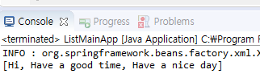

# Spring : List

### ListMainApp.java

```java
package com.mycompany.online;

import java.util.List;

import org.springframework.beans.factory.BeanFactory;
import org.springframework.beans.factory.xml.XmlBeanFactory;
import org.springframework.context.ApplicationContext;
import org.springframework.context.support.ClassPathXmlApplicationContext;
import org.springframework.core.io.FileSystemResource;
import org.springframework.core.io.Resource;

/*
 * insaBean.xml문서를 스캔하자.
 * 객체주입, 의존성 주입을 받기 위해서
 * 스캔한 내용은 스프링에서 제공하는 ApplicationContext나 혹은 BeanFactory를 통해 관리받을 수 있다.
 * 그 중 BeanFactory로 진행했다.
 * parsing error발생한 상황, bean create받지 못하는 문제로 에러가 발생한다.
 * ListController에 대한 Bean생성이라는 사실을 착각 - List<String>
 */

public class ListMainApp {
	
	List<String> listList = null;
	   public void setListList(List<String> listList) {
	      this.listList = listList;
	   }
	   public static void main(String[] args) {
	      ListMainApp lma = new ListMainApp();
	      Resource resource = new FileSystemResource("C:\\workspace_sts3\\spring3\\src\\main\\java\\com\\mycompany\\online\\insaBean.xml");
	      BeanFactory factory = new XmlBeanFactory(resource);
	      ListController list = (ListController)factory.getBean("insaBean");
	      System.out.println(list.listBean);
	   }
}
```

* 외부에서 객체를 주입하기 위해서는 반드시 xml에 bean이 등록되어 있어야하고, 등록한 뒤에 객체를 관리해주는, 주체가 되는 클래스가 있어야한다.\
  \- Bean을 관리해주는 별도의 클래스 \
    ApplicationContext or BeanFactory = Bean공장장
* 이 경우에는 insaBean이라는 xml에게서 값을 주입받으려고 한다.

### ListController.java

```java
package com.mycompany.online;

import java.util.List;

import javax.servlet.http.HttpServletRequest;
import javax.servlet.http.HttpServletResponse;

import org.apache.log4j.Logger;
import org.springframework.web.servlet.ModelAndView;
import org.springframework.web.servlet.mvc.AbstractController;

public class ListController extends AbstractController {
	Logger logger = Logger.getLogger(ListController.class);
	
	List<String> listBean = null;//Di하기위해 생성하지 않는다.
	
	//setter객체 주입법, 직접 인스턴스화 하면 라이프사이클을 직접 관리해야하므로 spring에서는 
	//대신 관리해주므로 spring이 원하는 방법으로 등록한다. Bean태그를 활용해 xml에 클래스 등록
	public void setListBean(List<String> listBean) {
		this.listBean = listBean;//null이지만 주입이 성공하면 null이 아니다. -> xml의 <list>가 주입될것
	}
	
	@Override
	protected ModelAndView handleRequestInternal(HttpServletRequest request, HttpServletResponse response)
			throws Exception {
		logger.info("ListController 호출 성공");
		ModelAndView mav = new ModelAndView();
		
		for(int i=0;i<listBean.size();i++) {
			logger.info(listBean.get(i));
		}
		return mav;
	}
}
```

### insaBean.xml

```markup
<?xml version="1.0" encoding="UTF-8"?>
<beans 
    xmlns="http://www.springframework.org/schema/beans"
   xmlns:xsi="http://www.w3.org/2001/XMLSchema-instance"
   xsi:schemaLocation="http://www.springframework.org/schema/beans https://www.springframework.org/schema/beans/spring-beans.xsd">
   <bean name="insaBean" class="com.mycompany.online.ListController">
   	<property name="listBean"><!-- setter메서드 역할 -->
   	<!-- List<String> listBean = new ArrayList<>(); listBean.add("Hi")
   	 스프링은 자바코드를 대신할 수 있는 태그를 제공하고 있다. -->
   		<list>
   			<value>Hi</value>
   			<value>Have a good time</value>
   			<value>Have a nice day</value>
   		</list>
   	</property>
   </bean>
</beans>
```

### 결과 : Console


