# Spring : 환경설정 및 프로젝트생성, 살펴보기

## Spring : UTF-8 설정

### Window &gt; Preferences

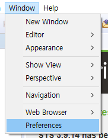

### Preferences &gt; General &gt; User Storage Service

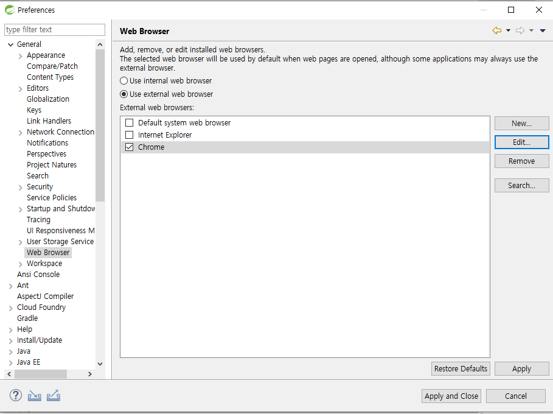

### General &gt; Workspace

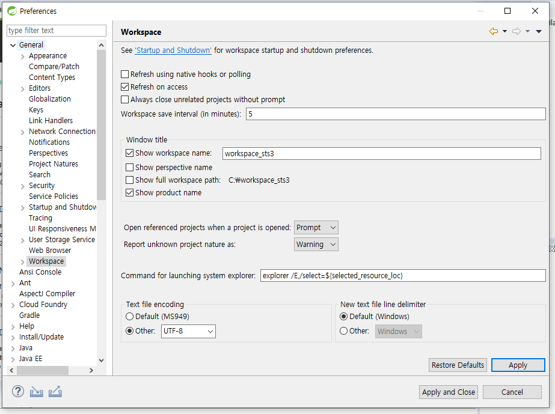

### General &gt; Content Types

### Preferences &gt; Web

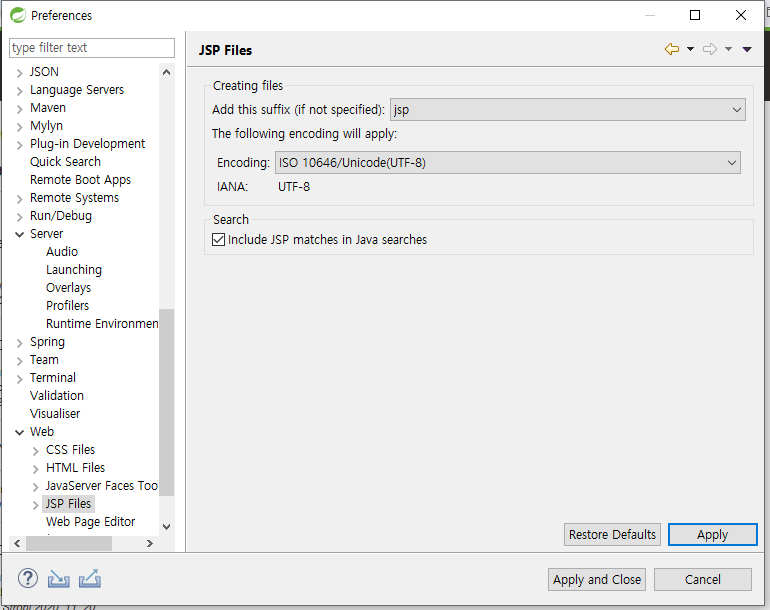

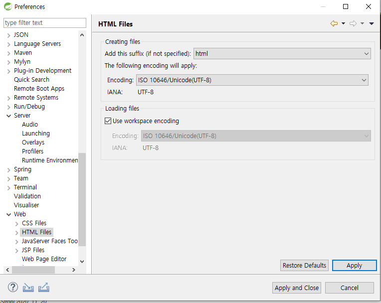

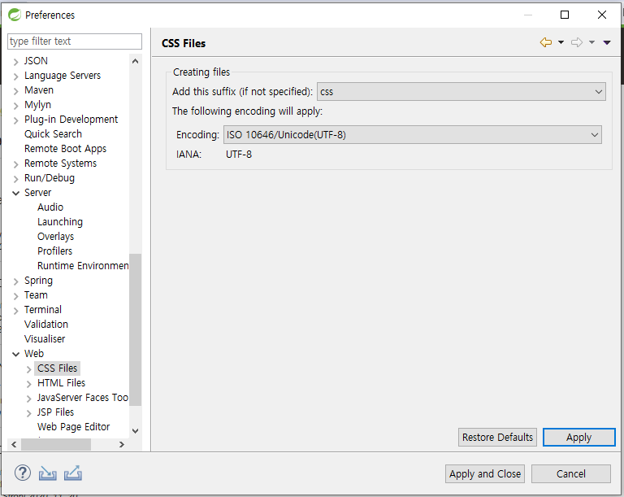

## Spring : JDK버전 맞추기

### 1. 프로젝트 &gt; Build Path &gt; Configure Build Path

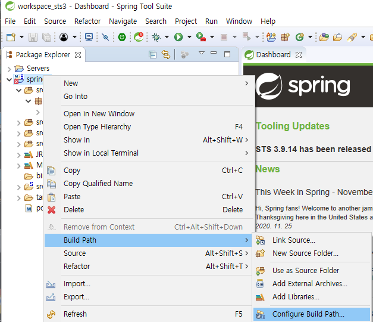

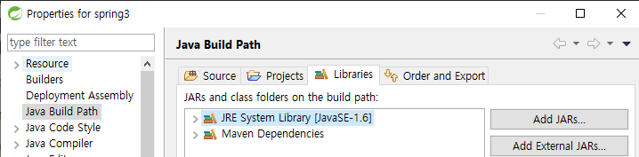

### 2. 프로젝트 &gt; Properties

## Spring : jar 저장 경로

### 프로젝트 &gt; Build Path &gt; Configure Build Path &gt; Libraries

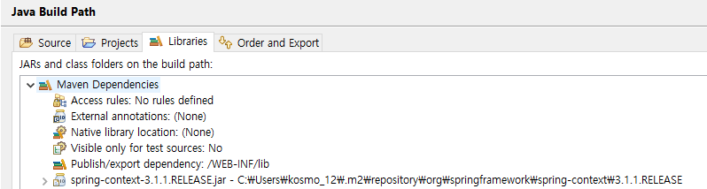

## Spring : 프로젝트 생성

### File &gt; New &gt; Spring Legacy Project

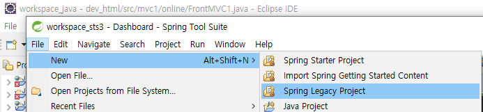

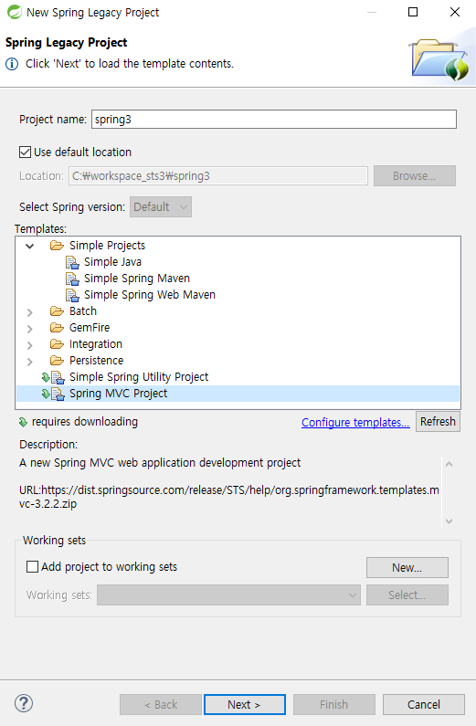

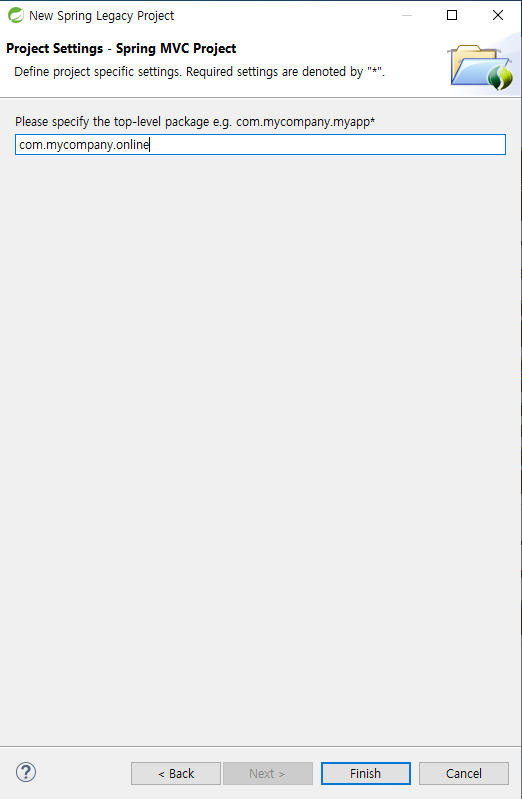

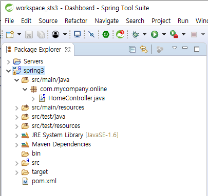

## Spring : 살펴보기

### Window &gt; Preferences 

### Git연동

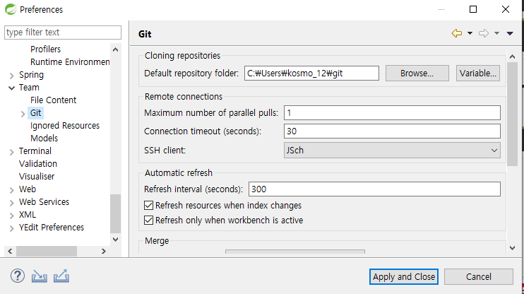

### JVM

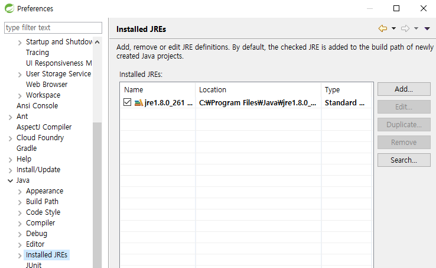

